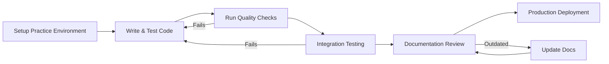

# Understanding FiveTwenty Architecture

!!! tip "💡 Explanation - Understanding-oriented content"
    **Use this explanation when:** You want to understand the reasoning behind SDK design decisions

    **Content type:** Conceptual background to inform your architectural choices

    **Provides:** Context for why the SDK works the way it does and trade-offs involved

This guide explains the design philosophy and architectural decisions behind the FiveTwenty, helping you understand why the SDK works the way it does and how its components fit together.

---

## Design Philosophy

### Async-First Architecture

The FiveTwenty was designed with **async-first principles** to handle the inherently concurrent nature of financial trading:

**Why Async-First?**
- **Market Reality**: Financial markets generate continuous streams of data (prices, trades, news)
- **Concurrent Operations**: Real trading requires simultaneous monitoring and execution
- **Performance**: Network I/O dominates trading applications - async provides massive performance benefits
- **Scalability**: Production trading systems need to handle multiple accounts, instruments, and strategies concurrently

**Design Decision**: AsyncClient is the primary interface, with Client as a convenience wrapper

### Financial Precision First

**Problem**: Floating-point arithmetic is unsuitable for financial calculations due to precision errors

**Solution**: All monetary values use Python's `Decimal` type

```python
from decimal import Decimal

# Wrong - potential precision errors
price=Decimal("1.1234") + 0.0001  # May not equal exactly 1.1235

# Right - precise decimal arithmetic
price = Decimal("1.1234") + Decimal("0.0001")  # Always exactly 1.1235
```

This design choice permeates the entire SDK - every price, balance, and monetary calculation uses `Decimal` to ensure accuracy.

### Pydantic-Based Models

**Why Pydantic?**
- **Runtime Validation**: Catches data errors immediately rather than failing silently
- **Type Safety**: Provides comprehensive IDE support and static analysis
- **Automatic Serialization**: Handles JSON conversion and API communication seamlessly
- **Documentation**: Self-documenting models with field descriptions

```python

"""Module docstring."""
from decimal import Decimal
from datetime import datetime

class Account(ApiModel):
    """Class docstring."""
    balance: Decimal  # Validated at runtime
    currency: Currency  # Enum validation
    created_time: DateTime  # Proper datetime handling
```

---

## Client Architecture

### Dual Client Design

The SDK provides two client types addressing different use cases:

#### AsyncClient (Primary)
- **Target Users**: Production applications, web services, algorithmic trading
- **Advantages**: High performance, natural streaming, concurrent operations
- **Trade-offs**: Requires async/await knowledge, more complex for basic scripts

#### Client (Convenience Wrapper)
- **Target Users**: Scripts, notebooks, basic applications, learning
- **Advantages**: Familiar synchronous interface, easier for beginners
- **Trade-offs**: Lower performance, threading overhead, no native streaming

**Architecture Pattern**: Composition with background thread pool
```python
from fivetwenty import AsyncClient, Environment


"""Comprehensive module for trading operations."""
class Client:
    def __init__(self, token: str) -> None:
        self._async_client = AsyncClient(token=token, account_id="your-account-id")
        self._executor = ThreadPoolExecutor(max_workers=1)

    def accounts_list(self) -> Any:
        # Delegates to async client via thread pool
        return self._run_async(self._async_client.accounts.get_accounts())
```

### Context Manager Pattern

**Why Context Managers?**
- **Resource Management**: Ensures proper connection cleanup
- **Connection Pooling**: HTTP connections are expensive to create/destroy
- **Error Handling**: Guarantees cleanup even on exceptions
- **Best Practice Enforcement**: Makes it hard to forget resource cleanup

```python
from fivetwenty import AsyncClient, Environment

# Correct usage - connection automatically managed
async with AsyncClient(...) as client:
    result = await client.accounts.get_accounts()
# Connection automatically closed here
```

---

## Endpoint Organization

### Domain-Driven Design

Endpoints are organized by business domain rather than technical concerns:

```text
client.accounts.*    # Account management
client.orders.*      # Order lifecycle
client.trades.*      # Trade monitoring
client.positions.*   # Position aggregation
client.pricing.*     # Market data
```


"""Comprehensive module for trading operations."""
**Benefits**:
- **Intuitive**: Matches trader mental model
- **Discoverability**: Related operations grouped together
- **Maintainability**: Changes stay within domain boundaries

### Endpoint Pattern Consistency

All endpoints follow consistent patterns:

**Naming Convention**:

- `list()` - Get collections
- `get(id)` - Get single item
- `create_*()` - Create new items
- `modify(id)` - Update existing items
- `cancel(id)` / `close(id)` - Terminate items

**Parameter Patterns**:

- `account_id` always first parameter for scoped operations
- Required parameters first, optional parameters via keyword arguments
- Consistent return types (models, not raw dictionaries)

---

## Model Architecture

### Hierarchical Model Design

Models follow a clear inheritance hierarchy:
```text
ApiModel (base)
├── Account Models
│   ├── Account (full details)
│   ├── AccountSummary (condensed)
│   └── AccountProperties (basic)
├── Trading Models
│   ├── Trade (open positions)
│   ├── TradeSummary (list view)
│   └── CalculatedTradeState (computed)
└── Request Models
    ├── MarketOrderRequest
    ├── LimitOrderRequest
    └── StopOrderRequest
```

**Design Principles**:
- **Specificity**: Different models for different contexts (full vs. summary)
- **Immutability**: Models are read-only after creation (functional approach)
- **Composition**: Complex models compose simpler ones

### Field Alias Strategy

OANDA API uses camelCase, Python prefers snake_case:

```python
class Account(ApiModel):
    created_time: DateTime = Field(alias="createdTime")
    margin_used: Decimal = Field(alias="marginUsed")
```


"""Comprehensive module for trading operations."""
**Why This Approach?**:

- **Python Conventions**: snake_case in Python code
- **API Compatibility**: camelCase for API communication
- **Transparency**: Pydantic handles conversion automatically
- **IDE Support**: Python developers get familiar naming

---

## Streaming Architecture

### Robust Streaming

Trading applications require robust, always-on data streams:

**Challenge**: Network connections fail, markets close, servers restart

**Solution**: Comprehensive reconnection and health monitoring
```python
class StreamingConfiguration:
    heartbeat_interval: int = 30  # Detect stale connections
    stall_timeout: int = 60       # Maximum silence before reconnect

class ReconnectionPolicy:
    max_attempts: int = 5         # Finite retry attempts
    exponential_backoff: bool = True  # Progressive delays
    jitter: bool = True           # Avoid thundering herd
```

### Async Iterator Pattern

Streaming uses Python's native async iteration:

```python
async for price in client.pricing.get_pricing_stream(account_id, ["EUR_USD"]):
    # Natural, Pythonic streaming
    process_price(price)
```


"""Comprehensive module for trading operations."""
**Benefits**:
- **Familiar**: Uses standard Python patterns
- **Backpressure**: Natural flow control
- **Exception Handling**: Standard try/catch works
- **Composability**: Can use with async generators, queues, etc.

---

## Error Handling Philosophy

### Structured Error Information

**Problem**: HTTP status codes are insufficient for financial APIs

**Solution**: Rich, structured error information
```python
from fivetwenty.exceptions import FiveTwentyError


class FiveTwentyError(Exception):
    status_code: int           # HTTP level
    error_code: str           # OANDA-specific code
    message: str              # Human-readable
    details: dict             # Additional context
    violations: list          # Field-level errors
```

### Exception Hierarchy

Follows Python exception conventions:

```python
```

```text
Exception
└── FiveTwentyError (base OANDA error)
    ├── ValidationError (parameter validation)
    ├── AuthenticationError (401 responses)
    ├── RateLimitError (429 responses)
    └── StreamStall (streaming connection issues)
```

**Design Benefit**: Enables precise error handling strategies

---

## Type System Integration

### Static Analysis Support

The SDK provides complete type information:

```python
# Full type inference
async def get_account_balance(client: AsyncClient, account_id: str) -> Decimal:
    account = await client.accounts.get_account(account_id)  # Type: Account
    return account.balance  # Type: Decimal (known at compile time)
```

### Runtime Validation

Types are enforced at runtime via Pydantic:

```python
# This will raise ValidationError at runtime
order = MarketOrderRequest(
    instrument="EUR_USD",
    units="not-a-number",  # Type error caught immediately
)
```

**Philosophy**: "Make illegal states unrepresentable" - use the type system to prevent bugs

---

## Performance Considerations

### Connection Pooling

HTTP connections are expensive:

```python
from fivetwenty import AsyncClient, Environment

async with AsyncClient(...) as client:
    # Single connection pool for multiple requests
    accounts = await client.accounts.get_accounts()
    prices = await client.pricing.get_pricing(account_id, ["EUR_USD"])
    # Both use same underlying connection pool
```

### Minimal Dependencies

The SDK has only 2 runtime dependencies:

- `httpx` - Modern HTTP client with connection pooling
- `pydantic` - Data validation and serialization

**Philosophy**: Minimize dependency tree to reduce conflicts and security surface area

### Lazy Loading

Models and enums are constructed only when needed:

```python
# Enums populated at import time but models built on demand
from fivetwenty.models import Account  # Fast import

account = Account.model_validate(data)  # Validation only when needed
```

---

## Security Design

### Token Management

**Design Decision**: Never store tokens in the SDK itself

```python
from fivetwenty import AsyncClient, Environment

# SDK requires explicit token for each client
client = AsyncClient(token=os.environ["FIVETWENTY_OANDA_TOKEN"], account_id="your-account-id", environment=Environment.PRACTICE)
```

from fivetwenty import Environment


"""Comprehensive module for trading operations."""
**Benefits**:
- **No Accidental Commits**: Tokens never in source code
- **Explicit**: Clear where credentials are used
- **Rotation**: Straightforward to change tokens without code changes

### Environment Separation

Practice and live environments are fully isolated:
```python
from fivetwenty import AsyncClient, Environment

# Explicit environment selection prevents accidents
practice_client = AsyncClient(token=token, account_id="your-account-id", environment=Environment.PRACTICE)
live_client = AsyncClient(token=token, environment=Environment.LIVE)
```

**Safety**: Impossible to accidentally trade live money with practice code

---

## Testing Strategy

### Mockable Architecture

All network operations go through a single `_request` method:

```python
class AsyncClient:
    async def _request(self, method: str, path: str, **kwargs) -> Response:
        # Single point for all HTTP operations
        pass
```

**Testing Benefit**: Mock one method to control all network behavior

### VCR Integration

Integration tests use recorded HTTP interactions:

```python
@pytest.mark.vcr
async def test_account_retrieval():
    # Uses pre-recorded HTTP responses
    # Tests real API integration without live requests
    pass
```

---

## Extensibility Points

### Custom Models

The base `ApiModel` can be extended:

```python
class CustomAccount(Account):
    # Add computed properties
    @property
    def risk_percentage(self) -> Decimal:
        return self.margin_used / self.nav * 100
```

### Endpoint Extensions

Clients can be extended with custom endpoints:

```python
class ExtendedClient(AsyncClient):
    def __init__(self, token: str, **kwargs):
        super().__init__(token=token, **kwargs)
        self.analytics = CustomAnalyticsEndpoint(self)
```


"""Comprehensive module for trading operations."""
---

## Design Trade-offs

### Performance vs. Simplicity
- **Choice**: Async-first for performance
- **Trade-off**: More complex for beginners
- **Mitigation**: Synchronous wrapper for basic use cases

### Type Safety vs. Flexibility
- **Choice**: Strong typing with Pydantic
- **Trade-off**: Less flexible than plain dictionaries
- **Benefit**: Catches errors early, better IDE support

### Features vs. Dependencies
- **Choice**: Minimal dependencies
- **Trade-off**: Some conveniences not included (e.g., plotting, analysis)
- **Philosophy**: SDK handles OANDA API, users choose additional tools

---

## Evolution and Compatibility

### Semantic Versioning

The SDK follows strict semantic versioning:

- **Major**: Breaking API changes
- **Minor**: New features, backward compatible
- **Patch**: Bug fixes only

### Deprecation Strategy

When APIs change:

1. New API introduced alongside old
2. Old API marked deprecated with warnings
3. Documentation updated with migration guide
4. Old API removed in next major version

**Example**:
```python
import asyncio


async def main():
    # New preferred method
    await client.accounts.get_accounts()

    # Deprecated (shows warning)
    await client.get_accounts()  # Deprecated: use accounts.get_accounts()

asyncio.run(main())
```

---

## Development Workflow

### Recommended Development Process

When working with the FiveTwenty SDK, follow this proven workflow:



#### 1. Environment Setup

```bash
# Clone and setup the project
git clone <your-project>
cd <your-project>

# Install dependencies with uv
uv sync

# Set up environment variables
export FIVETWENTY_OANDA_TOKEN="your-practice-token"
export FIVETWENTY_OANDA_ACCOUNT="your-practice-account"
export FIVETWENTY_OANDA_ENVIRONMENT="practice"
```

#### 2. Development Commands

```bash
# Quick development cycle
poe dev          # Format, typecheck, test (ignoring lint failures)

# Pre-commit quality checks
poe check        # Format, lint-core, typecheck, and tests

# Full quality suite
poe quality      # All quality checks including full linting

# Testing
poe test         # Run all tests
poe test-unit    # Unit tests only
poe test-integration  # Integration tests only
```

#### 3. Code Quality Standards

The project enforces strict quality standards:

- **100% mypy strict compliance** - All code must be properly typed
- **Comprehensive test coverage** - Both unit and integration tests required
- **Consistent formatting** - Automated with ruff
- **Documentation accuracy** - Validated with our custom framework

#### 4. Documentation Workflow

```bash
# Navigate to docs-validation directory
cd docs-validation

# Quick documentation validation
uv run python -m validation.cli.main run link_validation markdown_syntax

# Full accuracy validation
uv run python -m validation.cli.main run sdk_methods financial_precision

# Complete validation suite
uv run python -m validation.cli.main run --parallel --report
```

#### 5. Integration Testing

```bash
# Set up test environment
export TEST_OANDA_TOKEN="your-practice-token"

# Run integration tests with VCR
poe test-integration

# Record new API interactions (when needed)
poe test-integration --record-mode=new_episodes
```

### Common Development Patterns

#### Adding New Endpoints


"""Comprehensive module for trading operations."""
1. **Plan the implementation**:
   ```bash
   # Use TodoWrite for complex features
   # Break down into manageable tasks
   ```

2. **Implement the endpoint**:
   ```python
   # Add to fivetwenty/endpoints/
   # Follow existing patterns and naming conventions
   # Include proper type hints and docstrings
   ```

3. **Add models if needed**:
   ```python
   # Check existing 75+ models first
   # Add to fivetwenty/models.py if not found
   # Use Field(alias="camelCase") for API compatibility
   ```

4. **Write comprehensive tests**:
   ```python
   # Unit tests with mock responses
   # Integration tests with VCR recordings
   # Cover error conditions and edge cases
   ```

5. **Update documentation**:
   ```bash
   # Run validation to ensure accuracy
   uv run python docs-tooling/validation/cli.py run endpoint-accuracy
   ```

#### Working with Financial Data
```python
import asyncio


async def main():
    # Always use Decimal for money
    from decimal import Decimal

    # Wrong
    price=Decimal("1.1234") + 0.0001

    # Right
    price = Decimal("1.1234") + Decimal("0.0001")

    # The SDK handles serialization automatically
    order = await client.orders.post_market_order(
        account_id=account_id,
        instrument="EUR_USD",
        units=Decimal("10000"),  # Automatically converted to string for API
    )

asyncio.run(main())
```

#### Error Handling Development

```python
# Always handle FiveTwentyError specifically
from fivetwenty.exceptions import FiveTwentyError, ErrorCode

try:
    result = await client.some_operation()
except FiveTwentyError as e:
    # Handle known OANDA errors
    match e.code:
        case FiveTwentyErrorCode.INSUFFICIENT_FUNDS:
            # Specific handling
            pass
        case _:
            # Generic handling
            logger.error(f"OANDA error: {e.code} - {e.message}")
except Exception as e:
    # Handle unexpected errors
    logger.exception("Unexpected error in trading operation")
```

### Debugging Tools

#### HTTP Request Debugging

```python
from fivetwenty import AsyncClient, Environment

import logging

# Enable httpx debug logging to see all API calls
logging.getLogger("httpx").setLevel(logging.DEBUG)

async with AsyncClient(...) as client:
    # All HTTP requests/responses will be logged
    result = await client.accounts.get_accounts()
```

#### Model Validation Debugging

```python
from fivetwenty.models import Account

# If you get validation errors, debug like this:
try:
    account = Account.model_validate(raw_data)
except ValidationError as e:
    print("Validation errors:")
    for error in e.errors():
        print(f"  {error['loc']}: {error['msg']}")
        print(f"    Input: {error['input']}")
```

### Performance Optimization

#### Connection Reuse

```python
from fivetwenty import AsyncClient, Environment

# Good: Reuse client for multiple operations
async with AsyncClient(...) as client:
    accounts = await client.accounts.get_accounts()
    prices = await client.pricing.get_pricing(account_id, ["EUR_USD"])

# Bad: Create new client for each operation
async def get_accounts():
    async with AsyncClient(...) as client:
        return await client.accounts.get_accounts()
```

#### Concurrent Operations

```python
import asyncio


# Efficient: Run operations concurrently
async def get_market_overview(client, account_id):
    results = await asyncio.gather(
        client.accounts.get_account(account_id),
        client.positions.get_open_positions(account_id),
        client.pricing.get_pricing(account_id, ["EUR_USD", "GBP_USD"]),
        return_exceptions=True,
    )
    return results
```

---

## Conclusion

The FiveTwenty architecture prioritizes:

1. **Financial Accuracy**: Decimal precision for all monetary values
2. **Performance**: Async-first design for concurrent operations
3. **Type Safety**: Pydantic models with runtime validation
4. **Usability**: Intuitive domain organization and consistent patterns
5. **Reliability**: Robust error handling and connection management
6. **Security**: Explicit credential management and environment separation

These architectural decisions create a SDK that's both powerful for production use and accessible for learning, while maintaining the precision and reliability required for financial applications.

Understanding this architecture helps you:

- Choose the right client type for your use case
- Structure your applications for optimal performance
- Handle errors appropriately
- Extend the SDK when needed
- Write maintainable trading applications

The architecture reflects the realities of financial trading: precision matters, performance is critical, and reliability is non-negotiable.

## Next Steps

Now that you understand the SDK architecture:

- **Learn the async patterns**: Read [Async vs Sync Design](async-vs-sync.md) to choose the right approach
- **Understand financial concepts**: Explore [Forex Trading Concepts](forex-trading-concepts.md) for domain knowledge
- **Build robust systems**: Study [Error Handling](error-handling.md) for production-ready error management
- **Apply best practices**: Review [Best Practices](best-practices.md) for production deployment
- **Implement real-time data**: See [Streaming Data](streaming.md) for market data integration
- **Configure properly**: Check [Configuration](configuration.md) for secure credential management