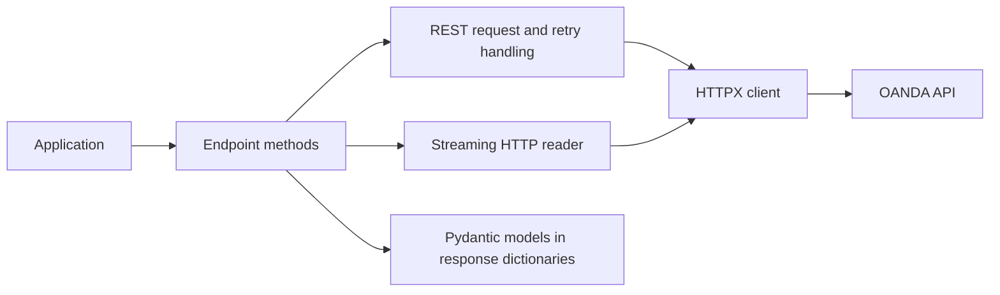

# SDK architecture

FiveTwenty translates between OANDA's JSON API and Python objects. The design has
three main layers: clients manage HTTP connections, endpoint groups build requests
and parse responses, and Pydantic models validate individual data objects.



## Async and sync clients

`AsyncClient` is the primary implementation. It uses HTTPX for requests, connection
pooling and streaming. Reuse one client for related work on the same event loop and
close it with `async with` or `await client.aclose()`.

`Client` runs an `AsyncClient` on a dedicated background event-loop thread. Ordinary
endpoint calls block until the corresponding coroutine finishes and return the
same response shape. Synchronous pricing uses `client.pricing.stream_iter()`;
other async-generator methods are not converted into blocking iterators.

See [async and sync clients](async-vs-sync.md) for examples of creating clients,
closing connections and consuming streams.

## Requests and response envelopes

Endpoint methods include `get_account_summary()`, `post_order()`,
`put_trade_orders()` and `cancel_order()`. Most methods that operate on an account
take `account_id` first. Use the [endpoint reference](../../api-reference/endpoints/index.md)
to find a method's name, parameters and return type.

Most methods return a dictionary with OANDA's field names as keys and typed models
as values. This outer dictionary is called a response envelope: it holds the data
you requested along with metadata such as `lastTransactionID`.

```python
from fivetwenty import AsyncClient
from fivetwenty.models import AccountSummary


async def read_account(client: AsyncClient) -> AccountSummary:
    response = await client.accounts.get_account_summary(client.account_id)
    account = response["account"]
    print(response["lastTransactionID"])
    return account
```

`get_accounts()` is an exception: it returns a list of account-property models.
Conditional transaction fields in write responses may be absent. Inspect the
returned keys rather than assuming every accepted request produced a fill.

## Model values and wire values

Model attributes use Python names such as `closeout_bid`. When the SDK serializes
a model for an API request, it maps these names to OANDA aliases such as
`closeoutBid` and converts values to the API format. These serialized values are
often called wire values.

Financial attributes declared as `Decimal` remain decimals in Python. The public
`PriceValue`, `AccountUnits` and `DecimalNumber` aliases also represent `Decimal` values.

Timestamps become Python datetimes. `datetime_format="UNIX"` controls how timestamps
are sent and received; model attributes remain Python `datetime` objects. Python
retains microsecond precision, so finer precision in an API timestamp is lost.

```python
from decimal import Decimal

from fivetwenty.models import LimitOrderRequest

order = LimitOrderRequest(instrument="EUR_USD", units=Decimal("1"), price=Decimal("1.05"))
order.units = Decimal("2")
wire = order.model_dump(mode="json", by_alias=True, exclude_none=True)
print(wire["units"])  # Serialized string: "2"
```

Models are mutable, with assignment validation enabled. Updating a local model
never updates the account; send an endpoint request to change server state.
Compatibility dictionary access on a model returns serialized values, so use
attributes when you need native decimals, datetimes or nested model objects.

## Retry and streaming behavior

REST retries apply to eligible read requests after selected status or transport
failures. `max_retries` counts attempts after the initial request. Writes are sent
once because a timeout does not establish whether the server processed them.

Basic pricing and transaction streams yield typed records from line-delimited
JSON. They report failures to the caller. `stream_pricing_with_retries()` adds a
reconnection policy and connection-state values. Reconnection does not replay
missed transactions or restore application state.

Close a partially consumed async stream with `contextlib.aclosing`. The sync pricing
iterator has a bounded queue of 1,024 records and drops the oldest queued record
when full. It is a current-price interface, not lossless storage.

## Configuration and credentials

The client resolves an `AccountConfig`, direct credentials or environment variables
as described in [configuration](configuration.md). It retains the token in memory
for Authorization headers. `SecretStr` masks configuration representations, and
SDK request logging redacts Authorization headers; application logs, dumps and
custom transports remain the application's responsibility.

The selected environment chooses practice or live hosts. Configuration is not a
permission boundary: verify the resolved environment before an application is
allowed to submit orders.

## Testing and extension

REST and streams both use the configured HTTPX client. Inject an HTTPX client with
`MockTransport` to test requests and responses without contacting OANDA. Mocking
only `_request()` does not cover streaming. See the
[testing guide](../../contributing/testing-guide.md).

Custom transports must supply the appropriate base URL and transport settings.
Closing the SDK also closes an injected HTTPX client, so avoid sharing that HTTP
client with code that needs it to stay open. The direct runtime dependencies are
HTTPX and Pydantic. Your application handles plotting, strategy execution and
storing account state.

While FiveTwenty is below version 1.0, minor releases may include breaking changes.
The [changelog](https://github.com/NimbleOx/fivetwenty/blob/main/CHANGELOG.md) records
these changes and explains how to update affected code.
