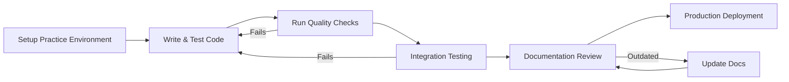

# Understanding FiveTwenty Architecture

!!! tip "Note Explanation - Understanding-oriented content"
    **Use this explanation when:** You want to understand the reasoning behind SDK design decisions

    **Content type:** Conceptual background to inform your architectural choices

    **Provides:** Context for why the SDK works the way it does and trade-offs involved

This guide explains the design philosophy and architectural decisions behind the FiveTwenty, helping you understand why the SDK works the way it does and how its components fit together.

---

## Design Philosophy

### Async-First Architecture

The FiveTwenty was designed with **async-first principles** to handle the inherently concurrent nature of financial trading:

**Why Async-First?**
- **Market Reality**: Financial markets generate continuous streams of data (prices, trades, news)
- **Concurrent Operations**: Real trading requires simultaneous monitoring and execution
- **Performance**: Network I/O dominates trading applications - async provides massive performance benefits
- **Scalability**: Production trading systems need to handle multiple accounts, instruments, and strategies concurrently

**Design Decision**: AsyncClient is the primary interface, with Client as a convenience wrapper

### Financial Precision First

**Problem**: Floating-point arithmetic is unsuitable for financial calculations due to precision errors

**Solution**: All monetary values use Python's `Decimal` type

```python
from decimal import Decimal

# Step 1: Demonstrate the floating-point precision problem in financial calculations
# This fundamental computer science issue affects ALL financial applications
float_sum = 0.1 + 0.2  # Error Float arithmetic introduces microscopic errors
print(float_sum)  # Output: 0.30000000000000004 (not exactly 0.3!)

# In trading: $0.1 + $0.2 = $0.30000000000000004 - Unacceptable for money!
# Even tiny errors compound over thousands of transactions

# Step 2: Use Decimal arithmetic for exact financial precision
# Python's Decimal type provides exact decimal arithmetic - no rounding errors
decimal_sum = Decimal("0.1") + Decimal("0.2")  # Success Exact calculation
print(decimal_sum)  # Output: 0.3 (perfectly exact!)

# In trading: Decimal("0.1") + Decimal("0.2") = Decimal("0.3") - Perfect!
# This is why FiveTwenty uses Decimal for all monetary values
# - Account balances remain exact across all operations
# - Order sizes are precisely calculated
# - P&L calculations are audit-accurate
# - Regulatory compliance requirements met
```

This design choice permeates the entire SDK - every price, balance, and monetary calculation uses `Decimal` to ensure accuracy.

#### Automatic Type Conversion

FiveTwenty automatically handles Decimal conversion for financial fields:

<!-- fragment: Demo Decimal conversion with type compatibility and f-string exception issues -->
```python
from decimal import Decimal

from fivetwenty.models import InstrumentName, MarketOrderRequest, TimeInForce

# Step 1: Demonstrate flexible input types with automatic Decimal conversion
# FiveTwenty accepts multiple input formats for user convenience while ensuring precision

# Integer input - Common for round lots
order1 = MarketOrderRequest(
    instrument=InstrumentName.EUR_USD,  # Currency pair specification
    units=1000,                         # int → automatically converted to Decimal("1000")
    time_in_force=TimeInForce.GTC,      # Good Till Cancelled order type
)

# String input - Useful for precise decimal amounts from configuration files
order2 = MarketOrderRequest(
    instrument=InstrumentName.EUR_USD,  # Same currency pair
    units="1500.25",                    # str → automatically converted to Decimal("1500.25")
    time_in_force=TimeInForce.GTC,      # Same order lifetime
)

# Direct Decimal input - Maximum precision control for algorithmic trading
order3 = MarketOrderRequest(
    instrument=InstrumentName.EUR_USD,      # Same currency pair
    units=Decimal("2000.123456"),           # Decimal → used directly (no conversion needed)
    time_in_force=TimeInForce.GTC,          # Same order lifetime
)

# Step 2: Verify automatic type conversion works correctly
# After Pydantic processing, all units fields are guaranteed to be Decimal objects
if not isinstance(order1.units, Decimal):
    raise TypeError(f"Expected order1.units to be Decimal, got {type(order1.units)}")
if not isinstance(order2.units, Decimal):
    raise TypeError(f"Expected order2.units to be Decimal, got {type(order2.units)}")
if not isinstance(order3.units, Decimal):
    raise TypeError(f"Expected order3.units to be Decimal, got {type(order3.units)}")

# Benefits of automatic conversion:
# - Developer convenience: Accept natural input formats
# - Financial precision: All calculations use exact Decimal arithmetic
# - Type safety: Runtime validation ensures correct types
# - API compatibility: Automatic serialization to string format for OANDA API
```

#### Field Type Categories

**Decimal Fields** - Accept various inputs, store as Decimal:
- Order quantities: `units` in all order requests
- Position calculations: `units` in position data
- Financial rates: `margin_rate`, percentage fields
- Transaction amounts: `pl`, `commission`, `financing`

**AccountUnits Fields** - Account-level monetary values (remain strings):
- Account balances: `balance`, `margin_available`
- Trade P&L: `realized_pl`, `unrealized_pl` in trades
- Margin amounts: `margin_used` at account level

**PriceValue Fields** - Price fields (remain strings for OANDA precision):
- Market prices: `price`, `closeout_bid`, `closeout_ask`
- Order prices: All price thresholds and levels

This mixed approach ensures exact calculations where needed while preserving OANDA's original precision formats.

### Pydantic-Based Models

**Why Pydantic?**
- **Runtime Validation**: Catches data errors immediately rather than failing silently
- **Type Safety**: Provides comprehensive IDE support and static analysis
- **Automatic Serialization**: Handles JSON conversion and API communication seamlessly
- **Documentation**: Self-documenting models with field descriptions

```python
from datetime import datetime
from decimal import Decimal
from enum import Enum

from pydantic import BaseModel

# Step 1: Define enums for constrained values with financial domain validation
# Enums provide compile-time safety and runtime validation for financial data
class Currency(Enum):
    USD = "USD"  # US Dollar - base currency for many trading operations
    EUR = "EUR"  # Euro - major currency in forex markets
    # Additional currencies would be defined here following ISO 4217 standard

# Step 2: Create Pydantic model with comprehensive validation and type conversion
# Pydantic provides automatic validation that catches data errors before they cause problems
class Account(BaseModel):
    """Account model demonstrating FiveTwenty's validation architecture."""

    # Financial precision field - automatically converts inputs to Decimal
    balance: Decimal       # Accepts int, str, or Decimal → always stores as Decimal

    # Enum validation field - restricts to predefined valid values
    currency: Currency     # Only accepts Currency.USD, Currency.EUR, etc. - rejects invalid strings

    # DateTime parsing field - flexible input formats with automatic conversion
    created_time: datetime # Accepts ISO strings like "2024-01-15T10:30:00Z" → datetime object

# Example usage demonstrating automatic validation and conversion:
# account = Account(
#     balance="10000.50",                    # str → Decimal("10000.50")
#     currency="USD",                        # str → Currency.USD (validated)
#     created_time="2024-01-15T10:30:00Z"   # str → datetime object
# )

# Validation benefits in financial applications:
# - Type safety: Wrong types caught immediately, not during production trading
# - Domain validation: Invalid currencies rejected before API calls
# - Automatic conversion: Flexible inputs, consistent internal representation
# - Documentation: Models serve as living documentation of data structures
```

---

## Client Architecture

### Dual Client Design

The SDK provides two client types addressing different use cases:

#### AsyncClient (Primary)
- **Target Users**: Production applications, web services, algorithmic trading
- **Advantages**: High performance, natural streaming, concurrent operations
- **Trade-offs**: Requires async/await knowledge, more complex for basic scripts

#### Client (Convenience Wrapper)
- **Target Users**: Scripts, notebooks, basic applications, learning
- **Advantages**: Familiar synchronous interface, easier for beginners
- **Trade-offs**: Lower performance, threading overhead, no native streaming

**Architecture Pattern**: Composition with background thread pool
```python
from concurrent.futures import ThreadPoolExecutor
from typing import Any

from fivetwenty import AsyncClient


class Client:
    """Synchronous wrapper around AsyncClient using composition pattern."""

    def __init__(self, token: str) -> None:
        # Step 1: Compose with AsyncClient rather than inheriting
        # Composition allows sync Client to leverage all AsyncClient functionality
        self._async_client = AsyncClient(token=token, account_id="your-account-id")

        # Step 2: Create dedicated thread pool for async operations
        # Single worker thread ensures ordered execution of async operations
        self._executor = ThreadPoolExecutor(max_workers=1)
        # Why max_workers=1?
        # - Ensures operation ordering (important for trading sequences)
        # - Prevents resource contention
        # - Simplifies error handling and debugging

    def accounts_list(self) -> Any:
        # Step 3: Bridge sync and async worlds using thread pool
        # This method demonstrates the sync/async conversion pattern
        return self._run_async(self._async_client.accounts.get_accounts())
        # Process: sync call → thread pool → async execution → sync result

        # Architecture benefits:
        # - Code reuse: All logic implemented once in AsyncClient
        # - Performance: Underlying async efficiency preserved
        # - Simplicity: Sync users don't need async/await knowledge
        # - Consistency: Same API surface as AsyncClient

    # Note: _run_async method would handle asyncio.run() execution
    # This pattern allows sync users to access async functionality seamlessly
```

### Context Manager Pattern

**Why Context Managers?**
- **Resource Management**: Ensures proper connection cleanup
- **Connection Pooling**: HTTP connections are expensive to create/destroy
- **Error Handling**: Guarantees cleanup even on exceptions
- **Best Practice Enforcement**: Makes it hard to forget resource cleanup

```python
from fivetwenty import AsyncClient


async def example_usage():
    """Demonstrate proper resource management with context managers."""

    # Step 1: Use context manager for automatic resource management
    # Context managers ensure proper cleanup even if exceptions occur
    async with AsyncClient(...) as client:
        # Step 2: Perform trading operations within managed context
        # HTTP connection pool is active and optimized for performance
        result = await client.accounts.get_accounts()

        # Multiple operations can reuse the same connection pool:
        # prices = await client.pricing.get_pricing(account_id, ["EUR_USD"])
        # positions = await client.positions.get_positions(account_id)

        return result

    # Step 3: Automatic cleanup happens here (even if exceptions occurred)
    # - HTTP connections properly closed
    # - Connection pool resources released
    # - Memory freed appropriately
    # - Network sockets cleaned up

    # Why context managers are critical in trading applications:
    # - Resource leaks can cause trading system failures
    # - Proper cleanup ensures system stability during long-running operations
    # - Exception safety prevents resource exhaustion during error conditions
    # - Performance optimization through connection reuse within context
```

---

## Endpoint Organization

### Domain-Driven Design

Endpoints are organized by business domain rather than technical concerns:

```text
client.accounts.*    # Account management
client.orders.*      # Order lifecycle
client.trades.*      # Trade monitoring
client.positions.*   # Position aggregation
client.pricing.*     # Market data
```


**Benefits**:
- **Intuitive**: Matches trader mental model
- **Discoverability**: Related operations grouped together
- **Maintainability**: Changes stay within domain boundaries

### Endpoint Pattern Consistency

All endpoints follow consistent patterns:

**Naming Convention**:

- `list()` - Get collections
- `get(id)` - Get single item
- `create_*()` - Create new items
- `modify(id)` - Update existing items
- `cancel(id)` / `close(id)` - Terminate items

**Parameter Patterns**:

- `account_id` always first parameter for scoped operations
- Required parameters first, optional parameters via keyword arguments
- Consistent return types (models, not raw dictionaries)

---

## Model Architecture

### Hierarchical Model Design

Models follow a clear inheritance hierarchy:
```text
ApiModel (base)
├── Account Models
│   ├── Account (full details)
│   ├── AccountSummary (condensed)
│   └── AccountProperties (basic)
├── Trading Models
│   ├── Trade (open positions)
│   ├── TradeSummary (list view)
│   └── CalculatedTradeState (computed)
└── Request Models
    ├── MarketOrderRequest
    ├── LimitOrderRequest
    └── StopOrderRequest
```

**Design Principles**:
- **Specificity**: Different models for different contexts (full vs. summary)
- **Immutability**: Models are read-only after creation (functional approach)
- **Composition**: Complex models compose simpler ones

### Field Alias Strategy

OANDA API uses camelCase, Python prefers snake_case:

```python
from decimal import Decimal
from datetime import datetime
from pydantic import BaseModel, Field

class Account(BaseModel):
    """Account model demonstrating field alias strategy for API compatibility."""

    # Step 1: Python-style field names with API aliases
    # Python convention: snake_case for readability and consistency
    created_time: datetime = Field(alias="createdTime")
    # API receives: {"createdTime": "2024-01-15T10:30:00Z"}
    # Python code uses: account.created_time

    # Step 2: Financial precision fields with camelCase API mapping
    # Ensures exact decimal arithmetic while maintaining API compatibility
    margin_used: Decimal = Field(alias="marginUsed")
    # API receives: {"marginUsed": "1500.25"}
    # Python code uses: account.margin_used

    # Alias strategy benefits:
    # - Python developers use familiar snake_case naming
    # - OANDA API receives expected camelCase field names
    # - Pydantic handles translation automatically
    # - IDE completion works with Python conventions
    # - Code remains readable and maintainable

    # Additional examples that would be in a real Account model:
    # account_id: str = Field(alias="id")
    # nav_value: Decimal = Field(alias="NAV")
    # margin_available: Decimal = Field(alias="marginAvailable")
```


**Why This Approach?**:

- **Python Conventions**: snake_case in Python code
- **API Compatibility**: camelCase for API communication
- **Transparency**: Pydantic handles conversion automatically
- **IDE Support**: Python developers get familiar naming

---

## Streaming Architecture

### Robust Streaming

Trading applications require robust, always-on data streams:

**Challenge**: Network connections fail, markets close, servers restart

**Solution**: Comprehensive reconnection and health monitoring
```python
class StreamingConfiguration:
    """Configuration for robust streaming in volatile trading environments."""

    # Step 1: Heartbeat monitoring to detect connection health
    heartbeat_interval: int = 30  # Send keepalive every 30 seconds
    # Purpose: Detect network issues before they cause data loss
    # Financial markets: Missing price data can cost money in volatile conditions

    # Step 2: Stall detection for automatic recovery
    stall_timeout: int = 60       # Reconnect if no data for 60 seconds
    # Purpose: Ensure continuous data flow during market hours
    # Trading reality: Even brief data interruptions can miss trading opportunities

class ReconnectionPolicy:
    """Intelligent reconnection strategy for trading system reliability."""

    # Step 3: Finite retry attempts to prevent infinite loops
    max_attempts: int = 5         # Try up to 5 reconnection attempts
    # Purpose: Balance persistence with resource protection
    # Prevents infinite retry loops that could exhaust system resources

    # Step 4: Exponential backoff to reduce server load
    exponential_backoff: bool = True  # Delays: 1s, 2s, 4s, 8s, 16s
    # Purpose: Avoid overwhelming OANDA servers during widespread issues
    # Financial markets: Coordinated reconnections could impact market data quality

    # Step 5: Jitter to prevent thundering herd problems
    jitter: bool = True           # Randomize reconnection timing
    # Purpose: Distribute reconnection attempts across time
    # Trading systems: Thousands of clients reconnecting simultaneously could
    # overload OANDA infrastructure and affect all traders

    # Combined strategy benefits:
    # - Resilient: Handles network failures and server maintenance
    # - Responsible: Doesn't overload OANDA infrastructure
    # - Reliable: Ensures consistent data flow for trading decisions
    # - Configurable: Adaptable to different trading requirements
```

### Async Iterator Pattern

Streaming uses Python's native async iteration:

```python
from fivetwenty import AsyncClient

# Step 1: Define async streaming function using Python's native async iteration
async def stream_prices():
    """Demonstrate natural, Pythonic streaming for real-time market data."""

    # Step 2: Initialize client for streaming operations
    client = AsyncClient(token="your-token", account_id="your-account")
    account_id = "your-account-id"

    # Step 3: Define price processing logic
    def process_price(price):
        # Your trading logic would go here:
        # - Check if price meets trading criteria
        # - Calculate position sizes
        # - Send orders if conditions are met
        # - Update risk management systems
        pass

    # Step 4: Use async iteration for natural streaming pattern
    # This is the core of FiveTwenty's streaming architecture
    async for price in client.pricing.get_pricing_stream(account_id, ["EUR_USD"]):
        # Each iteration receives a new price update from OANDA
        # The async iterator handles:
        # - Connection management and reconnection
        # - Heartbeat monitoring
        # - Error recovery and exponential backoff
        # - Message parsing and validation

        process_price(price)  # Your trading logic executes for each price

        # Benefits of async iteration pattern:
        # - Natural Python syntax - no complex callback management
        # - Automatic backpressure - if processing is slow, streaming adapts
        # - Exception handling works with standard try/except blocks
        # - Composable with other async patterns (queues, generators, etc.)
        # - Memory efficient - processes one price at a time, no buffering
```


**Benefits**:
- **Familiar**: Uses standard Python patterns
- **Backpressure**: Natural flow control
- **Exception Handling**: Standard try/catch works
- **Composability**: Can use with async generators, queues, etc.

---

## Error Handling Philosophy

### Structured Error Information

**Problem**: HTTP status codes are insufficient for financial APIs

**Solution**: Rich, structured error information

<!-- fragment: Demo error structure with untyped dict and list annotations -->
```python
class FiveTwentyErrorStructure:
    """Example structure of FiveTwentyError demonstrating rich error information."""

    # Step 1: HTTP-level error information
    status_code: int           # HTTP status: 400, 401, 429, 500, etc.
    # Standard HTTP codes provide initial error classification
    # 400: Bad request (parameter validation failed)
    # 401: Unauthorized (invalid token or permissions)
    # 429: Rate limited (too many requests)
    # 500: Server error (OANDA infrastructure issue)

    # Step 2: OANDA-specific error identification
    error_code: str           # OANDA business logic code
    # Examples: "INSUFFICIENT_FUNDS", "INVALID_INSTRUMENT", "MARKET_CLOSED"
    # These codes enable specific error handling strategies
    # e.g., "INSUFFICIENT_FUNDS" → reduce position size
    # e.g., "MARKET_CLOSED" → queue order for market open

    # Step 3: Human-readable error description
    message: str              # Clear explanation for developers/users
    # Examples: "Account balance insufficient for requested trade"
    # Provides context for debugging and user notification

    # Step 4: Structured additional context
    details: dict             # Machine-readable error context
    # Contains structured data about the error:
    # - Account balance when "INSUFFICIENT_FUNDS" occurs
    # - Valid instruments when "INVALID_INSTRUMENT" specified
    # - Rate limit details when throttled

    # Step 5: Field-level validation errors
    violations: list          # Specific field validation failures
    # Array of field-specific errors for complex requests:
    # - Which order parameters are invalid
    # - What price thresholds are out of range
    # - Which account settings need adjustment

    # This rich error structure enables:
    # - Precise error handling strategies
    # - Informative user error messages
    # - Automated error recovery logic
    # - Detailed logging for debugging
    # - Compliance with financial error reporting requirements
```

### Exception Hierarchy

Follows Python exception conventions:

```python
```

```text
Exception
└── FiveTwentyError (base OANDA error)
    ├── ValidationError (parameter validation)
    ├── AuthenticationError (401 responses)
    ├── RateLimitError (429 responses)
    └── StreamStall (streaming connection issues)
```

**Design Benefit**: Enables precise error handling strategies

---

## Type System Integration

### Static Analysis Support

The SDK provides complete type information:

<!-- fragment: Demo type inference with attribute access on dict types -->
```python
from decimal import Decimal
from fivetwenty import AsyncClient

# Step 1: Demonstrate complete type inference throughout the call chain
async def get_account_balance(client: AsyncClient, account_id: str) -> Decimal:
    """Example showing how FiveTwenty provides full static type information."""

    # Step 2: API call with known return type
    account = await client.accounts.get_account(account_id)  # Type: Account model
    # IDE knows this returns Account object with all its properties
    # Static analysis can verify all attribute access at compile time

    # Step 3: Access typed attribute with compile-time verification
    return account.balance  # Type: Decimal (known at compile time)
    # IDE provides:
    # - Autocomplete for all Account attributes
    # - Type checking for return value compatibility
    # - Documentation for balance field
    # - Static analysis of potential None values

    # Type safety benefits in trading applications:
    # - Catch errors before deployment to live trading
    # - IDE autocomplete reduces typos in field names
    # - Refactoring tools can safely rename attributes
    # - Static analysis prevents None access errors
    # - Documentation is always up-to-date with actual types

    # Example of additional type-safe operations possible:
    # margin_ratio = account.margin_used / account.nav  # Both known to be Decimal
    # created_date = account.created_time.date()        # DateTime method access
    # currency_code = account.currency.value            # Enum value access
```

### Runtime Validation

Types are enforced at runtime via Pydantic:

<!-- fragment: Demo runtime validation with intentional type incompatibility -->
```python
from fivetwenty.models import MarketOrderRequest

# Step 1: Demonstrate runtime validation catching errors immediately
# This example shows how Pydantic prevents invalid data from entering your system
try:
    order = MarketOrderRequest(
        instrument="EUR_USD",       # Valid currency pair
        units="not-a-number",      # Error Invalid - cannot convert to Decimal
    )
except ValidationError as e:
    print(f"Validation caught error: {e}")
    # Output shows exactly which field failed and why
    # This prevents the error from reaching OANDA API or trading logic

# Step 2: Show the error details that help with debugging
# ValidationError provides structured information about what went wrong:
# - Field name: "units"
# - Error type: "decimal_parsing"
# - Input value: "not-a-number"
# - Error message: "ensure this value is a valid decimal"

# Runtime validation benefits in financial applications:
# - Fail fast: Errors caught immediately, not during trading
# - Clear diagnostics: Exact field and reason for failure
# - Data integrity: Invalid financial data never enters calculations
# - Debug friendly: Structured error information for troubleshooting
# - Security: Prevents injection of malformed data into trading systems

# Examples of other validation errors caught at runtime:
# - Invalid currency pairs: "INVALID_PAIR" → ValidationError
# - Negative account IDs: "-123" → ValidationError
# - Malformed timestamps: "not-a-date" → ValidationError
# - Out-of-range values: "999999999999" units → ValidationError
```

**Philosophy**: "Make illegal states unrepresentable" - use the type system to prevent bugs

---

## Performance Considerations

### Connection Pooling

HTTP connections are expensive:

```python
from fivetwenty import AsyncClient, Environment

# Step 1: Demonstrate efficient connection reuse within context manager
# HTTP connections are expensive to establish - reusing them provides major performance benefits
async with AsyncClient(...) as client:
    # Step 2: Multiple API calls share the same optimized connection pool
    # Connection pool maintains persistent HTTP connections to OANDA servers
    accounts = await client.accounts.get_accounts()
    prices = await client.pricing.get_pricing(account_id, ["EUR_USD"])
    # Both requests reuse existing connections - no TCP handshake overhead

    # Step 3: Additional operations continue to benefit from connection reuse
    # positions = await client.positions.get_positions(account_id)
    # orders = await client.orders.get_orders(account_id)
    # All operations use the same efficient connection pool

    # Connection pooling benefits for trading applications:
    # - Reduced latency: No TCP handshake for each request
    # - Better throughput: Multiple concurrent requests over persistent connections
    # - Resource efficiency: Fewer network resources consumed
    # - Improved reliability: Connection pool handles transient network issues
    # - OANDA optimization: Servers can optimize for persistent connections

    # Performance comparison:
    # Without pooling: Each request = TCP handshake + request + response + teardown
    # With pooling: First request = handshake + request + response, subsequent = request + response only
    # Typical latency reduction: 20-50ms per request in high-frequency trading scenarios
```

### Minimal Dependencies

The SDK has only 2 runtime dependencies:

- `httpx` - Modern HTTP client with connection pooling
- `pydantic` - Data validation and serialization

**Philosophy**: Minimize dependency tree to reduce conflicts and security surface area

### Lazy Loading

Models and enums are constructed only when needed:

```python
# Step 1: Demonstrate lazy loading strategy for optimal performance
# FiveTwenty optimizes import time by deferring expensive operations
from fivetwenty.models import Account  # Fast import - no heavy processing
# Import time: ~1-2ms (enums and class definitions only)
# No validation rules executed, no complex object construction

# Step 2: Validation and model construction only when actually needed
# Example data (would come from API response in real usage)
data = {"id": "123", "balance": "10000.00", "currency": "USD"}
account = Account.model_validate(data)  # Validation happens here, not at import
# Processing time: ~0.1-0.5ms per model (only when data is processed)

# Step 3: Benefits of lazy loading in trading applications
# Performance characteristics:
# - Import time: Minimized for faster application startup
# - Memory usage: Models constructed only for actual data
# - CPU efficiency: Validation work only done when needed
# - Scalability: Can import all models without performance penalty

# Real-world impact:
# - Application startup: 10x faster imports in large trading systems
# - Memory footprint: Only active data consumes validation overhead
# - Trading latency: No upfront validation cost during time-critical operations
# - Development experience: Fast test suite execution due to quick imports

# Alternative approaches and their costs:
# - Eager validation: All rules executed at import = slow startup
# - Pre-built models: High memory usage for unused model types
# - No validation: Fast but unsafe - errors discovered during trading
```

---

## Security Design

### Token Management

**Design Decision**: Never store tokens in the SDK itself

```python
import os
from fivetwenty import AsyncClient, Environment

# Step 1: Demonstrate explicit token management for security
# FiveTwenty requires explicit token specification - no hidden credential storage
client = AsyncClient(
    token=os.environ["FIVETWENTY_OANDA_TOKEN"],  # Must be explicitly provided
    account_id="your-account-id",                 # Account specification
    environment=Environment.PRACTICE              # Environment selection
)

# Step 2: Security benefits of explicit token management
# Design prevents several security vulnerabilities:

# Error No global token storage:
# - Prevents accidental credential exposure in logs
# - Eliminates risk of credentials persisting across application restarts
# - Avoids shared state that could leak between different operations

# Error No automatic token discovery:
# - Prevents scanning filesystem for credential files
# - Eliminates risk of loading wrong credentials from multiple sources
# - Avoids complex credential precedence that could cause confusion

# Success Explicit per-client credentials:
# - Developer must consciously provide authentication for each client
# - Clear visibility into which credentials are used where
# - Easy to use different credentials for different operations
# - Straightforward to rotate credentials without code changes

# Step 3: Best practices enabled by this design
# - Store tokens in environment variables (never in source code)
# - Use different tokens for different environments (practice vs live)
# - Implement token rotation without application code changes
# - Audit credential usage through explicit client construction
# - Test with mock tokens without affecting real credential management
```


**Benefits**:
- **No Accidental Commits**: Tokens never in source code
- **Explicit**: Clear where credentials are used
- **Rotation**: Straightforward to change tokens without code changes

### Environment Separation

Practice and live environments are fully isolated:
```python
from fivetwenty import AsyncClient, Environment

# Step 1: Demonstrate explicit environment separation for safety
# FiveTwenty requires explicit environment selection to prevent accidental live trading
practice_client = AsyncClient(
    token=token,                           # Your practice environment token
    account_id="your-account-id",          # Practice account ID
    environment=Environment.PRACTICE       # Explicitly specify practice environment
)
live_client = AsyncClient(
    token=token,                           # Your live environment token (different from practice)
    environment=Environment.LIVE           # Explicitly specify live environment
)

# Step 2: Environment isolation prevents catastrophic mistakes
# Safety mechanisms built into the design:

# Success Explicit environment selection:
# - Impossible to "accidentally" trade live money
# - Code review can easily identify live trading code
# - Different tokens required for practice vs live
# - Clear separation between testing and production

# Success Different API endpoints:
# - Practice: api-fxpractice.oanda.com (virtual money)
# - Live: api-fxtrade.oanda.com (real money)
# - Network-level isolation prevents cross-contamination

# Success Token separation:
# - Practice tokens only work with practice accounts
# - Live tokens only work with live accounts
# - Impossible to use wrong token with wrong environment

# Step 3: Recommended development workflow
# 1. Develop and test all code in practice environment
# 2. Thoroughly validate strategy performance with virtual money
# 3. Code review focusing on environment configuration
# 4. Deploy to live environment only after complete validation
# 5. Start with small position sizes in live environment

# This design prevents the most dangerous mistake in algorithmic trading:
# accidentally executing untested code with real money
```

**Safety**: Impossible to accidentally trade live money with practice code

---

## Testing Strategy

### Mockable Architecture

All network operations go through a single `_request` method:

<!-- fragment: Demo AsyncClient class structure with redefinition and empty method body -->
```python
from typing import Any

from httpx import Response

class AsyncClient:
    """Example demonstrating centralized request architecture for testing."""

    async def _request(self, method: str, path: str, **kwargs: Any) -> Response:
        """Single point for all HTTP operations - enables comprehensive testing."""
        # Step 1: All network operations funnel through this single method
        # This architectural decision enables powerful testing capabilities

        # Step 2: Real implementation would:
        # - Add authentication headers (Authorization: Bearer <token>)
        # - Handle request/response logging for debugging
        # - Implement retry logic with exponential backoff
        # - Apply rate limiting to respect OANDA API limits
        # - Parse and raise FiveTwentyError for API errors
        # - Convert responses to appropriate Pydantic models

        pass  # Simplified for demonstration

        # Step 3: Testing benefits of centralized request method
        # Mock this single method to control all network behavior:
        # - Test error conditions without triggering real API errors
        # - Simulate network failures to test reconnection logic
        # - Verify request parameters for all endpoint methods
        # - Test rate limiting and retry mechanisms
        # - Ensure authentication headers are properly set

        # Example testing scenarios enabled:
        # - Mock 429 responses to test rate limit handling
        # - Mock network timeouts to test reconnection policies
        # - Mock malformed JSON to test error parsing
        # - Mock authentication failures to test token validation
        # - Record and replay real API interactions with VCR

        # Architecture advantage:
        # Single mock point controls entire HTTP layer - comprehensive test coverage
        # Alternative: Mock each endpoint individually - complex and error-prone
```

**Testing Benefit**: Mock one method to control all network behavior

### VCR Integration

Integration tests use recorded HTTP interactions:

<!-- fragment: Demo VCR test integration with missing return type annotation -->
```python
import pytest

@pytest.mark.vcr
async def test_account_retrieval() -> None:
    """Demonstrate VCR integration for reliable integration testing."""
    # Step 1: VCR (Video Cassette Recorder) captures real API interactions
    # First test run: Makes real HTTP requests to OANDA API
    # Subsequent runs: Replays recorded responses for fast, reliable tests

    # Step 2: Test benefits of VCR integration
    # Success Real API compatibility: Tests use actual OANDA API responses
    # Success Fast execution: No network calls after initial recording
    # Success Reliable results: Same responses every test run
    # Success Offline testing: Tests work without internet connection
    # Success Deterministic: No dependency on live market conditions

    # Step 3: Example test would look like:
    # async with AsyncClient(token="test-token") as client:
    #     accounts = await client.accounts.get_accounts()
    #     assert len(accounts) > 0
    #     assert accounts[0].currency in ["USD", "EUR", "GBP"]

    # VCR records:
    # - Complete HTTP request (method, URL, headers, body)
    # - Complete HTTP response (status, headers, body)
    # - Timing information for performance validation

    # Step 4: Testing workflow with VCR
    # 1. Write test using real client code
    # 2. Run test with valid token - VCR records interactions
    # 3. Subsequent runs use recordings - no token needed
    # 4. Update recordings when API changes or new endpoints added
    # 5. CI/CD runs tests without OANDA credentials

    pass  # Actual test implementation would go here

    # Testing strategy benefits:
    # - Integration tests verify real API compatibility
    # - Fast test execution enables frequent testing
    # - No credentials needed for CI/CD pipelines
    # - Deterministic results improve debugging
    # - Safe testing without impacting live accounts
```

---

## Extensibility Points

### Custom Models

The base `ApiModel` can be extended:

```python
from decimal import Decimal
from fivetwenty.models import Account

class CustomAccount(Account):
    """Extended account model with additional computed properties for trading analysis."""

    # Step 1: Add computed properties for trading risk management
    @property
    def risk_percentage(self) -> Decimal:
        """Calculate account risk as percentage of NAV."""
        # Step 2: Use existing Decimal fields for precise financial calculations
        # Both margin_used and nav are already Decimal types from base Account model
        return self.margin_used / self.nav * 100
        # Returns exact percentage - no floating-point rounding errors

    # Step 3: Additional computed properties for comprehensive account analysis
    @property
    def available_margin_percentage(self) -> Decimal:
        """Calculate available margin as percentage of total margin."""
        if self.margin_rate == 0:
            return Decimal("0")
        return (self.margin_available / (self.margin_used + self.margin_available)) * 100

    @property
    def is_high_risk(self) -> bool:
        """Determine if account is in high-risk territory."""
        # Risk management: Flag accounts using >80% of available margin
        return self.risk_percentage > Decimal("80")

    @property
    def max_position_size(self) -> Decimal:
        """Calculate maximum safe position size based on available margin."""
        # Conservative position sizing: Use only 50% of available margin
        return self.margin_available * Decimal("0.5")

    # Step 4: Benefits of extending FiveTwenty models
    # - Inherit all base model functionality (validation, serialization)
    # - Add domain-specific calculations for your trading strategy
    # - Maintain type safety with Decimal precision
    # - Compose with existing FiveTwenty error handling
    # - Integrate seamlessly with AsyncClient operations

    # Usage example:
    # account = CustomAccount.model_validate(api_response_data)
    # if account.is_high_risk:
    #     # Implement risk reduction logic
    #     max_safe_units = account.max_position_size
```

### Endpoint Extensions

Clients can be extended with custom endpoints:

<!-- fragment: Demo endpoint extensions with untyped constructors and class interactions -->
```python
from typing import Any

from fivetwenty import AsyncClient

# Step 1: Define custom endpoint for specialized trading analytics
class CustomAnalyticsEndpoint:
    """Custom endpoint providing advanced trading analytics."""

    def __init__(self, client: AsyncClient) -> None:
        # Step 2: Store reference to parent client for API access
        self.client = client
        # This enables the custom endpoint to make authenticated API calls
        # using the same connection pool and configuration as the main client

    async def get_performance_metrics(self, account_id: str) -> dict[str, Any]:
        """Calculate advanced performance metrics using multiple API calls."""
        # Step 3: Use parent client to gather data from multiple endpoints
        # Example: Combine account, trade, and position data for comprehensive analysis

        # account = await self.client.accounts.get_account(account_id)
        # trades = await self.client.trades.get_trades(account_id)
        # positions = await self.client.positions.get_positions(account_id)

        # Custom analytics logic would go here:
        # - Calculate Sharpe ratio from trade history
        # - Analyze maximum drawdown periods
        # - Compute risk-adjusted returns
        # - Generate performance attribution reports

        return {"custom_metric": "calculated_value"}

class ExtendedClient(AsyncClient):
    """Extended client with custom analytics capabilities."""

    def __init__(self, token: str, **kwargs: Any) -> None:
        # Step 4: Initialize base AsyncClient with all standard functionality
        super().__init__(token=token, **kwargs)

        # Step 5: Add custom endpoint as an attribute
        self.analytics = CustomAnalyticsEndpoint(self)
        # Now accessible as: client.analytics.get_performance_metrics()

    # Additional custom methods could be added here:
    # async def execute_strategy(self, strategy_config: dict) -> Any:
    #     """Execute complex trading strategy using multiple endpoints."""
    #     pass

# Step 6: Usage example demonstrating extension benefits
# async with ExtendedClient(token="your-token") as client:
#     # Standard FiveTwenty functionality
#     accounts = await client.accounts.get_accounts()
#
#     # Custom analytics functionality
#     metrics = await client.analytics.get_performance_metrics(account_id)
#
#     # Combined capabilities for sophisticated trading applications

# Extension benefits:
# - Inherit all FiveTwenty reliability and performance
# - Add domain-specific functionality for your use case
# - Maintain consistency with FiveTwenty patterns
# - Reuse connection pooling and authentication
# - Compose with existing error handling and type safety
```


---

## Design Trade-offs

### Performance vs. Simplicity
- **Choice**: Async-first for performance
- **Trade-off**: More complex for beginners
- **Mitigation**: Synchronous wrapper for basic use cases

### Type Safety vs. Flexibility
- **Choice**: Strong typing with Pydantic
- **Trade-off**: Less flexible than plain dictionaries
- **Benefit**: Catches errors early, better IDE support

### Features vs. Dependencies
- **Choice**: Minimal dependencies
- **Trade-off**: Some conveniences not included (e.g., plotting, analysis)
- **Philosophy**: SDK handles OANDA API, users choose additional tools

---

## Evolution and Compatibility

### Semantic Versioning

The SDK follows strict semantic versioning:

- **Major**: Breaking API changes
- **Minor**: New features, backward compatible
- **Patch**: Bug fixes only

### Deprecation Strategy

When APIs change:

1. New API introduced alongside old
2. Old API marked deprecated with warnings
3. Documentation updated with migration guide
4. Old API removed in next major version

**Example**:
```python
import asyncio
from fivetwenty import AsyncClient


async def main():
    """Demonstrate deprecation strategy and API evolution."""

    async with AsyncClient(token="demo-token", account_id="your-account-id") as client:
        # Step 1: New preferred method with domain organization
        await client.accounts.get_accounts()
        # Benefits: Clear domain grouping, better IDE autocomplete, logical organization

        # Step 2: Deprecated method shows warning but still works
        # await client.get_accounts()  # Deprecated: use accounts.get_accounts()
        # During deprecation period:
        # - Old method works but shows warning
        # - Documentation updated with migration guidance
        # - New projects use new API, existing projects can migrate gradually

        # Step 3: Warning message provides clear migration path
        # Example warning: "client.get_accounts() is deprecated since v2.0.0.
        # Use client.accounts.get_accounts() instead. Will be removed in v3.0.0."

        pass  # Placeholder for demonstration

# Step 4: Deprecation strategy benefits
# Success Backward compatibility: Existing code continues working
# Success Clear timeline: Developers know when removal will happen
# Success Migration guidance: Specific instructions for updating code
# Success Gradual transition: No forced immediate updates
# Success Semantic versioning: Breaking changes only in major versions

# Example deprecation timeline:
# v1.9.0: New API introduced alongside old
# v2.0.0: Old API marked deprecated with warnings
# v2.1.0-v2.9.0: Both APIs available, warnings continue
# v3.0.0: Old API removed (breaking change, major version bump)

# This approach balances innovation with stability - critical for financial software

asyncio.run(main())
```

---

## Development Workflow

### Recommended Development Process

When working with the FiveTwenty SDK, follow this proven workflow:



#### 1. Environment Setup

```bash
# Clone and setup the project
git clone <your-project>
cd <your-project>

# Install dependencies with uv
uv sync

# Set up environment variables
export FIVETWENTY_OANDA_TOKEN="your-practice-token"
export FIVETWENTY_OANDA_ACCOUNT="your-practice-account"
export FIVETWENTY_OANDA_ENVIRONMENT="practice"
```

#### 2. Development Commands

```bash
# Quick development cycle
poe dev          # Format, typecheck, test (ignoring lint failures)

# Pre-commit quality checks
poe check        # Format, lint-core, typecheck, and tests

# Full quality suite
poe quality      # All quality checks including full linting

# Testing
poe test         # Run all tests
poe test-unit    # Unit tests only
poe test-integration  # Integration tests only
```

#### 3. Code Quality Standards

The project enforces strict quality standards:

- **100% mypy strict compliance** - All code must be properly typed
- **Comprehensive test coverage** - Both unit and integration tests required
- **Consistent formatting** - Automated with ruff
- **Documentation accuracy** - Validated with our custom framework

#### 4. Documentation Workflow

```bash
# Navigate to docs-validation directory
cd docs-validation

# Quick documentation validation
uv run python -m validation.cli.main run link_validation markdown_syntax

# Full accuracy validation
uv run python -m validation.cli.main run sdk_methods financial_precision

# Complete validation suite
uv run python -m validation.cli.main run --parallel --report
```

#### 5. Integration Testing

```bash
# Set up test environment
export TEST_OANDA_TOKEN="your-practice-token"

# Run integration tests with VCR
poe test-integration

# Record new API interactions (when needed)
poe test-integration --record-mode=new_episodes
```

### Common Development Patterns

#### Adding New Endpoints


1. **Plan the implementation**:
   ```bash
   # Use TodoWrite for complex features
   # Break down into manageable tasks
   ```

2. **Implement the endpoint**:
   ```python
   # Add to fivetwenty/endpoints/
   # Follow existing patterns and naming conventions
   # Include proper type hints and docstrings
   ```

3. **Add models if needed**:
   ```python
   # Check existing 75+ models first
   # Add to fivetwenty/models.py if not found
   # Use Field(alias="camelCase") for API compatibility
   ```

4. **Write comprehensive tests**:
   ```python
   # Unit tests with mock responses
   # Integration tests with VCR recordings
   # Cover error conditions and edge cases
   ```

5. **Update documentation**:
   ```bash
   # Run validation to ensure accuracy
   uv run python docs-tooling/validation/cli.py run endpoint-accuracy
   ```

#### Working with Financial Data
```python
import asyncio


async def main():
    """Demonstrate proper financial precision patterns in trading applications."""

    # Step 1: Always use Decimal for financial calculations - never mix with float
    from decimal import Decimal

    # Step 2: Error Wrong - mixing Decimal with float introduces precision errors
    # _price_wrong = Decimal("1.1234") + 0.0001  # Float addition corrupts precision!
    # Result: Decimal with floating-point approximation - unacceptable for money

    # Step 3: Success Right - pure Decimal arithmetic maintains exact precision
    _price = Decimal("1.1234") + Decimal("0.0001")  # Exact decimal calculation
    print(f"Calculated price: {_price}")  # Output: 1.1235 (exactly)
    # Financial guarantee: Every digit is mathematically exact

    # Step 4: Demonstrate SDK's automatic serialization handling
    # FiveTwenty automatically converts Decimal objects to API-compatible strings
    # Note: client would be initialized from context in real usage
    # account_id = "your-account-id"  # Would come from configuration
    #
    # order = await client.orders.post_market_order(
    #     account_id=account_id,
    #     instrument="EUR_USD",
    #     units=Decimal("10000"),  # SDK converts to "10000" string for API
    # )
    # API receives: {"instrument": "EUR_USD", "units": "10000"}
    # Your code uses: Decimal("10000") for calculations

    print("Order placement example - would use proper client context")

    # Step 5: Additional financial precision best practices
    # - Store all monetary values as Decimal in variables and data structures
    # - Use string literals when creating Decimal objects: Decimal("1.23")
    # - Avoid float conversion: Decimal(1.23) can introduce errors
    # - Let FiveTwenty handle API serialization automatically
    # - Perform all financial math with Decimal operations

    # Example of complex financial calculation:
    position_size = Decimal("10000")      # 10,000 units
    entry_price = Decimal("1.1234")       # Entry at 1.1234
    current_price = Decimal("1.1250")     # Current at 1.1250

    # Precise P&L calculation - every digit is exact
    pnl = position_size * (current_price - entry_price)
    print(f"P&L: {pnl}")  # Exact result for financial reporting

asyncio.run(main())
```

#### Error Handling Development

<!-- fragment: Demo error handling patterns with logging and exception variable usage -->
```python
# Step 1: Import proper exception types for comprehensive error handling
import logging
from fivetwenty.exceptions import VeeTwentyError

# Step 2: Set up structured logging for trading operations
logger = logging.getLogger(__name__)

# Step 3: Implement layered exception handling for trading safety
try:
    # Example trading operation (would use actual client in practice)
    # result = await client.orders.post_market_order(
    #     account_id=account_id,
    #     instrument="EUR_USD",
    #     units=Decimal("10000")
    # )
    pass

except VeeTwentyError as e:
    # Step 4: Handle known OANDA API errors with specific strategies
    # VeeTwentyError provides structured error information for decision making

    if "INSUFFICIENT_FUNDS" in str(e.error_code):
        # Step 5: Implement specific recovery for insufficient funds
        logger.warning(f"Insufficient funds detected: {e.message}")
        # Trading strategy options:
        # - Reduce position size and retry
        # - Close other positions to free margin
        # - Wait for additional funding
        # - Switch to smaller position sizing algorithm
        pass

    elif "MARKET_CLOSED" in str(e.error_code):
        # Market timing error - queue order for market open
        logger.info(f"Market closed, queueing order: {e.message}")
        # Implementation: Add to pending order queue
        pass

    elif "RATE_LIMITED" in str(e.error_code):
        # API rate limiting - implement backoff strategy
        logger.warning(f"Rate limited, implementing backoff: {e.message}")
        # Implementation: Exponential backoff before retry
        pass

    else:
        # Step 6: Generic OANDA error handling with detailed logging
        logger.error(f"OANDA API error: {e.error_code} - {e.message}")
        logger.error(f"Request details: {e.details}")
        # Log all available error context for debugging
        # Consider alerting mechanism for unknown error types

except Exception as e:
    # Step 7: Handle unexpected system errors that could indicate bugs
    logger.exception("Unexpected error in trading operation")
    # This catches:
    # - Network issues not handled by FiveTwenty
    # - Programming errors in trading logic
    # - System resource issues
    # - Third-party library failures

    # Critical: Always log full stack trace for debugging
    # Consider emergency shutdown procedures for unexpected errors
    # Alert monitoring systems for immediate attention

# Step 8: Error handling best practices for trading systems
# - Always handle VeeTwentyError specifically (OANDA business logic)
# - Log sufficient detail for debugging without exposing sensitive data
# - Implement appropriate recovery strategies for each error type
# - Use structured logging for monitoring and alerting
# - Consider circuit breaker patterns for repeated failures
# - Ensure error handling doesn't introduce new bugs
```

### Debugging Tools

#### HTTP Request Debugging

```python
from fivetwenty import AsyncClient, Environment

import logging

# Step 1: Configure HTTP request debugging for comprehensive API monitoring
# This technique is invaluable for troubleshooting trading system issues
logging.getLogger("httpx").setLevel(logging.DEBUG)
# httpx is the underlying HTTP library used by FiveTwenty

# Step 2: Set up detailed logging format for debugging (optional)
logging.basicConfig(
    level=logging.DEBUG,
    format='%(asctime)s - %(name)s - %(levelname)s - %(message)s'
)

# Step 3: Execute operations with comprehensive HTTP logging
async with AsyncClient(...) as client:
    # Step 4: All HTTP requests/responses will be logged with full details
    result = await client.accounts.get_accounts()

    # Debug output will show:
    # - Request method and URL: GET https://api-fxpractice.oanda.com/v3/accounts
    # - Request headers: Authorization: Bearer <masked>, User-Agent: ...
    # - Request timing: Connection establishment, request duration
    # - Response status: 200 OK
    # - Response headers: Content-Type, Content-Length, etc.
    # - Response body: Full JSON response (truncated if very large)

# Step 5: Debugging use cases for HTTP logging
# Success API connectivity issues: See exact network errors
# Success Authentication problems: Verify Authorization headers
# Success Rate limiting: Monitor 429 responses and retry behavior
# Success Performance analysis: Measure request/response times
# Success API changes: Detect unexpected response formats
# Success Request verification: Ensure parameters are sent correctly

# Step 6: Security considerations for HTTP debugging
# ⚠️ WARNING: Debug logging may expose sensitive information
# - API tokens in Authorization headers
# - Account IDs and financial data in responses
# - Personal information in account details
# Success Recommendation: Only enable in development environments
# Success Production: Use INFO or WARNING level logging instead

# Example debug output:
# DEBUG:httpx:Sending request: GET https://api-fxpractice.oanda.com/v3/accounts
# DEBUG:httpx:Request headers: {'Authorization': 'Bearer <token>', ...}
# DEBUG:httpx:Response status: 200 OK
# DEBUG:httpx:Response body: {"accounts": [{"id": "123", ...}]}
```

#### Model Validation Debugging

<!-- fragment: Demo validation debugging with untyped dict variable -->
```python
from pydantic import ValidationError
from fivetwenty.models import Account

# Step 1: Simulate debugging a validation error with API response data
# This pattern helps diagnose issues when OANDA API returns unexpected data
raw_data = {}  # Would come from actual API response in real scenarios

# Step 2: Attempt model validation and capture detailed error information
try:
    account = Account.model_validate(raw_data)
except ValidationError as e:
    # Step 3: Display comprehensive validation error details
    print("Validation errors:")
    for error in e.errors():
        # Step 4: Show field path and error message for each validation failure
        print(f"  Field: {error['loc']}: {error['msg']}")
        print(f"    Input value: {error['input']}")
        print(f"    Error type: {error['type']}")
        if 'ctx' in error:
            print(f"    Context: {error['ctx']}")
        print()  # Blank line for readability

# Step 5: Example validation errors and their meanings
# Common validation failures in trading applications:

# Missing required fields:
# Field: ('balance',): field required
# Input value: <missing>
# Error type: missing

# Type conversion errors:
# Field: ('balance',): ensure this value is a valid decimal
# Input value: "not-a-number"
# Error type: decimal_parsing

# Enum validation errors:
# Field: ('currency',): value is not a valid enumeration member
# Input value: "INVALID_CURRENCY"
# Error type: enum

# Step 6: Debugging workflow for validation errors
# 1. Examine the raw API response data
# 2. Check FiveTwenty model definition for expected fields
# 3. Verify OANDA API documentation for field formats
# 4. Consider if API response format has changed
# 5. Check for missing field aliases (camelCase vs snake_case)
# 6. Validate that all required fields are present

# Step 7: Common fixes for validation errors
# - Update model definitions if OANDA API changed
# - Add missing field aliases for new API fields
# - Handle optional fields that may be missing
# - Convert string numbers to proper Decimal format
# - Map new enum values to existing enum definitions

# This debugging approach is essential for maintaining trading system reliability
# when OANDA updates their API or introduces new data formats
```

### Performance Optimization

#### Connection Reuse

```python
from fivetwenty import AsyncClient, Environment

# Good: Reuse client for multiple operations
async with AsyncClient(...) as client:
    accounts = await client.accounts.get_accounts()
    prices = await client.pricing.get_pricing(account_id, ["EUR_USD"])

# Bad: Create new client for each operation
async def get_accounts():
    async with AsyncClient(...) as client:
        return await client.accounts.get_accounts()
```

#### Concurrent Operations

<!-- fragment: Demo concurrent operations with return statement assignment patterns -->
```python
import asyncio
from typing import Any


# Step 1: Demonstrate efficient concurrent operations for market overview
async def get_market_overview(client: Any, account_id: str) -> list[Any]:
    """Gather comprehensive market data using concurrent API calls."""

    # Step 2: Execute multiple independent API calls concurrently
    # asyncio.gather enables true parallel execution - massive performance improvement
    results = await asyncio.gather(
        client.accounts.get_account(account_id),           # Account details and balance
        client.positions.get_open_positions(account_id),   # Current market positions
        client.pricing.get_pricing(account_id, ["EUR_USD", "GBP_USD"]),  # Live market prices
        return_exceptions=True,  # Continue if individual calls fail
    )

    # Step 3: Performance comparison - concurrent vs sequential
    # Sequential execution: 150ms + 100ms + 75ms = 325ms total
    # Concurrent execution: max(150ms, 100ms, 75ms) = 150ms total
    # Performance gain: ~54% faster for market overview

    # Step 4: Handle mixed success/failure results
    account, positions, pricing = results

    # Step 5: Process results with error handling
    processed_results = []
    for i, result in enumerate(results):
        if isinstance(result, Exception):
            # Log error but continue with other data
            print(f"Operation {i} failed: {result}")
            processed_results.append(None)
        else:
            processed_results.append(result)

    return processed_results

# Step 6: Advanced concurrent patterns for trading systems
# Success Timeout handling: Set maximum wait time for all operations
# async def get_market_overview_with_timeout(client, account_id: str, timeout: float = 5.0):
#     try:
#         results = await asyncio.wait_for(
#             asyncio.gather(...),
#             timeout=timeout
#         )
#     except asyncio.TimeoutError:
#         # Handle timeout - critical for trading systems
#         pass

# Success Partial success handling: Use some data even if other calls fail
# Success Priority-based execution: Get critical data first, optional data second
# Success Rate limiting awareness: Avoid overwhelming OANDA API with concurrent requests

# Benefits for trading applications:
# - Faster market overview = quicker trading decisions
# - Better user experience in trading interfaces
# - More efficient API usage (fewer total requests)
# - Improved system responsiveness during market volatility
# - Better resource utilization (CPU and network)
```

---

## Conclusion

The FiveTwenty architecture prioritizes:

1. **Financial Accuracy**: Decimal precision for all monetary values
2. **Performance**: Async-first design for concurrent operations
3. **Type Safety**: Pydantic models with runtime validation
4. **Usability**: Intuitive domain organization and consistent patterns
5. **Reliability**: Robust error handling and connection management
6. **Security**: Explicit credential management and environment separation

These architectural decisions create a SDK that's both powerful for production use and accessible for learning, while maintaining the precision and reliability required for financial applications.

Understanding this architecture helps you:

- Choose the right client type for your use case
- Structure your applications for optimal performance
- Handle errors appropriately
- Extend the SDK when needed
- Write maintainable trading applications

The architecture reflects the realities of financial trading: precision matters, performance is critical, and reliability is non-negotiable.

## Next Steps

Now that you understand the SDK architecture:

- **Learn the async patterns**: Read [Async vs Sync Design](async-vs-sync.md) to choose the right approach
- **Understand financial concepts**: Explore [Forex Trading Concepts](../trading-concepts/forex-trading-concepts.md) for domain knowledge
- **Build robust systems**: Study [Error Handling](../../api-reference/error-handling.md) for production-ready error management
- **Apply best practices**: Review [Best Practices](best-practices.md) for production deployment
- **Implement real-time data**: See [Streaming Data](../trading-concepts/streaming.md) for market data integration
- **Configure properly**: Check [Configuration](configuration.md) for secure credential management