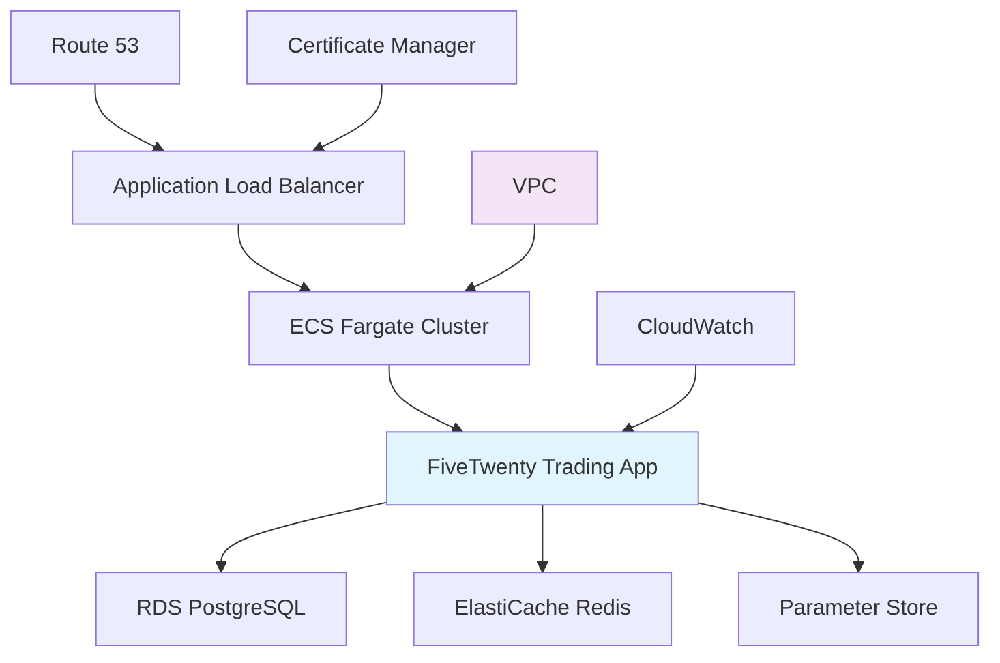

# Cloud Platform Deployment

Deploy FiveTwenty applications using cloud-native services on AWS, Google Cloud Platform, or Azure with managed infrastructure and enterprise-grade security.

## Overview

Cloud platform deployment leverages managed services for databases, monitoring, security, and scaling. This approach provides enterprise-grade infrastructure with minimal operational overhead.

**Best for**: Production trading operations, teams requiring high availability, organizations with compliance requirements, applications needing global distribution.

## AWS Deployment

### AWS Architecture Overview



### AWS Infrastructure with Terraform

```hcl
# infrastructure/aws/main.tf
terraform {
  required_providers {
    aws = {
      source  = "hashicorp/aws"
      version = "~> 5.0"
    }
  }
}

provider "aws" {
  region = var.aws_region
}

# VPC Configuration
resource "aws_vpc" "trading_vpc" {
  cidr_block           = "10.0.0.0/16"
  enable_dns_hostnames = true
  enable_dns_support   = true

  tags = {
    Name = "fivetwenty-trading-vpc"
    Environment = var.environment
  }
}

# Subnets
resource "aws_subnet" "private_subnet_1" {
  vpc_id            = aws_vpc.trading_vpc.id
  cidr_block        = "10.0.1.0/24"
  availability_zone = "${var.aws_region}a"

  tags = {
    Name = "fivetwenty-private-subnet-1"
    Environment = var.environment
  }
}

resource "aws_subnet" "private_subnet_2" {
  vpc_id            = aws_vpc.trading_vpc.id
  cidr_block        = "10.0.2.0/24"
  availability_zone = "${var.aws_region}b"

  tags = {
    Name = "fivetwenty-private-subnet-2"
    Environment = var.environment
  }
}

resource "aws_subnet" "public_subnet_1" {
  vpc_id                  = aws_vpc.trading_vpc.id
  cidr_block              = "10.0.101.0/24"
  availability_zone       = "${var.aws_region}a"
  map_public_ip_on_launch = true

  tags = {
    Name = "fivetwenty-public-subnet-1"
    Environment = var.environment
  }
}

resource "aws_subnet" "public_subnet_2" {
  vpc_id                  = aws_vpc.trading_vpc.id
  cidr_block              = "10.0.102.0/24"
  availability_zone       = "${var.aws_region}b"
  map_public_ip_on_launch = true

  tags = {
    Name = "fivetwenty-public-subnet-2"
    Environment = var.environment
  }
}

# Internet Gateway
resource "aws_internet_gateway" "trading_igw" {
  vpc_id = aws_vpc.trading_vpc.id

  tags = {
    Name = "fivetwenty-igw"
    Environment = var.environment
  }
}

# Route Tables
resource "aws_route_table" "public_rt" {
  vpc_id = aws_vpc.trading_vpc.id

  route {
    cidr_block = "0.0.0.0/0"
    gateway_id = aws_internet_gateway.trading_igw.id
  }

  tags = {
    Name = "fivetwenty-public-rt"
    Environment = var.environment
  }
}

# Security Groups
resource "aws_security_group" "trading_app_sg" {
  name        = "fivetwenty-trading-app-sg"
  description = "Security group for FiveTwenty trading application"
  vpc_id      = aws_vpc.trading_vpc.id

  ingress {
    from_port   = 8080
    to_port     = 8081
    protocol    = "tcp"
    cidr_blocks = ["10.0.0.0/16"]
  }

  egress {
    from_port   = 0
    to_port     = 0
    protocol    = "-1"
    cidr_blocks = ["0.0.0.0/0"]
  }

  tags = {
    Name = "fivetwenty-trading-app-sg"
    Environment = var.environment
  }
}

# RDS PostgreSQL Database
resource "aws_db_subnet_group" "trading_db_subnet_group" {
  name       = "fivetwenty-db-subnet-group"
  subnet_ids = [aws_subnet.private_subnet_1.id, aws_subnet.private_subnet_2.id]

  tags = {
    Name = "fivetwenty-db-subnet-group"
    Environment = var.environment
  }
}

resource "aws_security_group" "rds_sg" {
  name        = "fivetwenty-rds-sg"
  description = "Security group for RDS database"
  vpc_id      = aws_vpc.trading_vpc.id

  ingress {
    from_port       = 5432
    to_port         = 5432
    protocol        = "tcp"
    security_groups = [aws_security_group.trading_app_sg.id]
  }

  tags = {
    Name = "fivetwenty-rds-sg"
    Environment = var.environment
  }
}

resource "aws_db_instance" "trading_db" {
  identifier     = "fivetwenty-trading-db"
  engine         = "postgres"
  engine_version = "15.4"
  instance_class = "db.t3.medium"

  allocated_storage     = 100
  max_allocated_storage = 1000
  storage_type          = "gp3"
  storage_encrypted     = true

  db_name  = "trading_prod"
  username = "trading"
  password = var.db_password

  vpc_security_group_ids = [aws_security_group.rds_sg.id]
  db_subnet_group_name   = aws_db_subnet_group.trading_db_subnet_group.name

  backup_retention_period = 7
  backup_window          = "03:00-04:00"
  maintenance_window     = "sun:04:00-sun:05:00"

  deletion_protection = true
  skip_final_snapshot = false
  final_snapshot_identifier = "fivetwenty-trading-db-final-snapshot"

  tags = {
    Name = "fivetwenty-trading-db"
    Environment = var.environment
  }
}

# ElastiCache Redis Cluster
resource "aws_elasticache_subnet_group" "trading_cache_subnet_group" {
  name       = "fivetwenty-cache-subnet-group"
  subnet_ids = [aws_subnet.private_subnet_1.id, aws_subnet.private_subnet_2.id]
}

resource "aws_security_group" "redis_sg" {
  name        = "fivetwenty-redis-sg"
  description = "Security group for Redis cache"
  vpc_id      = aws_vpc.trading_vpc.id

  ingress {
    from_port       = 6379
    to_port         = 6379
    protocol        = "tcp"
    security_groups = [aws_security_group.trading_app_sg.id]
  }

  tags = {
    Name = "fivetwenty-redis-sg"
    Environment = var.environment
  }
}

resource "aws_elasticache_replication_group" "trading_redis" {
  replication_group_id       = "fivetwenty-redis"
  description                = "Redis cluster for FiveTwenty trading system"

  node_type                  = "cache.t3.medium"
  port                       = 6379
  parameter_group_name       = "default.redis7"

  num_cache_clusters         = 2
  automatic_failover_enabled = true
  multi_az_enabled          = true

  subnet_group_name = aws_elasticache_subnet_group.trading_cache_subnet_group.name
  security_group_ids = [aws_security_group.redis_sg.id]

  at_rest_encryption_enabled = true
  transit_encryption_enabled = true
  auth_token                 = var.redis_auth_token

  tags = {
    Name = "fivetwenty-redis"
    Environment = var.environment
  }
}

# Application Load Balancer
resource "aws_lb" "trading_alb" {
  name               = "fivetwenty-trading-alb"
  internal           = false
  load_balancer_type = "application"
  security_groups    = [aws_security_group.alb_sg.id]
  subnets           = [aws_subnet.public_subnet_1.id, aws_subnet.public_subnet_2.id]

  enable_deletion_protection = true

  tags = {
    Name = "fivetwenty-trading-alb"
    Environment = var.environment
  }
}

resource "aws_security_group" "alb_sg" {
  name        = "fivetwenty-alb-sg"
  description = "Security group for Application Load Balancer"
  vpc_id      = aws_vpc.trading_vpc.id

  ingress {
    from_port   = 80
    to_port     = 80
    protocol    = "tcp"
    cidr_blocks = ["0.0.0.0/0"]
  }

  ingress {
    from_port   = 443
    to_port     = 443
    protocol    = "tcp"
    cidr_blocks = ["0.0.0.0/0"]
  }

  egress {
    from_port   = 0
    to_port     = 0
    protocol    = "-1"
    cidr_blocks = ["0.0.0.0/0"]
  }

  tags = {
    Name = "fivetwenty-alb-sg"
    Environment = var.environment
  }
}

# ECS Cluster
resource "aws_ecs_cluster" "trading_cluster" {
  name = "fivetwenty-trading-cluster"

  setting {
    name  = "containerInsights"
    value = "enabled"
  }

  tags = {
    Name = "fivetwenty-trading-cluster"
    Environment = var.environment
  }
}

# Variables
variable "aws_region" {
  description = "AWS region"
  type        = string
  default     = "us-east-1"
}

variable "environment" {
  description = "Environment name"
  type        = string
  default     = "production"
}

variable "db_password" {
  description = "Database password"
  type        = string
  sensitive   = true
}

variable "redis_auth_token" {
  description = "Redis authentication token"
  type        = string
  sensitive   = true
}
```

### ECS Task Definition

```json
{
  "family": "fivetwenty-trading-app",
  "networkMode": "awsvpc",
  "requiresCompatibilities": ["FARGATE"],
  "cpu": "1024",
  "memory": "2048",
  "executionRoleArn": "arn:aws:iam::123456789012:role/ecsTaskExecutionRole",
  "taskRoleArn": "arn:aws:iam::123456789012:role/fivetwenty-trading-task-role",
  "containerDefinitions": [
    {
      "name": "fivetwenty-trading-app",
      "image": "123456789012.dkr.ecr.us-east-1.amazonaws.com/fivetwenty-trading:latest",
      "essential": true,
      "portMappings": [
        {
          "containerPort": 8080,
          "protocol": "tcp"
        },
        {
          "containerPort": 8081,
          "protocol": "tcp"
        }
      ],
      "environment": [
        {
          "name": "FIVETWENTY_OANDA_ENVIRONMENT",
          "value": "LIVE"
        },
        {
          "name": "LOG_LEVEL",
          "value": "INFO"
        }
      ],
      "secrets": [
        {
          "name": "FIVETWENTY_LIVE_TOKEN",
          "valueFrom": "arn:aws:ssm:us-east-1:123456789012:parameter/fivetwenty/live_token"
        },
        {
          "name": "FIVETWENTY_OANDA_ACCOUNT",
          "valueFrom": "arn:aws:ssm:us-east-1:123456789012:parameter/fivetwenty/account_id"
        },
        {
          "name": "DATABASE_URL",
          "valueFrom": "arn:aws:ssm:us-east-1:123456789012:parameter/fivetwenty/database_url"
        }
      ],
      "logConfiguration": {
        "logDriver": "awslogs",
        "options": {
          "awslogs-group": "/ecs/fivetwenty-trading-app",
          "awslogs-region": "us-east-1",
          "awslogs-stream-prefix": "ecs"
        }
      },
      "healthCheck": {
        "command": [
          "CMD-SHELL",
          "curl -f http://localhost:8081/health || exit 1"
        ],
        "interval": 30,
        "timeout": 5,
        "retries": 3,
        "startPeriod": 60
      }
    }
  ]
}
```

### ECS Service Configuration

```json
{
  "serviceName": "fivetwenty-trading-service",
  "cluster": "fivetwenty-trading-cluster",
  "taskDefinition": "fivetwenty-trading-app:1",
  "desiredCount": 2,
  "launchType": "FARGATE",
  "networkConfiguration": {
    "awsvpcConfiguration": {
      "subnets": [
        "subnet-12345678",
        "subnet-87654321"
      ],
      "securityGroups": [
        "sg-12345678"
      ],
      "assignPublicIp": "DISABLED"
    }
  },
  "loadBalancers": [
    {
      "targetGroupArn": "arn:aws:elasticloadbalancing:us-east-1:123456789012:targetgroup/fivetwenty-tg/1234567890123456",
      "containerName": "fivetwenty-trading-app",
      "containerPort": 8080
    }
  ],
  "healthCheckGracePeriodSeconds": 300,
  "deploymentConfiguration": {
    "maximumPercent": 200,
    "minimumHealthyPercent": 50,
    "deploymentCircuitBreaker": {
      "enable": true,
      "rollback": true
    }
  },
  "enableExecuteCommand": true
}
```

## Google Cloud Platform Deployment

### GCP Architecture Overview

```yaml
# gcp/cloudbuild.yaml
steps:
  # Build container image
  - name: 'gcr.io/cloud-builders/docker'
    args: ['build', '-t', 'gcr.io/$PROJECT_ID/fivetwenty-trading:$BUILD_ID', '.']

  # Push container image
  - name: 'gcr.io/cloud-builders/docker'
    args: ['push', 'gcr.io/$PROJECT_ID/fivetwenty-trading:$BUILD_ID']

  # Deploy to Cloud Run
  - name: 'gcr.io/google.com/cloudsdktool/cloud-sdk'
    entrypoint: gcloud
    args:
      - 'run'
      - 'deploy'
      - 'fivetwenty-trading'
      - '--image'
      - 'gcr.io/$PROJECT_ID/fivetwenty-trading:$BUILD_ID'
      - '--region'
      - 'us-central1'
      - '--platform'
      - 'managed'
      - '--allow-unauthenticated'
      - '--set-env-vars'
      - 'FIVETWENTY_OANDA_ENVIRONMENT=LIVE'
      - '--cpu'
      - '2'
      - '--memory'
      - '2Gi'
      - '--timeout'
      - '3600'
      - '--max-instances'
      - '5'

images:
  - 'gcr.io/$PROJECT_ID/fivetwenty-trading:$BUILD_ID'
```

### GCP Terraform Configuration

```hcl
# gcp/main.tf
terraform {
  required_providers {
    google = {
      source  = "hashicorp/google"
      version = "~> 4.0"
    }
  }
}

provider "google" {
  project = var.project_id
  region  = var.region
}

# Cloud SQL PostgreSQL Instance
resource "google_sql_database_instance" "trading_db" {
  name             = "fivetwenty-trading-db"
  database_version = "POSTGRES_15"
  region           = var.region

  settings {
    tier = "db-custom-2-8192"

    backup_configuration {
      enabled                        = true
      start_time                     = "03:00"
      point_in_time_recovery_enabled = true
      transaction_log_retention_days = 7
    }

    ip_configuration {
      ipv4_enabled    = false
      private_network = google_compute_network.trading_network.id
    }

    database_flags {
      name  = "log_checkpoints"
      value = "on"
    }

    database_flags {
      name  = "log_connections"
      value = "on"
    }
  }

  deletion_protection = true
}

resource "google_sql_database" "trading_database" {
  name     = "trading_prod"
  instance = google_sql_database_instance.trading_db.name
}

resource "google_sql_user" "trading_user" {
  name     = "trading"
  instance = google_sql_database_instance.trading_db.name
  password = var.db_password
}

# Memorystore Redis Instance
resource "google_redis_instance" "trading_cache" {
  name           = "fivetwenty-trading-cache"
  tier           = "STANDARD_HA"
  memory_size_gb = 4
  region         = var.region

  auth_enabled = true
  redis_version = "REDIS_7_0"

  authorized_network = google_compute_network.trading_network.id

  redis_configs = {
    maxmemory-policy = "allkeys-lru"
  }
}

# VPC Network
resource "google_compute_network" "trading_network" {
  name                    = "fivetwenty-trading-network"
  auto_create_subnetworks = false
}

resource "google_compute_subnetwork" "trading_subnet" {
  name          = "fivetwenty-trading-subnet"
  ip_cidr_range = "10.1.0.0/16"
  region        = var.region
  network       = google_compute_network.trading_network.id

  private_ip_google_access = true
}

# Cloud Run Service
resource "google_cloud_run_service" "trading_service" {
  name     = "fivetwenty-trading-service"
  location = var.region

  template {
    spec {
      containers {
        image = "gcr.io/${var.project_id}/fivetwenty-trading:latest"

        env {
          name  = "FIVETWENTY_OANDA_ENVIRONMENT"
          value = "LIVE"
        }

        env {
          name = "FIVETWENTY_LIVE_TOKEN"
          value_from {
            secret_key_ref {
              name = google_secret_manager_secret.live_token.secret_id
              key  = "latest"
            }
          }
        }

        env {
          name = "DATABASE_URL"
          value = "postgresql://trading:${var.db_password}@${google_sql_database_instance.trading_db.private_ip_address}:5432/trading_prod"
        }

        resources {
          limits = {
            cpu    = "2000m"
            memory = "2Gi"
          }
        }

        ports {
          container_port = 8080
        }
      }
    }

    metadata {
      annotations = {
        "autoscaling.knative.dev/maxScale" = "5"
        "run.googleapis.com/cpu-throttling" = "false"
        "run.googleapis.com/execution-environment" = "gen2"
      }
    }
  }

  traffic {
    percent         = 100
    latest_revision = true
  }
}

# Secret Manager
resource "google_secret_manager_secret" "live_token" {
  secret_id = "fivetwenty-live-token"

  replication {
    automatic = true
  }
}

resource "google_secret_manager_secret_version" "live_token_version" {
  secret      = google_secret_manager_secret.live_token.id
  secret_data = var.fivetwenty_live_token
}

# Variables
variable "project_id" {
  description = "GCP project ID"
  type        = string
}

variable "region" {
  description = "GCP region"
  type        = string
  default     = "us-central1"
}

variable "db_password" {
  description = "Database password"
  type        = string
  sensitive   = true
}

variable "fivetwenty_live_token" {
  description = "FiveTwenty live API token"
  type        = string
  sensitive   = true
}
```

## Azure Deployment

### Azure Resource Manager Template

```json
{
  "$schema": "https://schema.management.azure.com/schemas/2019-04-01/deploymentTemplate.json#",
  "contentVersion": "1.0.0.0",
  "parameters": {
    "appName": {
      "type": "string",
      "defaultValue": "fivetwenty-trading"
    },
    "environment": {
      "type": "string",
      "defaultValue": "production"
    },
    "dbAdminPassword": {
      "type": "securestring"
    }
  },
  "variables": {
    "location": "[resourceGroup().location]",
    "containerGroupName": "[concat(parameters('appName'), '-container-group')]",
    "postgreSQLServerName": "[concat(parameters('appName'), '-db-server')]",
    "keyVaultName": "[concat(parameters('appName'), '-keyvault')]"
  },
  "resources": [
    {
      "type": "Microsoft.DBforPostgreSQL/flexibleServers",
      "apiVersion": "2021-06-01",
      "name": "[variables('postgreSQLServerName')]",
      "location": "[variables('location')]",
      "sku": {
        "name": "Standard_D2s_v3",
        "tier": "GeneralPurpose"
      },
      "properties": {
        "administratorLogin": "trading",
        "administratorLoginPassword": "[parameters('dbAdminPassword')]",
        "version": "15",
        "storage": {
          "storageSizeGB": 128
        },
        "backup": {
          "backupRetentionDays": 7,
          "geoRedundantBackup": "Enabled"
        },
        "highAvailability": {
          "mode": "ZoneRedundant"
        }
      }
    },
    {
      "type": "Microsoft.Cache/Redis",
      "apiVersion": "2021-06-01",
      "name": "[concat(parameters('appName'), '-redis')]",
      "location": "[variables('location')]",
      "properties": {
        "sku": {
          "name": "Premium",
          "family": "P",
          "capacity": 1
        },
        "redisConfiguration": {
          "maxmemory-policy": "allkeys-lru"
        },
        "enableNonSslPort": false,
        "redisVersion": "6"
      }
    },
    {
      "type": "Microsoft.KeyVault/vaults",
      "apiVersion": "2021-06-01-preview",
      "name": "[variables('keyVaultName')]",
      "location": "[variables('location')]",
      "properties": {
        "sku": {
          "family": "A",
          "name": "standard"
        },
        "tenantId": "[subscription().tenantId]",
        "accessPolicies": [],
        "enabledForDeployment": false,
        "enabledForDiskEncryption": false,
        "enabledForTemplateDeployment": true
      }
    },
    {
      "type": "Microsoft.ContainerInstance/containerGroups",
      "apiVersion": "2021-03-01",
      "name": "[variables('containerGroupName')]",
      "location": "[variables('location')]",
      "dependsOn": [
        "[resourceId('Microsoft.DBforPostgreSQL/flexibleServers', variables('postgreSQLServerName'))]",
        "[resourceId('Microsoft.Cache/Redis', concat(parameters('appName'), '-redis'))]"
      ],
      "properties": {
        "containers": [
          {
            "name": "fivetwenty-trading-app",
            "properties": {
              "image": "your-registry.azurecr.io/fivetwenty-trading:latest",
              "resources": {
                "requests": {
                  "cpu": 2,
                  "memoryInGB": 4
                }
              },
              "ports": [
                {
                  "port": 8080,
                  "protocol": "TCP"
                },
                {
                  "port": 8081,
                  "protocol": "TCP"
                }
              ],
              "environmentVariables": [
                {
                  "name": "FIVETWENTY_OANDA_ENVIRONMENT",
                  "value": "LIVE"
                }
              ],
              "volumeMounts": [
                {
                  "name": "logs",
                  "mountPath": "/app/logs"
                }
              ]
            }
          }
        ],
        "osType": "Linux",
        "restartPolicy": "Always",
        "ipAddress": {
          "type": "Public",
          "ports": [
            {
              "protocol": "TCP",
              "port": 8080
            },
            {
              "protocol": "TCP",
              "port": 8081
            }
          ]
        },
        "volumes": [
          {
            "name": "logs",
            "azureFile": {
              "shareName": "logs",
              "storageAccountName": "[concat(parameters('appName'), 'storage')]",
              "storageAccountKey": "[listKeys(resourceId('Microsoft.Storage/storageAccounts', concat(parameters('appName'), 'storage')), '2021-04-01').keys[0].value]"
            }
          }
        ]
      }
    }
  ],
  "outputs": {
    "databaseFQDN": {
      "type": "string",
      "value": "[reference(resourceId('Microsoft.DBforPostgreSQL/flexibleServers', variables('postgreSQLServerName'))).fullyQualifiedDomainName]"
    },
    "containerGroupIP": {
      "type": "string",
      "value": "[reference(resourceId('Microsoft.ContainerInstance/containerGroups', variables('containerGroupName'))).ipAddress.ip]"
    }
  }
}
```

## Cloud-Native Application Configuration

### Cloud-Optimized Application Code

```python
# src/cloud_app.py
import asyncio
import logging
import os
from typing import Optional

import aiohttp
import boto3
from azure.identity import DefaultAzureCredential
from azure.keyvault.secrets import SecretClient
from google.cloud import secretmanager

from fivetwenty import AsyncClient, Environment


class CloudSecretsManager:
    """Multi-cloud secrets management."""

    def __init__(self, cloud_provider: str):
        self.cloud_provider = cloud_provider.lower()
        self.client = None

        if self.cloud_provider == "aws":
            self.client = boto3.client('secretsmanager')
        elif self.cloud_provider == "gcp":
            self.client = secretmanager.SecretManagerServiceClient()
        elif self.cloud_provider == "azure":
            credential = DefaultAzureCredential()
            vault_url = os.getenv('AZURE_KEY_VAULT_URL')
            self.client = SecretClient(vault_url=vault_url, credential=credential)

    async def get_secret(self, secret_name: str) -> Optional[str]:
        """Retrieve secret from cloud provider."""

        try:
            if self.cloud_provider == "aws":
                response = self.client.get_secret_value(SecretId=secret_name)
                return response['SecretString']

            elif self.cloud_provider == "gcp":
                project_id = os.getenv('GOOGLE_CLOUD_PROJECT')
                name = f"projects/{project_id}/secrets/{secret_name}/versions/latest"
                response = self.client.access_secret_version(request={"name": name})
                return response.payload.data.decode("UTF-8")

            elif self.cloud_provider == "azure":
                secret = self.client.get_secret(secret_name)
                return secret.value

        except Exception as e:
            logging.error(f"Failed to retrieve secret {secret_name}: {e}")
            return None

class CloudTradingApplication:
    """Cloud-native FiveTwenty trading application."""

    def __init__(self):
        self.cloud_provider = os.getenv('CLOUD_PROVIDER', 'aws').lower()
        self.secrets_manager = CloudSecretsManager(self.cloud_provider)
        self.client: Optional[AsyncClient] = None
        self.running = False

    async def initialize(self):
        """Initialize cloud application."""

        # Get secrets from cloud provider
        live_token = await self.secrets_manager.get_secret('fivetwenty-live-token')
        account_id = await self.secrets_manager.get_secret('fivetwenty-account-id')

        if not live_token or not account_id:
            raise ValueError("Failed to retrieve required secrets")

        # Initialize FiveTwenty client
        self.client = AsyncClient(
            token=live_token,
            environment=Environment.LIVE,
            timeout=30.0
        )

        await self.client.__aenter__()

        # Validate connection
        account = await self.client.accounts.get_account(account_id=account_id)
        logging.info(f"Connected to account: {account_id}")
        logging.info(f"Account balance: {account.balance}")

    async def start_health_server(self):
        """Start health check server for cloud load balancers."""

        app = aiohttp.web.Application()
        app.router.add_get('/health', self.health_check)
        app.router.add_get('/ready', self.readiness_check)

        runner = aiohttp.web.AppRunner(app)
        await runner.setup()

        port = int(os.getenv('HEALTH_PORT', '8081'))
        site = aiohttp.web.TCPSite(runner, '0.0.0.0', port)
        await site.start()

        logging.info(f"Health server started on port {port}")

    async def health_check(self, request):
        """Health check endpoint."""

        if self.client and self.running:
            return aiohttp.web.json_response({"status": "healthy"})
        else:
            return aiohttp.web.json_response(
                {"status": "unhealthy"},
                status=503
            )

    async def readiness_check(self, request):
        """Readiness check endpoint."""

        if self.client:
            return aiohttp.web.json_response({"status": "ready"})
        else:
            return aiohttp.web.json_response(
                {"status": "not ready"},
                status=503
            )

    async def run(self):
        """Main application loop."""

        self.running = True

        try:
            await self.initialize()
            await self.start_health_server()

            while self.running:
                # Your trading logic here
                await asyncio.sleep(1)

        except Exception as e:
            logging.error(f"Application error: {e}")
            raise
        finally:
            if self.client:
                await self.client.__aexit__(None, None, None)

# Entry point
async def main():
    """Cloud application entry point."""

    # Configure cloud logging
    if os.getenv('CLOUD_PROVIDER') == 'gcp':
        import google.cloud.logging
        client = google.cloud.logging.Client()
        client.setup_logging()

    app = CloudTradingApplication()
    await app.run()

if __name__ == "__main__":
    asyncio.run(main())
```

## Deployment Automation

### GitHub Actions for Multi-Cloud Deployment

```yaml
# .github/workflows/deploy.yml
name: Deploy to Cloud

on:
  push:
    branches: [main]
  workflow_dispatch:
    inputs:
      cloud_provider:
        description: 'Cloud Provider (aws/gcp/azure)'
        required: true
        default: 'aws'
        type: choice
        options:
        - aws
        - gcp
        - azure

env:
  REGISTRY: ghcr.io
  IMAGE_NAME: ${{ github.repository }}

jobs:
  build:
    runs-on: ubuntu-latest
    outputs:
      image: ${{ steps.image.outputs.image }}
    steps:
    - name: Checkout
      uses: actions/checkout@v4

    - name: Log in to Container Registry
      uses: docker/login-action@v3
      with:
        registry: ${{ env.REGISTRY }}
        username: ${{ github.actor }}
        password: ${{ secrets.GITHUB_TOKEN }}

    - name: Extract metadata
      id: meta
      uses: docker/metadata-action@v5
      with:
        images: ${{ env.REGISTRY }}/${{ env.IMAGE_NAME }}

    - name: Build and push
      uses: docker/build-push-action@v5
      with:
        context: .
        push: true
        tags: ${{ steps.meta.outputs.tags }}
        labels: ${{ steps.meta.outputs.labels }}

    - name: Output image
      id: image
      run: echo "image=${{ env.REGISTRY }}/${{ env.IMAGE_NAME }}:${{ github.sha }}" >> $GITHUB_OUTPUT

  deploy-aws:
    if: github.event.inputs.cloud_provider == 'aws' || github.event.inputs.cloud_provider == ''
    needs: build
    runs-on: ubuntu-latest
    steps:
    - name: Configure AWS credentials
      uses: aws-actions/configure-aws-credentials@v4
      with:
        aws-access-key-id: ${{ secrets.AWS_ACCESS_KEY_ID }}
        aws-secret-access-key: ${{ secrets.AWS_SECRET_ACCESS_KEY }}
        aws-region: us-east-1

    - name: Update ECS service
      run: |
        aws ecs update-service \
          --cluster fivetwenty-trading-cluster \
          --service fivetwenty-trading-service \
          --force-new-deployment

  deploy-gcp:
    if: github.event.inputs.cloud_provider == 'gcp'
    needs: build
    runs-on: ubuntu-latest
    steps:
    - name: Authenticate to Google Cloud
      uses: google-github-actions/auth@v2
      with:
        credentials_json: ${{ secrets.GCP_SA_KEY }}

    - name: Set up Cloud SDK
      uses: google-github-actions/setup-gcloud@v2

    - name: Deploy to Cloud Run
      run: |
        gcloud run deploy fivetwenty-trading \
          --image ${{ needs.build.outputs.image }} \
          --region us-central1 \
          --platform managed

  deploy-azure:
    if: github.event.inputs.cloud_provider == 'azure'
    needs: build
    runs-on: ubuntu-latest
    steps:
    - name: Login to Azure
      uses: azure/login@v1
      with:
        creds: ${{ secrets.AZURE_CREDENTIALS }}

    - name: Deploy to Container Instances
      uses: azure/aci-deploy@v1
      with:
        resource-group: fivetwenty-trading-rg
        dns-name-label: fivetwenty-trading-${{ github.run_number }}
        image: ${{ needs.build.outputs.image }}
        registry-login-server: ${{ env.REGISTRY }}
        registry-username: ${{ github.actor }}
        registry-password: ${{ secrets.GITHUB_TOKEN }}
        name: fivetwenty-trading-container
        location: 'east us'
```

## Monitoring and Observability

### Cloud-Native Monitoring Stack

```yaml
# monitoring/cloud-monitoring.yml
apiVersion: v1
kind: ConfigMap
metadata:
  name: prometheus-config
data:
  prometheus.yml: |
    global:
      scrape_interval: 15s
    scrape_configs:
      - job_name: 'fivetwenty-trading'
        kubernetes_sd_configs:
          - role: pod
        relabel_configs:
          - source_labels: [__meta_kubernetes_pod_label_app]
            action: keep
            regex: fivetwenty-trading
          - source_labels: [__meta_kubernetes_pod_annotation_prometheus_io_scrape]
            action: keep
            regex: true
          - source_labels: [__meta_kubernetes_pod_annotation_prometheus_io_path]
            action: replace
            target_label: __metrics_path__
            regex: (.+)

---
apiVersion: apps/v1
kind: Deployment
metadata:
  name: prometheus
spec:
  replicas: 1
  selector:
    matchLabels:
      app: prometheus
  template:
    metadata:
      labels:
        app: prometheus
    spec:
      containers:
      - name: prometheus
        image: prom/prometheus:latest
        ports:
        - containerPort: 9090
        volumeMounts:
        - name: config
          mountPath: /etc/prometheus
      volumes:
      - name: config
        configMap:
          name: prometheus-config
```

Cloud platform deployment provides enterprise-grade infrastructure with managed services, automatic scaling, and comprehensive security features for production FiveTwenty trading applications.