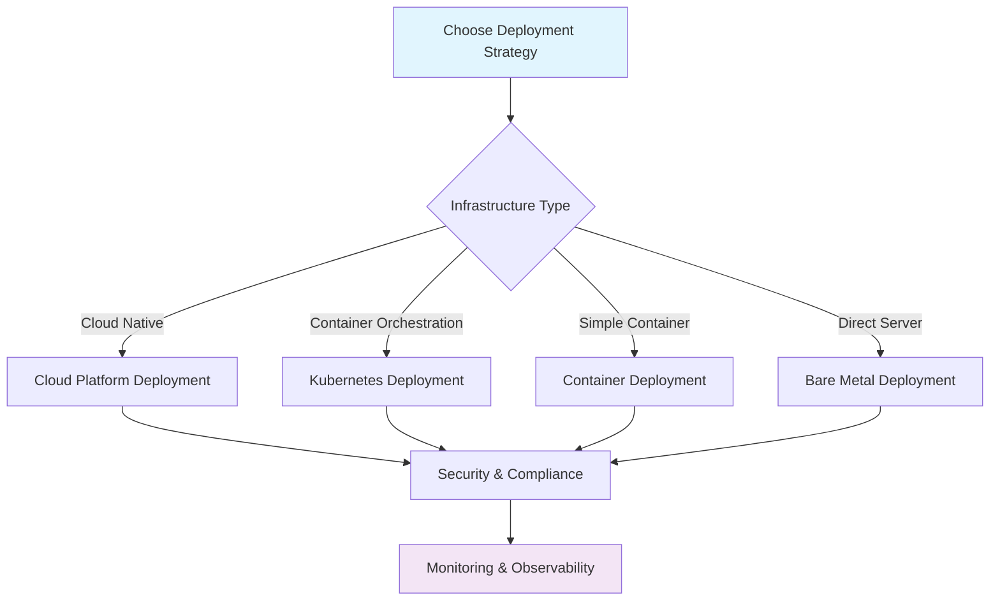

# Production Deployment Guide Series

Deploy FiveTwenty applications to production with proper security, monitoring, and reliability across different environments and platforms.

## Series Overview

This guide series covers complete production deployment strategies for FiveTwenty trading applications, from containerized deployments to cloud-native architectures. Each guide focuses on specific deployment environments and platforms.

### What You'll Learn

- **Environment Setup**: Secure configuration management and environment variables
- **Container Deployment**: Docker and container orchestration strategies
- **Cloud Platforms**: AWS, GCP, Azure, and hybrid deployments
- **Security Best Practices**: Secrets management, SSL, and network security
- **Monitoring & Observability**: Comprehensive monitoring, alerting, and logging
- **Disaster Recovery**: Backup strategies and failover procedures

### Deployment Options

Choose the deployment approach that best fits your infrastructure and requirements:

1. **[Container Deployment](container-deployment.md)** - Docker containers with monitoring
2. **[Cloud Platform Deployment](cloud-deployment.md)** - AWS, GCP, Azure native services
3. **[Kubernetes Deployment](kubernetes-deployment.md)** - Container orchestration and scaling
4. **[Bare Metal Deployment](bare-metal-deployment.md)** - Direct server deployment
5. **[Security & Compliance](security-compliance.md)** - Enterprise security requirements
6. **[Monitoring & Observability](monitoring-observability.md)** - Production monitoring setup

### Prerequisites

Before proceeding with any deployment guide:

- Working FiveTwenty application tested in practice environment
- Live OANDA trading account with API access
- Production server infrastructure (cloud or on-premises)
- Understanding of containerization and deployment concepts
- SSL certificates and domain setup (if applicable)

### Deployment Strategy Selection

### Common Components

All deployment approaches share these essential components:

#### Configuration Management
- Secure environment variable handling
- Secrets management and rotation
- Configuration validation and testing

#### Security Framework
- SSL/TLS encryption for all communications
- API token security and rotation
- Network security and firewall rules
- Audit logging and compliance

#### Monitoring Stack
- Real-time application metrics
- Infrastructure monitoring
- Alert management and notification
- Performance optimization

#### Risk Management
- Automated risk controls and limits
- Emergency stop procedures
- Position and exposure monitoring
- Compliance and audit trails

## Getting Started

1. **Assessment**: Evaluate your infrastructure requirements and constraints
2. **Environment Selection**: Choose the deployment guide that matches your setup
3. **Security Planning**: Review security requirements and compliance needs
4. **Implementation**: Follow the step-by-step deployment guide
5. **Testing**: Validate deployment with comprehensive testing
6. **Monitoring**: Implement full observability and alerting

### Critical Production Considerations

⚠️ **Important Reminders**:

- **Real Money Trading**: Production systems trade with real funds - validate all safety measures
- **Risk Management**: Ensure appropriate position limits and risk controls
- **Emergency Procedures**: Test emergency stop and disaster recovery procedures
- **Compliance**: Meet all regulatory and organizational security requirements
- **Monitoring**: Implement comprehensive monitoring and alerting before going live

### Support and Troubleshooting

Each deployment guide includes:

- **Troubleshooting sections** for common deployment issues
- **Performance optimization** recommendations
- **Scaling strategies** for growing trading operations
- **Maintenance procedures** for ongoing operations

## Deployment Comparison

| Approach | Complexity | Scalability | Maintenance | Best For |
|----------|------------|-------------|-------------|----------|
| **Container** | Low | Medium | Low | Small to medium deployments |
| **Cloud Platform** | Medium | High | Medium | Cloud-native applications |
| **Kubernetes** | High | Very High | High | Enterprise scalable systems |
| **Bare Metal** | Medium | Low | High | High-performance requirements |

Choose your deployment approach and follow the corresponding guide for detailed implementation instructions.