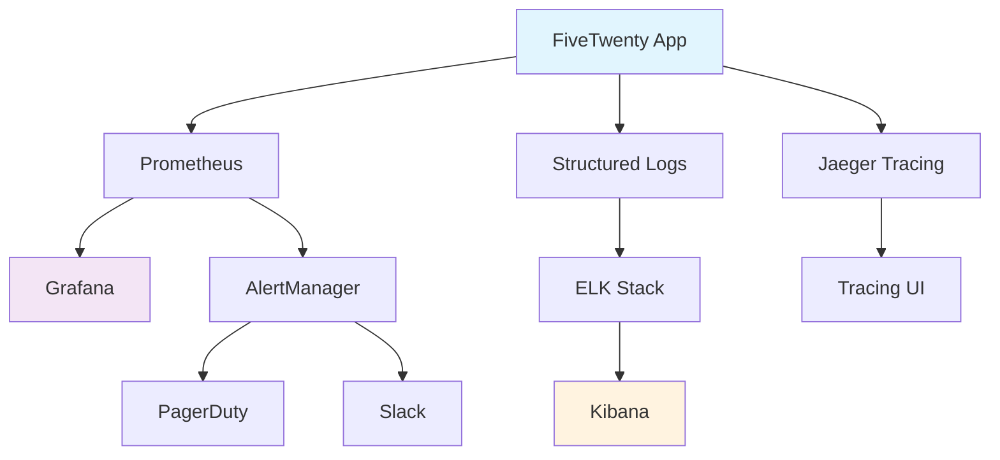

# Monitoring & Observability

Implement comprehensive monitoring, alerting, and observability for FiveTwenty trading applications with real-time insights and proactive issue detection.

## Overview

Monitoring and observability are crucial for maintaining reliable trading operations. This guide covers metrics collection, distributed tracing, log aggregation, alerting, and performance optimization for production FiveTwenty applications.

**Best for**: Production trading operations, performance optimization, operational teams, troubleshooting and debugging, capacity planning and scaling.

## Monitoring Architecture



## Application Metrics

### Custom Metrics Implementation

```python
import functools
import sys
import time
from decimal import Decimal

from prometheus_client import Counter, Gauge, Histogram, Info

# Business Metrics
TRADES_TOTAL = Counter(
    "fivetwenty_trades_total",
    "Total number of trades executed",
    ["instrument", "direction", "status"],
)

TRADE_VOLUME = Histogram(
    "fivetwenty_trade_volume",
    "Trade volume distribution",
    ["instrument", "direction"],
    buckets=[100, 500, 1000, 5000, 10000, 50000, 100000, 500000, 1000000],
)

ACCOUNT_BALANCE = Gauge(
    "fivetwenty_account_balance",
    "Current account balance",
    ["account_id", "currency"],
)

UNREALIZED_PL = Gauge(
    "fivetwenty_unrealized_pl",
    "Unrealized profit/loss",
    ["account_id", "instrument"],
)

ACTIVE_POSITIONS = Gauge(
    "fivetwenty_active_positions",
    "Number of active positions",
    ["account_id", "instrument"],
)

# Technical Metrics
API_REQUEST_DURATION = Histogram(
    "fivetwenty_api_request_duration_seconds",
    "Time spent on API requests",
    ["endpoint", "method", "status"],
    buckets=[0.001, 0.005, 0.01, 0.025, 0.05, 0.1, 0.25, 0.5, 1.0, 2.5, 5.0, 10.0],
)

API_REQUESTS_TOTAL = Counter(
    "fivetwenty_api_requests_total",
    "Total API requests",
    ["endpoint", "method", "status"],
)

CONNECTION_POOL_SIZE = Gauge(
    "fivetwenty_connection_pool_size",
    "Current connection pool size",
    ["pool_type"],
)

STREAMING_LATENCY = Histogram(
    "fivetwenty_streaming_latency_seconds",
    "Streaming data latency",
    ["stream_type"],
    buckets=[0.001, 0.005, 0.01, 0.025, 0.05, 0.1, 0.25, 0.5, 1.0],
)

# System Metrics
SYSTEM_INFO = Info(
    "fivetwenty_system_info",
    "System information",
)

ERROR_RATE = Counter(
    "fivetwenty_errors_total",
    "Total number of errors",
    ["error_type", "component"],
)

CIRCUIT_BREAKER_STATE = Gauge(
    "fivetwenty_circuit_breaker_state",
    "Circuit breaker state (0=closed, 1=open, 2=half-open)",
    ["circuit_name"],
)

class MetricsCollector:
    """Comprehensive metrics collection for FiveTwenty applications."""

    def __init__(self, app_name: str, version: str):
        self.app_name = app_name
        self.version = version

        # Set system information
        SYSTEM_INFO.info({
            "app_name": app_name,
            "version": version,
            "python_version": f"{sys.version_info.major}.{sys.version_info.minor}.{sys.version_info.micro}",
        })

    def track_trade(self, instrument: str, direction: str, volume: Decimal, status: str):
        """Track trade execution metrics."""
        TRADES_TOTAL.labels(
            instrument=instrument,
            direction=direction,
            status=status
        ).inc()

        TRADE_VOLUME.labels(
            instrument=instrument,
            direction=direction
        ).observe(abs(volume))

    def update_account_metrics(self, account_id: str, balance: Decimal, currency: str):
        """Update account-related metrics."""
        ACCOUNT_BALANCE.labels(
            account_id=account_id,
            currency=currency
        ).set(balance)

    def update_position_metrics(self, account_id: str, positions: list):
        """Update position-related metrics."""
        # Reset position gauges
        ACTIVE_POSITIONS.clear()
        UNREALIZED_PL.clear()

        for position in positions:
            instrument = position.instrument
            units = float(Decimal(str(position.long.units or "0"))) + float(Decimal(str(position.short.units or "0")))
            unrealized_pl = float(Decimal(str(position.unrealized_pl or "0")))

            if units != 0:
                ACTIVE_POSITIONS.labels(
                    account_id=account_id,
                    instrument=instrument
                ).set(abs(units))

                UNREALIZED_PL.labels(
                    account_id=account_id,
                    instrument=instrument
                ).set(unrealized_pl)

    def track_api_request(self, endpoint: str, method: str, status: str, duration: float):
        """Track API request metrics."""
        API_REQUESTS_TOTAL.labels(
            endpoint=endpoint,
            method=method,
            status=status
        ).inc()

        API_REQUEST_DURATION.labels(
            endpoint=endpoint,
            method=method,
            status=status
        ).observe(duration)

    def track_streaming_latency(self, stream_type: str, latency: float):
        """Track streaming data latency."""
        STREAMING_LATENCY.labels(stream_type=stream_type).observe(latency)

    def track_error(self, error_type: str, component: str):
        """Track application errors."""
        ERROR_RATE.labels(
            error_type=error_type,
            component=component,
        ).inc()

    def update_connection_pool_size(self, pool_type: str, size: int):
        """Update connection pool size metrics."""
        CONNECTION_POOL_SIZE.labels(pool_type=pool_type).set(size)

    def update_circuit_breaker_state(self, circuit_name: str, state: str):
        """Update circuit breaker state."""
        state_mapping = {"closed": 0, "open": 1, "half-open": 2}
        CIRCUIT_BREAKER_STATE.labels(circuit_name=circuit_name).set(
            state_mapping.get(state, 0)
        )

def metrics_middleware(metrics_collector: MetricsCollector):
    """Middleware to automatically track API metrics."""

    def decorator(func):
        @functools.wraps(func)
        async def wrapper(*args, **kwargs):
            start_time = time.time()
            endpoint = func.__name__
            method = "ASYNC"
            status = "success"

            try:
                result = await func(*args, **kwargs)
                return result
            except Exception as e:
                status = "error"
                metrics_collector.track_error(
                    error_type=type(e).__name__,
                    component=endpoint
                )
                raise
            finally:
                duration = time.time() - start_time
                metrics_collector.track_api_request(endpoint, method, status, duration)

        return wrapper
    return decorator
```

### Advanced Performance Monitoring

```python
# monitoring/performance.py
import asyncio
import psutil
import gc
from datetime import datetime, timedelta
from typing import Dict, List
import aiohttp
from dataclasses import dataclass

@dataclass
class PerformanceMetrics:
    timestamp: datetime
    cpu_usage: float
    memory_usage: float
    memory_available: float
    disk_usage: float
    network_io: Dict[str, int]
    gc_stats: Dict[str, int]
    active_connections: int
    response_times: List[float]

class PerformanceMonitor:
    """Advanced performance monitoring for trading applications."""

    def __init__(self, metrics_collector: MetricsCollector):
        self.metrics = metrics_collector
        self.performance_history = []
        self.max_history_size = 1000
        self.monitoring_active = False

    async def start_monitoring(self, interval_seconds: int = 30):
        """Start continuous performance monitoring."""
        self.monitoring_active = True

        while self.monitoring_active:
            try:
                await self._collect_performance_metrics()
                await asyncio.sleep(interval_seconds)
            except Exception as e:
                print(f"Performance monitoring error: {e}")
                await asyncio.sleep(interval_seconds)

    async def _collect_performance_metrics(self):
        """Collect comprehensive performance metrics."""

        # CPU metrics
        cpu_usage = psutil.cpu_percent(interval=1)

        # Memory metrics
        memory = psutil.virtual_memory()
        memory_usage = memory.percent
        memory_available = memory.available

        # Disk metrics
        disk = psutil.disk_usage("/")
        disk_usage = disk.percent

        # Network metrics
        network_io = psutil.net_io_counters()._asdict()

        # Garbage collection stats
        gc_stats = {
            "gen0_collections": gc.get_stats()[0]["collections"],
            "gen1_collections": gc.get_stats()[1]["collections"],
            "gen2_collections": gc.get_stats()[2]["collections"],
            "total_objects": len(gc.get_objects()),
        }

        # Active connections (approximate)
        try:
            connections = len(psutil.net_connections())
        except:
            connections = 0

        # Create performance snapshot
        performance_snapshot = PerformanceMetrics(
            timestamp=datetime.utcnow(),
            cpu_usage=cpu_usage,
            memory_usage=memory_usage,
            memory_available=memory_available,
            disk_usage=disk_usage,
            network_io=network_io,
            gc_stats=gc_stats,
            active_connections=connections,
            response_times=[]  # Would be populated from request tracking
        )

        # Store in history
        self.performance_history.append(performance_snapshot)

        # Trim history
        if len(self.performance_history) > self.max_history_size:
            self.performance_history = self.performance_history[-self.max_history_size:]

        # Update Prometheus metrics
        await self._update_prometheus_metrics(performance_snapshot)

        # Check for performance anomalies
        await self._check_performance_anomalies(performance_snapshot)

    async def _update_prometheus_metrics(self, snapshot: PerformanceMetrics):
        """Update Prometheus metrics with performance data."""

        # System metrics
        SYSTEM_CPU_USAGE = Gauge("system_cpu_usage_percent", "CPU usage percentage")
        SYSTEM_MEMORY_USAGE = Gauge("system_memory_usage_percent", "Memory usage percentage")
        SYSTEM_MEMORY_AVAILABLE = Gauge("system_memory_available_bytes", "Available memory in bytes")
        SYSTEM_DISK_USAGE = Gauge("system_disk_usage_percent", "Disk usage percentage")
        SYSTEM_NETWORK_BYTES_SENT = Counter("system_network_bytes_sent_total", "Total network bytes sent")
        SYSTEM_NETWORK_BYTES_RECV = Counter("system_network_bytes_recv_total", "Total network bytes received")
        SYSTEM_GC_COLLECTIONS = Counter("system_gc_collections_total", "Total garbage collections", ["generation"])
        SYSTEM_ACTIVE_CONNECTIONS = Gauge("system_active_connections", "Number of active network connections")

        SYSTEM_CPU_USAGE.set(snapshot.cpu_usage)
        SYSTEM_MEMORY_USAGE.set(snapshot.memory_usage)
        SYSTEM_MEMORY_AVAILABLE.set(snapshot.memory_available)
        SYSTEM_DISK_USAGE.set(snapshot.disk_usage)
        SYSTEM_ACTIVE_CONNECTIONS.set(snapshot.active_connections)

        # Network I/O (incremental)
        SYSTEM_NETWORK_BYTES_SENT._value._value = snapshot.network_io["bytes_sent"]
        SYSTEM_NETWORK_BYTES_RECV._value._value = snapshot.network_io["bytes_recv"]

        # GC stats
        for gen, collections in enumerate(["gen0_collections", "gen1_collections", "gen2_collections"]):
            SYSTEM_GC_COLLECTIONS.labels(generation=str(gen))._value._value = snapshot.gc_stats[collections]

    async def _check_performance_anomalies(self, snapshot: PerformanceMetrics):
        """Check for performance anomalies and alert if necessary."""

        # CPU usage alert
        if snapshot.cpu_usage > 80:
            await self._trigger_performance_alert(
                "HIGH_CPU_USAGE",
                f"CPU usage is {snapshot.cpu_usage}%",
                {"cpu_usage": snapshot.cpu_usage}
            )

        # Memory usage alert
        if snapshot.memory_usage > 85:
            await self._trigger_performance_alert(
                "HIGH_MEMORY_USAGE",
                f"Memory usage is {snapshot.memory_usage}%",
                {"memory_usage": snapshot.memory_usage}
            )

        # Disk usage alert
        if snapshot.disk_usage > 90:
            await self._trigger_performance_alert(
                "HIGH_DISK_USAGE",
                f"Disk usage is {snapshot.disk_usage}%",
                {"disk_usage": snapshot.disk_usage}
            )

        # Check for memory leaks (growing trend)
        if len(self.performance_history) >= 10:
            recent_memory = [p.memory_usage for p in self.performance_history[-10:]]
            if all(recent_memory[i] <= recent_memory[i+1] for i in range(len(recent_memory)-1)):
                await self._trigger_performance_alert(
                    "POTENTIAL_MEMORY_LEAK",
                    "Memory usage showing consistent upward trend",
                    {"memory_trend": recent_memory}
                )

    async def _trigger_performance_alert(self, alert_type: str, message: str, details: Dict):
        """Trigger performance-related alerts."""

        alert_data = {
            "alert_type": alert_type,
            "message": message,
            "details": details,
            "timestamp": datetime.utcnow().isoformat(),
            "severity": "warning" if alert_type != "POTENTIAL_MEMORY_LEAK" else "critical"
        }

        # Log the alert
        print(f"Performance Alert: {message}")

        # Would integrate with alerting system
        # await self.alert_manager.send_alert(alert_data)

    def get_performance_summary(self, minutes: int = 60) -> Dict:
        """Get performance summary for the last N minutes."""

        cutoff_time = datetime.utcnow() - timedelta(minutes=minutes)
        recent_metrics = [
            m for m in self.performance_history
            if m.timestamp > cutoff_time
        ]

        if not recent_metrics:
            return {}

        return {
            "time_range_minutes": minutes,
            "data_points": len(recent_metrics),
            "cpu_usage": {
                "avg": sum(m.cpu_usage for m in recent_metrics) / len(recent_metrics),
                "max": max(m.cpu_usage for m in recent_metrics),
                "min": min(m.cpu_usage for m in recent_metrics)
            },
            "memory_usage": {
                "avg": sum(m.memory_usage for m in recent_metrics) / len(recent_metrics),
                "max": max(m.memory_usage for m in recent_metrics),
                "min": min(m.memory_usage for m in recent_metrics)
            },
            "disk_usage": {
                "current": recent_metrics[-1].disk_usage if recent_metrics else 0
            },
            "active_connections": {
                "avg": sum(m.active_connections for m in recent_metrics) / len(recent_metrics),
                "max": max(m.active_connections for m in recent_metrics)
            }
        }

    def stop_monitoring(self):
        """Stop performance monitoring."""
        self.monitoring_active = False
```

## Distributed Tracing

### OpenTelemetry Integration

```python
# monitoring/tracing.py
import functools
from typing import Any, Dict, Optional

from opentelemetry import propagate, trace
from opentelemetry.exporter.jaeger.thrift import JaegerExporter
from opentelemetry.instrumentation.aiohttp_client import AioHttpClientInstrumentor
from opentelemetry.instrumentation.asyncpg import AsyncPGInstrumentor
from opentelemetry.instrumentation.redis import RedisInstrumentor
from opentelemetry.propagators.b3 import B3MultiFormat
from opentelemetry.sdk.trace import TracerProvider
from opentelemetry.sdk.trace.export import BatchSpanProcessor


class TracingManager:
    """Comprehensive distributed tracing for FiveTwenty applications."""

    def __init__(self, service_name: str, jaeger_endpoint: str):
        self.service_name = service_name
        self.jaeger_endpoint = jaeger_endpoint

        # Configure tracing
        self._setup_tracing()

        # Get tracer
        self.tracer = trace.get_tracer(__name__)

    def _setup_tracing(self):
        """Setup OpenTelemetry tracing with Jaeger."""

        # Set up tracer provider
        trace.set_tracer_provider(TracerProvider())

        # Configure Jaeger exporter
        jaeger_exporter = JaegerExporter(
            agent_host_name="localhost",
            agent_port=6831,
            collector_endpoint=self.jaeger_endpoint,
        )

        # Add span processor
        span_processor = BatchSpanProcessor(jaeger_exporter)
        trace.get_tracer_provider().add_span_processor(span_processor)

        # Set up propagators
        propagate.set_global_textmap(B3MultiFormat())

        # Auto-instrument libraries
        AioHttpClientInstrumentor().instrument()
        AsyncPGInstrumentor().instrument()
        RedisInstrumentor().instrument()

    def trace_trading_operation(self, operation_name: str):
        """Decorator for tracing trading operations."""

        def decorator(func):
            @functools.wraps(func)
            async def wrapper(*args, **kwargs):
                with self.tracer.start_as_current_span(
                    f"trading.{operation_name}",
                    attributes={
                        "service.name": self.service_name,
                        "operation.type": "trading",
                        "function.name": func.__name__
                    }
                ) as span:
                    try:
                        # Add function arguments as attributes
                        if args:
                            span.set_attribute("args.count", len(args))
                        if kwargs:
                            for key, value in kwargs.items():
                                if isinstance(value, (str, int, float, bool)):
                                    span.set_attribute(f"kwargs.{key}", value)

                        result = await func(*args, **kwargs)

                        # Add result information
                        if hasattr(result, "__dict__"):
                            span.set_attribute("result.type", type(result).__name__)

                        span.set_status(trace.Status(trace.StatusCode.OK))
                        return result

                    except Exception as e:
                        span.set_status(
                            trace.Status(
                                trace.StatusCode.ERROR,
                                description=str(e)
                            )
                        )
                        span.set_attribute("error.type", type(e).__name__)
                        span.set_attribute("error.message", str(e))
                        raise

            return wrapper
        return decorator

    def trace_api_call(self, endpoint: str, method: str = "GET"):
        """Decorator for tracing API calls."""

        def decorator(func):
            @functools.wraps(func)
            async def wrapper(*args, **kwargs):
                with self.tracer.start_as_current_span(
                    f"api.{endpoint}",
                    attributes={
                        "http.method": method,
                        "http.endpoint": endpoint,
                        "service.name": self.service_name
                    }
                ) as span:
                    try:
                        result = await func(*args, **kwargs)

                        # Add response information
                        if hasattr(result, "status_code"):
                            span.set_attribute("http.status_code", result.status_code)

                        span.set_status(trace.Status(trace.StatusCode.OK))
                        return result

                    except Exception as e:
                        span.set_attribute("error", True)
                        span.set_attribute("error.type", type(e).__name__)
                        span.set_attribute("error.message", str(e))
                        span.set_status(
                            trace.Status(
                                trace.StatusCode.ERROR,
                                description=str(e)
                            )
                        )
                        raise

            return wrapper
        return decorator

    async def trace_trade_execution(
        self,
        instrument: str,
        units: int,
        order_type: str,
        func,
        *args,
        **kwargs
    ):
        """Trace a complete trade execution flow."""

        with self.tracer.start_as_current_span(
            "trade.execution",
            attributes={
                "trade.instrument": instrument,
                "trade.units": units,
                "trade.order_type": order_type,
                "service.name": self.service_name
            }
        ) as parent_span:

            # Pre-trade validation span
            with self.tracer.start_as_current_span("trade.validation") as validation_span:
                # Add validation logic here
                validation_span.set_attribute("validation.passed", True)

            # API call span
            with self.tracer.start_as_current_span("trade.api_call") as api_span:
                try:
                    result = await func(*args, **kwargs)

                    # Extract trade details from result
                    if hasattr(result, "order_fill_transaction"):
                        fill_transaction = result.order_fill_transaction
                        api_span.set_attribute("trade.fill_price", str(fill_transaction.price))
                        api_span.set_attribute("trade.fill_time", str(fill_transaction.time))

                    parent_span.set_attribute("trade.status", "filled")
                    return result

                except Exception as e:
                    parent_span.set_attribute("trade.status", "failed")
                    parent_span.set_attribute("trade.error", str(e))
                    raise

    def create_span(self, name: str, attributes: Optional[Dict[str, Any]] = None):
        """Create a new span with optional attributes."""

        span = self.tracer.start_span(name)

        if attributes:
            for key, value in attributes.items():
                span.set_attribute(key, value)

        return span

    def get_current_trace_id(self) -> Optional[str]:
        """Get the current trace ID for correlation."""

        span = trace.get_current_span()
        if span and span.get_span_context().is_valid:
            return format(span.get_span_context().trace_id, "032x")
        return None

    def get_current_span_id(self) -> Optional[str]:
        """Get the current span ID."""

        span = trace.get_current_span()
        if span and span.get_span_context().is_valid:
            return format(span.get_span_context().span_id, '016x')
        return None
```

## Log Management

### Structured Logging Implementation

```python
# monitoring/logging.py
import logging
import sys
from datetime import datetime
from enum import Enum
from typing import Any, Dict, Optional

from pythonjsonlogger import jsonlogger


class LogLevel(Enum):
    DEBUG = "DEBUG"
    INFO = "INFO"
    WARNING = "WARNING"
    ERROR = "ERROR"
    CRITICAL = "CRITICAL"

class TradingLogFormatter(jsonlogger.JsonFormatter):
    """Custom JSON formatter for trading applications."""

    def add_fields(self, log_record, record, message_dict):
        super(TradingLogFormatter, self).add_fields(log_record, record, message_dict)

        # Add standard fields
        log_record['timestamp'] = datetime.utcnow().isoformat()
        log_record['level'] = record.levelname
        log_record['logger'] = record.name
        log_record['module'] = record.module
        log_record['function'] = record.funcName
        log_record['line'] = record.lineno

        # Add process information
        log_record['process_id'] = record.process
        log_record['thread_id'] = record.thread

        # Add correlation IDs if available
        if hasattr(record, 'trace_id'):
            log_record['trace_id'] = record.trace_id
        if hasattr(record, 'span_id'):
            log_record['span_id'] = record.span_id
        if hasattr(record, 'user_id'):
            log_record['user_id'] = record.user_id
        if hasattr(record, 'session_id'):
            log_record['session_id'] = record.session_id

class StructuredLogger:
    """Structured logging for trading applications."""

    def __init__(self, name: str, level: LogLevel = LogLevel.INFO):
        self.logger = logging.getLogger(name)
        self.logger.setLevel(getattr(logging, level.value))

        # Remove existing handlers
        for handler in self.logger.handlers[:]:
            self.logger.removeHandler(handler)

        self._setup_handlers()

    def _setup_handlers(self):
        """Setup log handlers with structured formatting."""

        # Console handler
        console_handler = logging.StreamHandler(sys.stdout)
        console_formatter = TradingLogFormatter(
            '%(timestamp)s %(level)s %(logger)s %(message)s'
        )
        console_handler.setFormatter(console_formatter)
        self.logger.addHandler(console_handler)

        # File handler for application logs
        file_handler = logging.handlers.RotatingFileHandler(
            '/opt/fivetwenty-trading/logs/application.json',
            maxBytes=100*1024*1024,  # 100MB
            backupCount=10
        )
        file_formatter = TradingLogFormatter()
        file_handler.setFormatter(file_formatter)
        self.logger.addHandler(file_handler)

        # Separate error log
        error_handler = logging.handlers.RotatingFileHandler(
            '/opt/fivetwenty-trading/logs/errors.json',
            maxBytes=50*1024*1024,  # 50MB
            backupCount=5
        )
        error_handler.setLevel(logging.ERROR)
        error_handler.setFormatter(file_formatter)
        self.logger.addHandler(error_handler)

    def log_trade_event(
        self,
        event_type: str,
        instrument: str,
        units: Decimal,
        price: Optional[Decimal] = None,
        order_id: Optional[str] = None,
        user_id: Optional[str] = None,
        additional_data: Optional[Dict[str, Any]] = None
    ):
        """Log structured trading events."""

        log_data = {
            "event_type": "trading_event",
            "trade_event_type": event_type,
            "instrument": instrument,
            "units": units,
            "price": price,
            "order_id": order_id,
            "user_id": user_id
        }

        if additional_data:
            log_data.update(additional_data)

        self.logger.info("Trading event", extra=log_data)

    def log_api_call(
        self,
        endpoint: str,
        method: str,
        status_code: int,
        duration_ms: float,
        response_size: Optional[int] = None,
        user_id: Optional[str] = None
    ):
        """Log API call information."""

        log_data = {
            "event_type": "api_call",
            "endpoint": endpoint,
            "method": method,
            "status_code": status_code,
            "duration_ms": duration_ms,
            "response_size": response_size,
            "user_id": user_id
        }

        level = logging.INFO if status_code < 400 else logging.ERROR
        self.logger.log(level, "API call", extra=log_data)

    def log_performance_metric(
        self,
        metric_name: str,
        value: float,
        unit: str,
        tags: Optional[Dict[str, str]] = None
    ):
        """Log performance metrics."""

        log_data = {
            "event_type": "performance_metric",
            "metric_name": metric_name,
            "value": value,
            "unit": unit,
            "tags": tags or {}
        }

        self.logger.info("Performance metric", extra=log_data)

    def log_security_event(
        self,
        event_type: str,
        user_id: Optional[str],
        ip_address: Optional[str],
        details: Dict[str, Any]
    ):
        """Log security-related events."""

        log_data = {
            "event_type": "security_event",
            "security_event_type": event_type,
            "user_id": user_id,
            "ip_address": ip_address,
            "details": details
        }

        self.logger.warning("Security event", extra=log_data)

    def log_error(
        self,
        error: Exception,
        context: Optional[Dict[str, Any]] = None,
        user_id: Optional[str] = None
    ):
        """Log application errors with context."""

        log_data = {
            "event_type": "application_error",
            "error_type": type(error).__name__,
            "error_message": str(error),
            "context": context or {},
            "user_id": user_id
        }

        self.logger.error("Application error", extra=log_data, exc_info=True)

    def log_business_event(
        self,
        event_name: str,
        event_data: Dict[str, Any],
        user_id: Optional[str] = None
    ):
        """Log business logic events."""

        log_data = {
            "event_type": "business_event",
            "event_name": event_name,
            "event_data": event_data,
            "user_id": user_id
        }

        self.logger.info("Business event", extra=log_data)

class LogCorrelationMiddleware:
    """Middleware to add correlation IDs to logs."""

    def __init__(self, tracing_manager):
        self.tracing = tracing_manager

    def __call__(self, record):
        """Add correlation IDs to log record."""

        # Add trace and span IDs
        record.trace_id = self.tracing.get_current_trace_id()
        record.span_id = self.tracing.get_current_span_id()

        return record

# Usage example
def setup_application_logging(app_name: str, tracing_manager):
    """Setup application-wide logging configuration."""

    # Create main application logger
    app_logger = StructuredLogger(app_name)

    # Add correlation middleware
    correlation_middleware = LogCorrelationMiddleware(tracing_manager)

    # Add filter to all handlers
    for handler in app_logger.logger.handlers:
        handler.addFilter(correlation_middleware)

    return app_logger
```

## Alerting and Notification

### Alert Manager Implementation

```python
# monitoring/alerting.py
import asyncio
import aiohttp
import smtplib
from email.mime.text import MimeText
from email.mime.multipart import MimeMultipart
from datetime import datetime, timedelta
from typing import Dict, List, Optional, Callable
from dataclasses import dataclass
from enum import Enum
import json

class AlertSeverity(Enum):
    INFO = "info"
    WARNING = "warning"
    CRITICAL = "critical"

class AlertChannel(Enum):
    EMAIL = "email"
    SLACK = "slack"
    PAGERDUTY = "pagerduty"
    WEBHOOK = "webhook"

@dataclass
class Alert:
    alert_id: str
    timestamp: datetime
    severity: AlertSeverity
    title: str
    description: str
    source: str
    tags: Dict[str, str]
    metrics: Dict[str, float]
    resolved: bool = False
    resolved_at: Optional[datetime] = None

@dataclass
class AlertRule:
    rule_id: str
    name: str
    description: str
    metric_name: str
    condition: str  # "gt", "lt", "eq"
    threshold: float
    duration_seconds: int
    severity: AlertSeverity
    channels: List[AlertChannel]
    enabled: bool = True

class AlertManager:
    """Comprehensive alerting system for trading applications."""

    def __init__(self, config: Dict[str, Any]):
        self.config = config
        self.active_alerts: Dict[str, Alert] = {}
        self.alert_rules: Dict[str, AlertRule] = {}
        self.alert_history: List[Alert] = []
        self.notification_handlers = {}

        # Setup notification handlers
        self._setup_notification_handlers()

        # Initialize default alert rules
        self._setup_default_alert_rules()

    def _setup_notification_handlers(self):
        """Setup notification handlers for different channels."""

        self.notification_handlers = {
            AlertChannel.EMAIL: self._send_email_alert,
            AlertChannel.SLACK: self._send_slack_alert,
            AlertChannel.PAGERDUTY: self._send_pagerduty_alert,
            AlertChannel.WEBHOOK: self._send_webhook_alert
        }

    def _setup_default_alert_rules(self):
        """Setup default alerting rules for trading applications."""

        default_rules = [
            AlertRule(
                rule_id="high_error_rate",
                name="High Error Rate",
                description="Error rate exceeds 5%",
                metric_name="error_rate_percent",
                condition="gt",
                threshold=5.0,
                duration_seconds=300,  # 5 minutes
                severity=AlertSeverity.WARNING,
                channels=[AlertChannel.SLACK, AlertChannel.EMAIL]
            ),
            AlertRule(
                rule_id="api_latency_high",
                name="High API Latency",
                description="API response time exceeds 2 seconds",
                metric_name="api_response_time_p95",
                condition="gt",
                threshold=2.0,
                duration_seconds=300,
                severity=AlertSeverity.WARNING,
                channels=[AlertChannel.SLACK]
            ),
            AlertRule(
                rule_id="account_balance_low",
                name="Low Account Balance",
                description="Account balance below minimum threshold",
                metric_name="account_balance",
                condition="lt",
                threshold=10000.0,
                duration_seconds=0,  # Immediate
                severity=AlertSeverity.CRITICAL,
                channels=[AlertChannel.EMAIL, AlertChannel.PAGERDUTY]
            ),
            AlertRule(
                rule_id="large_position_size",
                name="Large Position Size",
                description="Position size exceeds risk limits",
                metric_name="position_size",
                condition="gt",
                threshold=500000.0,
                duration_seconds=0,  # Immediate
                severity=AlertSeverity.CRITICAL,
                channels=[AlertChannel.EMAIL, AlertChannel.SLACK]
            ),
            AlertRule(
                rule_id="trading_system_down",
                name="Trading System Down",
                description="Trading system health check failed",
                metric_name="system_health",
                condition="eq",
                threshold=0.0,
                duration_seconds=60,
                severity=AlertSeverity.CRITICAL,
                channels=[AlertChannel.EMAIL, AlertChannel.PAGERDUTY, AlertChannel.SLACK]
            )
        ]

        for rule in default_rules:
            self.alert_rules[rule.rule_id] = rule

    async def evaluate_metrics(self, metrics: Dict[str, float]):
        """Evaluate metrics against alert rules."""

        for rule_id, rule in self.alert_rules.items():
            if not rule.enabled:
                continue

            if rule.metric_name in metrics:
                metric_value = metrics[rule.metric_name]
                should_alert = self._evaluate_condition(
                    metric_value,
                    rule.condition,
                    rule.threshold
                )

                if should_alert:
                    await self._handle_alert_condition(rule, metric_value, metrics)

    def _evaluate_condition(self, value: float, condition: str, threshold: float) -> bool:
        """Evaluate alert condition."""

        if condition == "gt":
            return value > threshold
        elif condition == "lt":
            return value < threshold
        elif condition == "eq":
            return value == threshold
        elif condition == "gte":
            return value >= threshold
        elif condition == "lte":
            return value <= threshold
        else:
            return False

    async def _handle_alert_condition(
        self,
        rule: AlertRule,
        metric_value: float,
        all_metrics: Dict[str, float]
    ):
        """Handle when an alert condition is met."""

        alert_id = f"{rule.rule_id}_{datetime.utcnow().strftime('%Y%m%d_%H%M%S')}"

        # Check if we already have an active alert for this rule
        existing_alert = self._get_active_alert_for_rule(rule.rule_id)

        if existing_alert:
            # Update existing alert
            existing_alert.metrics = all_metrics
            existing_alert.timestamp = datetime.utcnow()
        else:
            # Create new alert
            alert = Alert(
                alert_id=alert_id,
                timestamp=datetime.utcnow(),
                severity=rule.severity,
                title=rule.name,
                description=f"{rule.description}. Current value: {metric_value}, Threshold: {rule.threshold}",
                source="alert_manager",
                tags={"rule_id": rule.rule_id, "metric": rule.metric_name},
                metrics=all_metrics
            )

            self.active_alerts[alert_id] = alert
            self.alert_history.append(alert)

            # Send notifications
            await self._send_alert_notifications(alert, rule.channels)

    def _get_active_alert_for_rule(self, rule_id: str) -> Optional[Alert]:
        """Get active alert for a specific rule."""

        for alert in self.active_alerts.values():
            if alert.tags.get("rule_id") == rule_id and not alert.resolved:
                return alert
        return None

    async def _send_alert_notifications(self, alert: Alert, channels: List[AlertChannel]):
        """Send alert notifications through specified channels."""

        for channel in channels:
            if channel in self.notification_handlers:
                try:
                    await self.notification_handlers[channel](alert)
                except Exception as e:
                    print(f"Failed to send alert via {channel.value}: {e}")

    async def _send_email_alert(self, alert: Alert):
        """Send alert via email."""

        if not self.config.get("email"):
            return

        email_config = self.config["email"]

        msg = MimeMultipart()
        msg['From'] = email_config["from"]
        msg['To'] = ", ".join(email_config["to"])
        msg['Subject'] = f"[{alert.severity.value.upper()}] {alert.title}"

        body = f"""
Alert Details:
- Severity: {alert.severity.value.upper()}
- Timestamp: {alert.timestamp.isoformat()}
- Description: {alert.description}
- Source: {alert.source}

Metrics:
{json.dumps(alert.metrics, indent=2)}

Tags:
{json.dumps(alert.tags, indent=2)}
        """

        msg.attach(MimeText(body, 'plain'))

        try:
            server = smtplib.SMTP(email_config["smtp_server"], email_config["smtp_port"])
            if email_config.get("use_tls"):
                server.starttls()
            if email_config.get("username"):
                server.login(email_config["username"], email_config["password"])

            text = msg.as_string()
            server.sendmail(email_config["from"], email_config["to"], text)
            server.quit()

        except Exception as e:
            print(f"Failed to send email alert: {e}")

    async def _send_slack_alert(self, alert: Alert):
        """Send alert via Slack webhook."""

        if not self.config.get("slack", {}).get("webhook_url"):
            return

        webhook_url = self.config["slack"]["webhook_url"]

        # Determine color based on severity
        color_map = {
            AlertSeverity.INFO: "#36a64f",
            AlertSeverity.WARNING: "#ffaa00",
            AlertSeverity.CRITICAL: "#ff0000"
        }

        payload = {
            "text": f"Alert: {alert.title}",
            "attachments": [
                {
                    "color": color_map.get(alert.severity, "#36a64f"),
                    "fields": [
                        {
                            "title": "Severity",
                            "value": alert.severity.value.upper(),
                            "short": True
                        },
                        {
                            "title": "Timestamp",
                            "value": alert.timestamp.isoformat(),
                            "short": True
                        },
                        {
                            "title": "Description",
                            "value": alert.description,
                            "short": False
                        }
                    ]
                }
            ]
        }

        try:
            async with aiohttp.ClientSession() as session:
                async with session.post(webhook_url, json=payload) as response:
                    if response.status != 200:
                        print(f"Slack webhook returned status {response.status}")

        except Exception as e:
            print(f"Failed to send Slack alert: {e}")

    async def _send_pagerduty_alert(self, alert: Alert):
        """Send alert via PagerDuty."""

        if not self.config.get("pagerduty", {}).get("integration_key"):
            return

        integration_key = self.config["pagerduty"]["integration_key"]
        api_url = "https://events.pagerduty.com/v2/enqueue"

        payload = {
            "routing_key": integration_key,
            "event_action": "trigger",
            "dedup_key": alert.alert_id,
            "payload": {
                "summary": alert.title,
                "severity": "critical" if alert.severity == AlertSeverity.CRITICAL else "warning",
                "source": alert.source,
                "timestamp": alert.timestamp.isoformat(),
                "custom_details": {
                    "description": alert.description,
                    "metrics": alert.metrics,
                    "tags": alert.tags
                }
            }
        }

        try:
            async with aiohttp.ClientSession() as session:
                async with session.post(api_url, json=payload) as response:
                    if response.status != 202:
                        print(f"PagerDuty API returned status {response.status}")

        except Exception as e:
            print(f"Failed to send PagerDuty alert: {e}")

    async def _send_webhook_alert(self, alert: Alert):
        """Send alert via custom webhook."""

        if not self.config.get("webhook", {}).get("url"):
            return

        webhook_url = self.config["webhook"]["url"]

        payload = {
            "alert_id": alert.alert_id,
            "timestamp": alert.timestamp.isoformat(),
            "severity": alert.severity.value,
            "title": alert.title,
            "description": alert.description,
            "source": alert.source,
            "tags": alert.tags,
            "metrics": alert.metrics
        }

        try:
            async with aiohttp.ClientSession() as session:
                async with session.post(webhook_url, json=payload) as response:
                    if response.status not in [200, 201, 202]:
                        print(f"Webhook returned status {response.status}")

        except Exception as e:
            print(f"Failed to send webhook alert: {e}")

    async def resolve_alert(self, alert_id: str, resolution_note: str = ""):
        """Resolve an active alert."""

        if alert_id in self.active_alerts:
            alert = self.active_alerts[alert_id]
            alert.resolved = True
            alert.resolved_at = datetime.utcnow()

            # Send resolution notification
            await self._send_resolution_notification(alert, resolution_note)

            # Remove from active alerts
            del self.active_alerts[alert_id]

    async def _send_resolution_notification(self, alert: Alert, resolution_note: str):
        """Send alert resolution notification."""

        # This would send resolution notifications through the same channels
        # Implementation similar to alert notifications but for resolutions
        pass

    def get_alert_summary(self) -> Dict[str, Any]:
        """Get summary of current alerts."""

        severity_counts = {severity.value: 0 for severity in AlertSeverity}

        for alert in self.active_alerts.values():
            severity_counts[alert.severity.value] += 1

        return {
            "active_alerts_count": len(self.active_alerts),
            "alerts_by_severity": severity_counts,
            "total_alerts_today": len([
                alert for alert in self.alert_history
                if alert.timestamp.date() == datetime.utcnow().date()
            ])
        }
```

## Dashboard and Visualization

### Grafana Dashboard Configuration

```json
{
  "dashboard": {
    "id": null,
    "title": "FiveTwenty Trading System",
    "tags": ["trading", "fivetwenty", "oanda"],
    "timezone": "browser",
    "panels": [
      {
        "id": 1,
        "title": "Account Balance",
        "type": "stat",
        "targets": [
          {
            "expr": "fivetwenty_account_balance",
            "legendFormat": "{{currency}}"
          }
        ],
        "fieldConfig": {
          "defaults": {
            "unit": "currencyUSD",
            "thresholds": {
              "steps": [
                {"color": "red", "value": 0},
                {"color": "yellow", "value": 10000},
                {"color": "green", "value": 50000}
              ]
            }
          }
        },
        "gridPos": {"h": 8, "w": 6, "x": 0, "y": 0}
      },
      {
        "id": 2,
        "title": "Trading Volume",
        "type": "graph",
        "targets": [
          {
            "expr": "rate(fivetwenty_trades_total[5m])",
            "legendFormat": "{{instrument}} {{direction}}"
          }
        ],
        "yAxes": [
          {"label": "Trades per Second", "min": 0}
        ],
        "gridPos": {"h": 8, "w": 12, "x": 6, "y": 0}
      },
      {
        "id": 3,
        "title": "API Response Time",
        "type": "graph",
        "targets": [
          {
            "expr": "histogram_quantile(0.95, rate(fivetwenty_api_request_duration_seconds_bucket[5m]))",
            "legendFormat": "95th percentile"
          },
          {
            "expr": "histogram_quantile(0.50, rate(fivetwenty_api_request_duration_seconds_bucket[5m]))",
            "legendFormat": "50th percentile"
          }
        ],
        "yAxes": [
          {"label": "Response Time (seconds)", "min": 0}
        ],
        "gridPos": {"h": 8, "w": 12, "x": 0, "y": 8}
      },
      {
        "id": 4,
        "title": "Error Rate",
        "type": "graph",
        "targets": [
          {
            "expr": "rate(fivetwenty_errors_total[5m])",
            "legendFormat": "{{error_type}}"
          }
        ],
        "yAxes": [
          {"label": "Errors per Second", "min": 0}
        ],
        "gridPos": {"h": 8, "w": 6, "x": 12, "y": 8}
      },
      {
        "id": 5,
        "title": "Active Positions",
        "type": "table",
        "targets": [
          {
            "expr": "fivetwenty_active_positions",
            "format": "table",
            "instant": true
          }
        ],
        "gridPos": {"h": 8, "w": 12, "x": 0, "y": 16}
      },
      {
        "id": 6,
        "title": "System Resources",
        "type": "graph",
        "targets": [
          {
            "expr": "system_cpu_usage_percent",
            "legendFormat": "CPU Usage %"
          },
          {
            "expr": "system_memory_usage_percent",
            "legendFormat": "Memory Usage %"
          }
        ],
        "yAxes": [
          {"label": "Percentage", "min": 0, "max": 100}
        ],
        "gridPos": {"h": 8, "w": 12, "x": 12, "y": 16}
      }
    ],
    "time": {
      "from": "now-1h",
      "to": "now"
    },
    "refresh": "5s"
  }
}
```

### Custom Monitoring Dashboard

```python
# monitoring/dashboard.py
import asyncio
from datetime import datetime, timedelta
from typing import Dict, List, Any
import aiohttp
from aiohttp import web
import json

class TradingDashboard:
    """Custom monitoring dashboard for FiveTwenty trading system."""

    def __init__(self, metrics_collector, performance_monitor, alert_manager):
        self.metrics = metrics_collector
        self.performance = performance_monitor
        self.alerts = alert_manager
        self.app = web.Application()
        self._setup_routes()

    def _setup_routes(self):
        """Setup dashboard routes."""

        self.app.router.add_get('/', self._dashboard_home)
        self.app.router.add_get('/api/metrics', self._api_metrics)
        self.app.router.add_get('/api/performance', self._api_performance)
        self.app.router.add_get('/api/alerts', self._api_alerts)
        self.app.router.add_get('/api/health', self._api_health)

        # Static files
        self.app.router.add_static('/', path='static/', name='static')

    async def _dashboard_home(self, request):
        """Dashboard home page."""

        html = """
        <!DOCTYPE html>
        <html>
        <head>
            <title>FiveTwenty Trading Dashboard</title>
            <script src="https://cdn.plot.ly/plotly-latest.min.js"></script>
            <style>
                body { font-family: Arial, sans-serif; margin: 20px; }
                .metric-card { border: 1px solid #ccc; padding: 15px; margin: 10px; border-radius: 5px; }
                .alert-critical { background-color: #ffebee; border-left: 5px solid #f44336; }
                .alert-warning { background-color: #fff8e1; border-left: 5px solid #ff9800; }
                .grid { display: grid; grid-template-columns: repeat(auto-fit, minmax(300px, 1fr)); gap: 20px; }
            </style>
        </head>
        <body>
            <h1>FiveTwenty Trading System Dashboard</h1>

            <div class="grid">
                <div class="metric-card">
                    <h3>System Status</h3>
                    <div id="system-status">Loading...</div>
                </div>

                <div class="metric-card">
                    <h3>Active Alerts</h3>
                    <div id="active-alerts">Loading...</div>
                </div>

                <div class="metric-card">
                    <h3>Performance Metrics</h3>
                    <div id="performance-metrics">Loading...</div>
                </div>

                <div class="metric-card">
                    <h3>Trading Activity</h3>
                    <div id="trading-activity">Loading...</div>
                </div>
            </div>

            <div class="metric-card">
                <h3>System Performance</h3>
                <div id="performance-chart" style="height: 400px;"></div>
            </div>

            <script>
                async function loadDashboardData() {
                    try {
                        // Load alerts
                        const alertsResponse = await fetch('/api/alerts');
                        const alerts = await alertsResponse.json();
                        updateAlertsDisplay(alerts);

                        // Load performance data
                        const perfResponse = await fetch('/api/performance');
                        const performance = await perfResponse.json();
                        updatePerformanceDisplay(performance);

                        // Load metrics
                        const metricsResponse = await fetch('/api/metrics');
                        const metrics = await metricsResponse.json();
                        updateMetricsDisplay(metrics);

                    } catch (error) {
                        console.error('Failed to load dashboard data:', error);
                    }
                }

                function updateAlertsDisplay(alerts) {
                    const container = document.getElementById('active-alerts');
                    if (alerts.active_alerts_count === 0) {
                        container.innerHTML = '<span style="color: green;">No active alerts</span>';
                    } else {
                        let html = '';
                        for (const [severity, count] of Object.entries(alerts.alerts_by_severity)) {
                            if (count > 0) {
                                html += `<div class="alert-${severity}">${severity}: ${count}</div>`;
                            }
                        }
                        container.innerHTML = html;
                    }
                }

                function updatePerformanceDisplay(performance) {
                    const container = document.getElementById('performance-metrics');
                    container.innerHTML = `
                        <div>CPU: ${performance.cpu_usage?.avg?.toFixed(1) || 'N/A'}%</div>
                        <div>Memory: ${performance.memory_usage?.avg?.toFixed(1) || 'N/A'}%</div>
                        <div>Connections: ${performance.active_connections?.avg?.toFixed(0) || 'N/A'}</div>
                    `;
                }

                function updateMetricsDisplay(metrics) {
                    const container = document.getElementById('trading-activity');
                    container.innerHTML = `
                        <div>Account Balance: $${metrics.account_balance || 'N/A'}</div>
                        <div>Active Positions: ${metrics.active_positions || 0}</div>
                        <div>Trades Today: ${metrics.trades_today || 0}</div>
                    `;
                }

                // Initial load and periodic refresh
                loadDashboardData();
                setInterval(loadDashboardData, 30000); // Refresh every 30 seconds
            </script>
        </body>
        </html>
        """

        return web.Response(text=html, content_type='text/html')

    async def _api_metrics(self, request):
        """API endpoint for metrics data."""

        # Collect current metrics
        metrics_data = {
            "timestamp": datetime.utcnow().isoformat(),
            "account_balance": 0,  # Would come from actual metrics
            "active_positions": 0,
            "trades_today": 0,
            "api_response_time_avg": 0,
            "error_rate": 0
        }

        return web.json_response(metrics_data)

    async def _api_performance(self, request):
        """API endpoint for performance data."""

        performance_summary = self.performance.get_performance_summary(minutes=60)
        return web.json_response(performance_summary)

    async def _api_alerts(self, request):
        """API endpoint for alerts data."""

        alert_summary = self.alerts.get_alert_summary()
        return web.json_response(alert_summary)

    async def _api_health(self, request):
        """API endpoint for health status."""

        health_status = {
            "status": "healthy",
            "timestamp": datetime.utcnow().isoformat(),
            "uptime_seconds": 0,  # Would calculate actual uptime
            "version": "1.0.0"
        }

        return web.json_response(health_status)

    async def start_server(self, host: str = '0.0.0.0', port: int = 8090):
        """Start the dashboard server."""

        runner = web.AppRunner(self.app)
        await runner.setup()

        site = web.TCPSite(runner, host, port)
        await site.start()

        print(f"Dashboard server started at http://{host}:{port}")
```

Comprehensive monitoring and observability ensures FiveTwenty trading applications maintain optimal performance, reliability, and operational visibility in production environments.