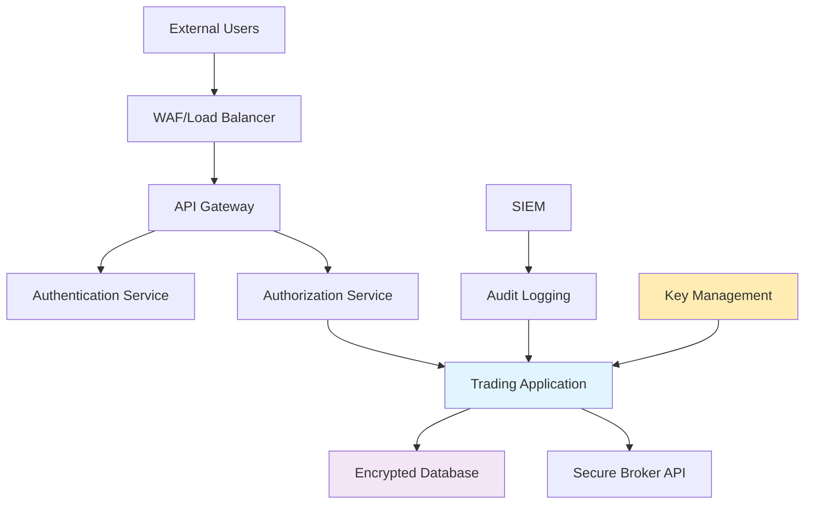

# Security & Compliance

Implement enterprise-grade security measures and compliance frameworks for FiveTwenty trading applications in regulated environments.

## Overview

Security and compliance are critical for trading applications handling real financial data and transactions. This guide covers comprehensive security frameworks, regulatory compliance, and risk management practices.

**Best for**: Regulated financial institutions, enterprise trading operations, organizations with strict compliance requirements, multi-tenant trading platforms.

## Security Framework

### Security Architecture



## Identity and Access Management (IAM)

### Multi-Factor Authentication

```python
# security/auth.py
import asyncio
import hashlib
import secrets
import pyotp
from datetime import datetime, timedelta
from typing import Optional, Dict, List
from dataclasses import dataclass
from cryptography.fernet import Fernet
import jwt
from fivetwenty import AsyncClient

@dataclass
class UserSession:
    user_id: str
    session_token: str
    expires_at: datetime
    permissions: List[str]
    ip_address: str
    user_agent: str

class SecureAuthenticationManager:
    """Enterprise-grade authentication and authorization."""

    def __init__(self, secret_key: bytes, jwt_secret: str):
        self.cipher = Fernet(secret_key)
        self.jwt_secret = jwt_secret
        self.active_sessions: Dict[str, UserSession] = {}
        self.failed_attempts: Dict[str, List[datetime]] = {}
        self.max_failed_attempts = 5
        self.lockout_duration = timedelta(minutes=30)

    async def authenticate_user(
        self,
        username: str,
        password: str,
        totp_code: str,
        ip_address: str,
        user_agent: str
    ) -> Optional[UserSession]:
        """Authenticate user with MFA."""

        # Check account lockout
        if self._is_account_locked(username):
            raise SecurityException("Account temporarily locked due to failed attempts")

        try:
            # Verify password
            if not await self._verify_password(username, password):
                self._record_failed_attempt(username)
                raise SecurityException("Invalid credentials")

            # Verify TOTP
            if not await self._verify_totp(username, totp_code):
                self._record_failed_attempt(username)
                raise SecurityException("Invalid TOTP code")

            # Get user permissions
            permissions = await self._get_user_permissions(username)

            # Create session
            session = UserSession(
                user_id=username,
                session_token=self._generate_session_token(),
                expires_at=datetime.utcnow() + timedelta(hours=8),
                permissions=permissions,
                ip_address=ip_address,
                user_agent=user_agent
            )

            self.active_sessions[session.session_token] = session

            # Clear failed attempts
            if username in self.failed_attempts:
                del self.failed_attempts[username]

            await self._log_authentication_event(username, "SUCCESS", ip_address)
            return session

        except SecurityException as e:
            await self._log_authentication_event(username, "FAILED", ip_address, str(e))
            raise

    async def verify_session(self, session_token: str, required_permission: str = None) -> Optional[UserSession]:
        """Verify and validate user session."""

        session = self.active_sessions.get(session_token)
        if not session:
            raise SecurityException("Invalid or expired session")

        # Check expiration
        if datetime.utcnow() > session.expires_at:
            del self.active_sessions[session_token]
            raise SecurityException("Session expired")

        # Check permissions
        if required_permission and required_permission not in session.permissions:
            raise SecurityException("Insufficient permissions")

        return session

    def _generate_session_token(self) -> str:
        """Generate cryptographically secure session token."""
        return secrets.token_urlsafe(32)

    async def _verify_password(self, username: str, password: str) -> bool:
        """Verify password using secure hashing."""
        # This would integrate with your user database
        # Using bcrypt or argon2 for password hashing
        import bcrypt

        stored_hash = await self._get_password_hash(username)
        if not stored_hash:
            return False

        return bcrypt.checkpw(password.encode('utf-8'), stored_hash.encode('utf-8'))

    async def _verify_totp(self, username: str, totp_code: str) -> bool:
        """Verify TOTP code."""
        totp_secret = await self._get_totp_secret(username)
        if not totp_secret:
            return False

        totp = pyotp.TOTP(totp_secret)
        return totp.verify(totp_code, valid_window=1)

    def _is_account_locked(self, username: str) -> bool:
        """Check if account is locked due to failed attempts."""
        if username not in self.failed_attempts:
            return False

        recent_failures = [
            attempt for attempt in self.failed_attempts[username]
            if datetime.utcnow() - attempt < self.lockout_duration
        ]

        return len(recent_failures) >= self.max_failed_attempts

    def _record_failed_attempt(self, username: str):
        """Record failed authentication attempt."""
        if username not in self.failed_attempts:
            self.failed_attempts[username] = []

        self.failed_attempts[username].append(datetime.utcnow())

        # Clean old attempts
        cutoff = datetime.utcnow() - self.lockout_duration
        self.failed_attempts[username] = [
            attempt for attempt in self.failed_attempts[username]
            if attempt > cutoff
        ]

    async def _log_authentication_event(self, username: str, event_type: str, ip_address: str, details: str = None):
        """Log authentication events for audit trail."""
        # This would integrate with your audit logging system
        pass

class SecurityException(Exception):
    """Security-related exception."""
    pass
```

### Role-Based Access Control (RBAC)

```python
# security/rbac.py
from enum import Enum
from typing import Dict, List, Set
from dataclasses import dataclass
from datetime import datetime

class Permission(Enum):
    # Trading permissions
    TRADE_EXECUTE = "trade:execute"
    TRADE_VIEW = "trade:view"
    TRADE_CANCEL = "trade:cancel"

    # Position permissions
    POSITION_VIEW = "position:view"
    POSITION_CLOSE = "position:close"
    POSITION_MODIFY = "position:modify"

    # Account permissions
    ACCOUNT_VIEW = "account:view"
    ACCOUNT_TRANSFER = "account:transfer"
    ACCOUNT_ADMIN = "account:admin"

    # System permissions
    SYSTEM_CONFIG = "system:config"
    SYSTEM_MONITOR = "system:monitor"
    SYSTEM_AUDIT = "system:audit"

@dataclass
class Role:
    name: str
    permissions: Set[Permission]
    description: str
    is_active: bool = True

@dataclass
class User:
    username: str
    roles: Set[str]
    is_active: bool
    created_at: datetime
    last_login: datetime
    trading_limits: Dict[str, float]

class RBACManager:
    """Role-Based Access Control manager."""

    def __init__(self):
        self.roles: Dict[str, Role] = {}
        self.users: Dict[str, User] = {}

        # Initialize default roles
        self._setup_default_roles()

    def _setup_default_roles(self):
        """Setup default roles and permissions."""

        # Trader role
        self.roles["trader"] = Role(
            name="trader",
            permissions={
                Permission.TRADE_EXECUTE,
                Permission.TRADE_VIEW,
                Permission.TRADE_CANCEL,
                Permission.POSITION_VIEW,
                Permission.POSITION_CLOSE,
                Permission.ACCOUNT_VIEW
            },
            description="Standard trading user"
        )

        # Senior trader role
        self.roles["senior_trader"] = Role(
            name="senior_trader",
            permissions={
                Permission.TRADE_EXECUTE,
                Permission.TRADE_VIEW,
                Permission.TRADE_CANCEL,
                Permission.POSITION_VIEW,
                Permission.POSITION_CLOSE,
                Permission.POSITION_MODIFY,
                Permission.ACCOUNT_VIEW,
                Permission.SYSTEM_MONITOR
            },
            description="Senior trading user with extended permissions"
        )

        # Risk manager role
        self.roles["risk_manager"] = Role(
            name="risk_manager",
            permissions={
                Permission.TRADE_VIEW,
                Permission.POSITION_VIEW,
                Permission.POSITION_CLOSE,
                Permission.ACCOUNT_VIEW,
                Permission.SYSTEM_MONITOR,
                Permission.SYSTEM_AUDIT
            },
            description="Risk management and monitoring"
        )

        # Administrator role
        self.roles["administrator"] = Role(
            name="administrator",
            permissions=set(Permission),  # All permissions
            description="System administrator"
        )

        # Read-only analyst role
        self.roles["analyst"] = Role(
            name="analyst",
            permissions={
                Permission.TRADE_VIEW,
                Permission.POSITION_VIEW,
                Permission.ACCOUNT_VIEW,
                Permission.SYSTEM_MONITOR
            },
            description="Read-only analysis and reporting"
        )

    def check_permission(self, username: str, required_permission: Permission) -> bool:
        """Check if user has required permission."""

        user = self.users.get(username)
        if not user or not user.is_active:
            return False

        # Get all permissions from user's roles
        user_permissions = set()
        for role_name in user.roles:
            role = self.roles.get(role_name)
            if role and role.is_active:
                user_permissions.update(role.permissions)

        return required_permission in user_permissions

    def get_user_permissions(self, username: str) -> Set[Permission]:
        """Get all permissions for a user."""

        user = self.users.get(username)
        if not user or not user.is_active:
            return set()

        user_permissions = set()
        for role_name in user.roles:
            role = self.roles.get(role_name)
            if role and role.is_active:
                user_permissions.update(role.permissions)

        return user_permissions

    def add_user(self, username: str, roles: List[str], trading_limits: Dict[str, float] = None):
        """Add new user with specified roles."""

        self.users[username] = User(
            username=username,
            roles=set(roles),
            is_active=True,
            created_at=datetime.utcnow(),
            last_login=datetime.utcnow(),
            trading_limits=trading_limits or {}
        )

    def assign_role(self, username: str, role_name: str):
        """Assign role to user."""

        if username in self.users and role_name in self.roles:
            self.users[username].roles.add(role_name)

    def revoke_role(self, username: str, role_name: str):
        """Revoke role from user."""

        if username in self.users:
            self.users[username].roles.discard(role_name)
```

## Data Encryption and Protection

### Encryption at Rest and in Transit

```python
# security/encryption.py
import os
import base64
from cryptography.fernet import Fernet
from cryptography.hazmat.primitives import hashes, serialization
from cryptography.hazmat.primitives.asymmetric import rsa, padding
from cryptography.hazmat.primitives.kdf.pbkdf2 import PBKDF2HMAC
from cryptography.hazmat.primitives.ciphers import Cipher, algorithms, modes
import asyncpg
import aioredis
from typing import Any, Dict, Optional

class EncryptionManager:
    """Comprehensive encryption manager for trading data."""

    def __init__(self, master_key: bytes):
        self.master_key = master_key
        self.cipher = Fernet(master_key)

        # Generate RSA key pair for asymmetric encryption
        self.private_key = rsa.generate_private_key(
            public_exponent=65537,
            key_size=2048
        )
        self.public_key = self.private_key.public_key()

    @classmethod
    def generate_master_key(cls) -> bytes:
        """Generate a new master key."""
        return Fernet.generate_key()

    def encrypt_sensitive_data(self, data: str) -> str:
        """Encrypt sensitive data using Fernet symmetric encryption."""
        if not isinstance(data, str):
            data = str(data)

        encrypted_data = self.cipher.encrypt(data.encode('utf-8'))
        return base64.b64encode(encrypted_data).decode('utf-8')

    def decrypt_sensitive_data(self, encrypted_data: str) -> str:
        """Decrypt sensitive data."""
        try:
            encrypted_bytes = base64.b64decode(encrypted_data.encode('utf-8'))
            decrypted_data = self.cipher.decrypt(encrypted_bytes)
            return decrypted_data.decode('utf-8')
        except Exception as e:
            raise EncryptionException(f"Failed to decrypt data: {e}")

    def encrypt_large_data(self, data: bytes) -> bytes:
        """Encrypt large data using AES-256-GCM."""
        # Generate random IV
        iv = os.urandom(16)

        # Derive key from master key
        kdf = PBKDF2HMAC(
            algorithm=hashes.SHA256(),
            length=32,
            salt=iv,
            iterations=100000,
        )
        key = kdf.derive(self.master_key)

        # Encrypt data
        cipher = Cipher(algorithms.AES(key), modes.GCM(iv))
        encryptor = cipher.encryptor()
        ciphertext = encryptor.update(data) + encryptor.finalize()

        # Return IV + tag + ciphertext
        return iv + encryptor.tag + ciphertext

    def decrypt_large_data(self, encrypted_data: bytes) -> bytes:
        """Decrypt large data."""
        try:
            # Extract IV, tag, and ciphertext
            iv = encrypted_data[:16]
            tag = encrypted_data[16:32]
            ciphertext = encrypted_data[32:]

            # Derive key
            kdf = PBKDF2HMAC(
                algorithm=hashes.SHA256(),
                length=32,
                salt=iv,
                iterations=100000,
            )
            key = kdf.derive(self.master_key)

            # Decrypt data
            cipher = Cipher(algorithms.AES(key), modes.GCM(iv, tag))
            decryptor = cipher.decryptor()
            return decryptor.update(ciphertext) + decryptor.finalize()

        except Exception as e:
            raise EncryptionException(f"Failed to decrypt large data: {e}")

    def encrypt_asymmetric(self, data: str, public_key_pem: Optional[str] = None) -> str:
        """Encrypt data using RSA public key."""
        if public_key_pem:
            public_key = serialization.load_pem_public_key(public_key_pem.encode())
        else:
            public_key = self.public_key

        encrypted_data = public_key.encrypt(
            data.encode('utf-8'),
            padding.OAEP(
                mgf=padding.MGF1(algorithm=hashes.SHA256()),
                algorithm=hashes.SHA256(),
                label=None
            )
        )

        return base64.b64encode(encrypted_data).decode('utf-8')

    def decrypt_asymmetric(self, encrypted_data: str) -> str:
        """Decrypt data using RSA private key."""
        try:
            encrypted_bytes = base64.b64decode(encrypted_data.encode('utf-8'))
            decrypted_data = self.private_key.decrypt(
                encrypted_bytes,
                padding.OAEP(
                    mgf=padding.MGF1(algorithm=hashes.SHA256()),
                    algorithm=hashes.SHA256(),
                    label=None
                )
            )
            return decrypted_data.decode('utf-8')

        except Exception as e:
            raise EncryptionException(f"Failed to decrypt asymmetric data: {e}")

class SecureDatabase:
    """Database wrapper with automatic encryption."""

    def __init__(self, database_url: str, encryption_manager: EncryptionManager):
        self.database_url = database_url
        self.encryption = encryption_manager
        self.pool = None

    async def initialize(self):
        """Initialize database connection pool."""
        self.pool = await asyncpg.create_pool(
            self.database_url,
            ssl='require',
            min_size=5,
            max_size=20
        )

    async def store_encrypted_record(self, table: str, record: Dict[str, Any]) -> int:
        """Store record with automatic encryption of sensitive fields."""

        # Fields that should be encrypted
        sensitive_fields = {'api_token', 'password', 'secret_key', 'private_data'}

        encrypted_record = {}
        for key, value in record.items():
            if key in sensitive_fields and value is not None:
                encrypted_record[f"{key}_encrypted"] = self.encryption.encrypt_sensitive_data(str(value))
            else:
                encrypted_record[key] = value

        # Build INSERT query
        columns = list(encrypted_record.keys())
        placeholders = [f"${i+1}" for i in range(len(columns))]

        query = f"""
            INSERT INTO {table} ({', '.join(columns)})
            VALUES ({', '.join(placeholders)})
            RETURNING id
        """

        async with self.pool.acquire() as conn:
            result = await conn.fetchval(query, *encrypted_record.values())
            return result

    async def fetch_decrypted_record(self, table: str, record_id: int) -> Optional[Dict[str, Any]]:
        """Fetch and decrypt record."""

        query = f"SELECT * FROM {table} WHERE id = $1"

        async with self.pool.acquire() as conn:
            record = await conn.fetchrow(query, record_id)

            if not record:
                return None

            decrypted_record = dict(record)

            # Decrypt sensitive fields
            for key in list(decrypted_record.keys()):
                if key.endswith('_encrypted'):
                    original_field = key.replace('_encrypted', '')
                    try:
                        decrypted_record[original_field] = self.encryption.decrypt_sensitive_data(
                            decrypted_record[key]
                        )
                        del decrypted_record[key]  # Remove encrypted version
                    except EncryptionException:
                        # If decryption fails, keep encrypted data
                        pass

            return decrypted_record

class EncryptionException(Exception):
    """Encryption-related exception."""
    pass
```

## Audit Logging and Compliance

### Comprehensive Audit Trail

```python
# security/audit.py
import asyncio
import json
from datetime import datetime
from typing import Any, Dict, Optional
from dataclasses import dataclass, asdict
from enum import Enum
import hashlib
import hmac

class AuditEventType(Enum):
    # Authentication events
    AUTH_LOGIN = "auth.login"
    AUTH_LOGOUT = "auth.logout"
    AUTH_FAILED = "auth.failed"
    AUTH_SESSION_EXPIRED = "auth.session_expired"

    # Trading events
    TRADE_EXECUTED = "trade.executed"
    TRADE_CANCELLED = "trade.cancelled"
    TRADE_MODIFIED = "trade.modified"

    # Position events
    POSITION_OPENED = "position.opened"
    POSITION_CLOSED = "position.closed"
    POSITION_MODIFIED = "position.modified"

    # Account events
    ACCOUNT_VIEWED = "account.viewed"
    ACCOUNT_TRANSFER = "account.transfer"
    ACCOUNT_SETTINGS_CHANGED = "account.settings_changed"

    # System events
    SYSTEM_CONFIG_CHANGED = "system.config_changed"
    SYSTEM_ERROR = "system.error"
    SYSTEM_STARTUP = "system.startup"
    SYSTEM_SHUTDOWN = "system.shutdown"

    # Security events
    SECURITY_VIOLATION = "security.violation"
    SECURITY_ALERT = "security.alert"
    PERMISSION_DENIED = "security.permission_denied"

@dataclass
class AuditEvent:
    timestamp: datetime
    event_type: AuditEventType
    user_id: Optional[str]
    session_id: Optional[str]
    ip_address: Optional[str]
    user_agent: Optional[str]
    resource: str
    action: str
    outcome: str  # SUCCESS, FAILURE, ERROR
    details: Dict[str, Any]
    risk_score: int = 0
    correlation_id: Optional[str] = None

class AuditLogger:
    """Comprehensive audit logging system."""

    def __init__(self, database_manager, encryption_manager, integrity_key: bytes):
        self.db = database_manager
        self.encryption = encryption_manager
        self.integrity_key = integrity_key
        self.buffer = []
        self.buffer_size = 100
        self.flush_interval = 30  # seconds

        # Start background flush task
        asyncio.create_task(self._periodic_flush())

    async def log_event(
        self,
        event_type: AuditEventType,
        user_id: Optional[str],
        resource: str,
        action: str,
        outcome: str,
        details: Dict[str, Any] = None,
        session_id: Optional[str] = None,
        ip_address: Optional[str] = None,
        user_agent: Optional[str] = None,
        correlation_id: Optional[str] = None
    ):
        """Log audit event."""

        event = AuditEvent(
            timestamp=datetime.utcnow(),
            event_type=event_type,
            user_id=user_id,
            session_id=session_id,
            ip_address=ip_address,
            user_agent=user_agent,
            resource=resource,
            action=action,
            outcome=outcome,
            details=details or {},
            correlation_id=correlation_id,
            risk_score=self._calculate_risk_score(event_type, outcome, details)
        )

        # Add to buffer
        self.buffer.append(event)

        # Flush if buffer is full
        if len(self.buffer) >= self.buffer_size:
            await self._flush_buffer()

        # Immediate flush for high-risk events
        if event.risk_score >= 7:
            await self._flush_buffer()

    def _calculate_risk_score(self, event_type: AuditEventType, outcome: str, details: Dict[str, Any]) -> int:
        """Calculate risk score for event."""

        base_scores = {
            AuditEventType.AUTH_FAILED: 5,
            AuditEventType.SECURITY_VIOLATION: 9,
            AuditEventType.PERMISSION_DENIED: 6,
            AuditEventType.TRADE_EXECUTED: 3,
            AuditEventType.ACCOUNT_TRANSFER: 7,
            AuditEventType.SYSTEM_CONFIG_CHANGED: 6,
        }

        score = base_scores.get(event_type, 1)

        # Adjust for outcome
        if outcome == "FAILURE":
            score += 2
        elif outcome == "ERROR":
            score += 3

        # Adjust for specific details
        if details:
            if details.get("amount", 0) > 100000:  # Large transactions
                score += 2
            if details.get("multiple_failures"):
                score += 3
            if details.get("unusual_location"):
                score += 2

        return min(score, 10)  # Cap at 10

    async def _flush_buffer(self):
        """Flush audit events to database."""

        if not self.buffer:
            return

        events_to_flush = self.buffer.copy()
        self.buffer.clear()

        try:
            for event in events_to_flush:
                await self._store_audit_event(event)
        except Exception as e:
            # Re-add events to buffer if storage fails
            self.buffer.extend(events_to_flush)
            print(f"Failed to flush audit events: {e}")

    async def _store_audit_event(self, event: AuditEvent):
        """Store audit event in database with integrity protection."""

        # Serialize event
        event_data = asdict(event)
        event_data['timestamp'] = event.timestamp.isoformat()
        event_data['event_type'] = event.event_type.value

        event_json = json.dumps(event_data, sort_keys=True)

        # Generate integrity hash
        integrity_hash = hmac.new(
            self.integrity_key,
            event_json.encode('utf-8'),
            hashlib.sha256
        ).hexdigest()

        # Encrypt sensitive details
        if event.details and any(key in event.details for key in ['password', 'token', 'secret']):
            encrypted_details = self.encryption.encrypt_sensitive_data(json.dumps(event.details))
        else:
            encrypted_details = None

        # Store in database
        await self.db.store_encrypted_record('audit_log', {
            'timestamp': event.timestamp,
            'event_type': event.event_type.value,
            'user_id': event.user_id,
            'session_id': event.session_id,
            'ip_address': event.ip_address,
            'resource': event.resource,
            'action': event.action,
            'outcome': event.outcome,
            'risk_score': event.risk_score,
            'correlation_id': event.correlation_id,
            'event_data': event_json,
            'encrypted_details': encrypted_details,
            'integrity_hash': integrity_hash
        })

    async def _periodic_flush(self):
        """Periodically flush buffer."""
        while True:
            await asyncio.sleep(self.flush_interval)
            await self._flush_buffer()

    async def search_audit_events(
        self,
        start_time: datetime,
        end_time: datetime,
        event_types: Optional[list] = None,
        user_id: Optional[str] = None,
        outcome: Optional[str] = None,
        min_risk_score: Optional[int] = None
    ) -> list:
        """Search audit events with filters."""

        conditions = ["timestamp >= $1", "timestamp <= $2"]
        params = [start_time, end_time]
        param_count = 2

        if event_types:
            param_count += 1
            conditions.append(f"event_type = ANY(${param_count})")
            params.append([et.value if isinstance(et, AuditEventType) else et for et in event_types])

        if user_id:
            param_count += 1
            conditions.append(f"user_id = ${param_count}")
            params.append(user_id)

        if outcome:
            param_count += 1
            conditions.append(f"outcome = ${param_count}")
            params.append(outcome)

        if min_risk_score:
            param_count += 1
            conditions.append(f"risk_score >= ${param_count}")
            params.append(min_risk_score)

        query = f"""
            SELECT * FROM audit_log
            WHERE {' AND '.join(conditions)}
            ORDER BY timestamp DESC
            LIMIT 1000
        """

        # Execute search
        # This would use your database manager
        results = []  # Placeholder

        return results

    async def verify_audit_integrity(self, event_id: int) -> bool:
        """Verify the integrity of an audit event."""

        # Fetch event from database
        # Recalculate integrity hash
        # Compare with stored hash
        # Return True if integrity is maintained

        return True  # Placeholder
```

## Regulatory Compliance

### GDPR Compliance Module

```python
# compliance/gdpr.py
from datetime import datetime, timedelta
from typing import Dict, List, Optional
from dataclasses import dataclass
from enum import Enum

class DataCategory(Enum):
    PERSONAL_IDENTIFIABLE = "pii"
    FINANCIAL_DATA = "financial"
    TRADING_DATA = "trading"
    SYSTEM_LOGS = "logs"
    ANALYTICS_DATA = "analytics"

class ProcessingPurpose(Enum):
    TRADING_EXECUTION = "trading_execution"
    RISK_MANAGEMENT = "risk_management"
    COMPLIANCE_MONITORING = "compliance_monitoring"
    SYSTEM_OPERATION = "system_operation"
    ANALYTICS = "analytics"

@dataclass
class DataRetentionPolicy:
    data_category: DataCategory
    retention_period_days: int
    legal_basis: str
    auto_delete: bool = True
    archive_before_delete: bool = True

@dataclass
class ConsentRecord:
    user_id: str
    consent_type: str
    granted: bool
    timestamp: datetime
    ip_address: str
    consent_version: str

class GDPRComplianceManager:
    """GDPR compliance management system."""

    def __init__(self, database_manager, audit_logger):
        self.db = database_manager
        self.audit = audit_logger

        # Define data retention policies
        self.retention_policies = {
            DataCategory.PERSONAL_IDENTIFIABLE: DataRetentionPolicy(
                data_category=DataCategory.PERSONAL_IDENTIFIABLE,
                retention_period_days=2555,  # 7 years for financial records
                legal_basis="Legal obligation (MiFID II)",
                auto_delete=False,  # Manual review required
                archive_before_delete=True
            ),
            DataCategory.FINANCIAL_DATA: DataRetentionPolicy(
                data_category=DataCategory.FINANCIAL_DATA,
                retention_period_days=2555,  # 7 years
                legal_basis="Legal obligation (Financial regulations)",
                auto_delete=False,
                archive_before_delete=True
            ),
            DataCategory.TRADING_DATA: DataRetentionPolicy(
                data_category=DataCategory.TRADING_DATA,
                retention_period_days=2555,  # 7 years
                legal_basis="Legal obligation (MiFID II)",
                auto_delete=False,
                archive_before_delete=True
            ),
            DataCategory.SYSTEM_LOGS: DataRetentionPolicy(
                data_category=DataCategory.SYSTEM_LOGS,
                retention_period_days=365,  # 1 year
                legal_basis="Legitimate interest (System security)",
                auto_delete=True,
                archive_before_delete=False
            ),
            DataCategory.ANALYTICS_DATA: DataRetentionPolicy(
                data_category=DataCategory.ANALYTICS_DATA,
                retention_period_days=730,  # 2 years
                legal_basis="Legitimate interest (Business analytics)",
                auto_delete=True,
                archive_before_delete=True
            )
        }

    async def record_consent(
        self,
        user_id: str,
        consent_type: str,
        granted: bool,
        ip_address: str,
        consent_version: str
    ):
        """Record user consent."""

        consent_record = ConsentRecord(
            user_id=user_id,
            consent_type=consent_type,
            granted=granted,
            timestamp=datetime.utcnow(),
            ip_address=ip_address,
            consent_version=consent_version
        )

        # Store consent record
        await self.db.store_encrypted_record('consent_records', {
            'user_id': user_id,
            'consent_type': consent_type,
            'granted': granted,
            'timestamp': consent_record.timestamp,
            'ip_address': ip_address,
            'consent_version': consent_version
        })

        # Audit log
        await self.audit.log_event(
            event_type=AuditEventType.ACCOUNT_SETTINGS_CHANGED,
            user_id=user_id,
            resource="consent",
            action="record_consent",
            outcome="SUCCESS",
            details={
                "consent_type": consent_type,
                "granted": granted,
                "consent_version": consent_version
            },
            ip_address=ip_address
        )

    async def check_consent(self, user_id: str, consent_type: str) -> bool:
        """Check if user has granted specific consent."""

        # Query latest consent record
        # Return granted status
        return True  # Placeholder

    async def handle_data_subject_request(self, user_id: str, request_type: str) -> Dict[str, any]:
        """Handle GDPR data subject requests."""

        result = {
            "request_type": request_type,
            "user_id": user_id,
            "timestamp": datetime.utcnow(),
            "status": "processing"
        }

        if request_type == "access":
            # Right to access - provide all personal data
            result["data"] = await self._export_user_data(user_id)
            result["status"] = "completed"

        elif request_type == "rectification":
            # Right to rectification - allow data correction
            result["status"] = "manual_review_required"

        elif request_type == "erasure":
            # Right to be forgotten
            erasure_result = await self._assess_erasure_request(user_id)
            result.update(erasure_result)

        elif request_type == "portability":
            # Right to data portability
            result["data"] = await self._export_portable_data(user_id)
            result["format"] = "JSON"
            result["status"] = "completed"

        elif request_type == "restriction":
            # Right to restriction of processing
            await self._restrict_processing(user_id)
            result["status"] = "completed"

        # Audit log
        await self.audit.log_event(
            event_type=AuditEventType.ACCOUNT_VIEWED,
            user_id=user_id,
            resource="gdpr_request",
            action=request_type,
            outcome="SUCCESS",
            details={"request_type": request_type}
        )

        return result

    async def _export_user_data(self, user_id: str) -> Dict[str, any]:
        """Export all user data for access request."""

        # Collect data from all tables containing user information
        user_data = {
            "personal_information": await self._get_user_profile(user_id),
            "trading_history": await self._get_trading_history(user_id),
            "account_data": await self._get_account_data(user_id),
            "consent_records": await self._get_consent_records(user_id),
            "audit_events": await self._get_user_audit_events(user_id)
        }

        return user_data

    async def _assess_erasure_request(self, user_id: str) -> Dict[str, any]:
        """Assess if user data can be erased under GDPR."""

        # Check if there are legal obligations to retain data
        active_obligations = await self._check_legal_obligations(user_id)

        if active_obligations:
            return {
                "status": "cannot_erase",
                "reason": "Legal obligation to retain trading records",
                "retention_period": "7 years from last trading activity",
                "legal_basis": "MiFID II Article 25"
            }

        # If no legal obligations, proceed with erasure
        await self._erase_user_data(user_id)

        return {
            "status": "erased",
            "erasure_date": datetime.utcnow(),
            "retained_data": "Minimal data required for regulatory compliance"
        }

    async def _check_legal_obligations(self, user_id: str) -> bool:
        """Check if there are legal obligations to retain user data."""

        # Check for recent trading activity
        recent_trades = await self._get_recent_trading_activity(user_id, days=30)

        # Check for open positions
        open_positions = await self._get_open_positions(user_id)

        # Check for pending investigations
        pending_investigations = await self._check_compliance_investigations(user_id)

        return bool(recent_trades or open_positions or pending_investigations)

    async def run_data_retention_cleanup(self):
        """Run automated data retention cleanup."""

        for category, policy in self.retention_policies.items():
            if policy.auto_delete:
                cutoff_date = datetime.utcnow() - timedelta(days=policy.retention_period_days)

                # Find records older than retention period
                expired_records = await self._find_expired_records(category, cutoff_date)

                for record in expired_records:
                    if policy.archive_before_delete:
                        await self._archive_record(record)

                    await self._delete_record(record)

                    # Audit the deletion
                    await self.audit.log_event(
                        event_type=AuditEventType.SYSTEM_CONFIG_CHANGED,
                        user_id=None,
                        resource="data_retention",
                        action="auto_delete",
                        outcome="SUCCESS",
                        details={
                            "data_category": category.value,
                            "record_id": record.get("id"),
                            "retention_policy": policy.legal_basis
                        }
                    )

# Additional compliance modules would be implemented here
# - SOX compliance
# - PCI DSS compliance
# - MiFID II compliance
# - CFTC regulations
```

## Security Monitoring and Incident Response

### Security Information and Event Management (SIEM)

```python
# security/siem.py
import asyncio
from datetime import datetime, timedelta
from typing import Dict, List, Optional
from dataclasses import dataclass
from enum import Enum
import json

class ThreatLevel(Enum):
    LOW = 1
    MEDIUM = 3
    HIGH = 7
    CRITICAL = 10

@dataclass
class SecurityAlert:
    alert_id: str
    timestamp: datetime
    threat_level: ThreatLevel
    category: str
    description: str
    affected_user: Optional[str]
    source_ip: Optional[str]
    indicators: Dict[str, any]
    mitigation_actions: List[str]
    resolved: bool = False

class SIEMManager:
    """Security Information and Event Management system."""

    def __init__(self, audit_logger, notification_manager):
        self.audit = audit_logger
        self.notifications = notification_manager
        self.active_alerts = {}
        self.threat_patterns = self._initialize_threat_patterns()

    def _initialize_threat_patterns(self):
        """Initialize threat detection patterns."""
        return {
            "brute_force": {
                "pattern": "multiple_failed_logins",
                "threshold": 5,
                "timeframe_minutes": 10,
                "threat_level": ThreatLevel.HIGH
            },
            "unusual_trading": {
                "pattern": "high_volume_trading",
                "threshold": 100000,  # $100k
                "timeframe_minutes": 5,
                "threat_level": ThreatLevel.MEDIUM
            },
            "geo_anomaly": {
                "pattern": "login_from_new_location",
                "threshold": 1,
                "timeframe_minutes": 1,
                "threat_level": ThreatLevel.MEDIUM
            },
            "privilege_escalation": {
                "pattern": "permission_changes",
                "threshold": 1,
                "timeframe_minutes": 1,
                "threat_level": ThreatLevel.HIGH
            }
        }

    async def analyze_security_events(self):
        """Continuously analyze security events for threats."""

        while True:
            try:
                # Analyze recent audit events
                recent_events = await self._get_recent_audit_events()

                for pattern_name, pattern_config in self.threat_patterns.items():
                    await self._check_threat_pattern(pattern_name, pattern_config, recent_events)

                await asyncio.sleep(60)  # Check every minute

            except Exception as e:
                print(f"SIEM analysis error: {e}")
                await asyncio.sleep(300)  # Wait 5 minutes on error

    async def _check_threat_pattern(self, pattern_name: str, pattern_config: dict, events: list):
        """Check for specific threat patterns in events."""

        timeframe = timedelta(minutes=pattern_config["timeframe_minutes"])
        cutoff_time = datetime.utcnow() - timeframe

        if pattern_name == "brute_force":
            await self._detect_brute_force(pattern_config, events, cutoff_time)
        elif pattern_name == "unusual_trading":
            await self._detect_unusual_trading(pattern_config, events, cutoff_time)
        elif pattern_name == "geo_anomaly":
            await self._detect_geo_anomaly(pattern_config, events, cutoff_time)
        elif pattern_name == "privilege_escalation":
            await self._detect_privilege_escalation(pattern_config, events, cutoff_time)

    async def _detect_brute_force(self, config: dict, events: list, cutoff_time: datetime):
        """Detect brute force attacks."""

        failed_logins = {}

        for event in events:
            if (event.get("event_type") == "auth.failed" and
                event.get("timestamp") > cutoff_time):

                ip_address = event.get("ip_address")
                if ip_address:
                    failed_logins[ip_address] = failed_logins.get(ip_address, 0) + 1

        for ip_address, failed_count in failed_logins.items():
            if failed_count >= config["threshold"]:
                await self._create_security_alert(
                    category="brute_force",
                    threat_level=config["threat_level"],
                    description=f"Brute force attack detected from {ip_address}",
                    source_ip=ip_address,
                    indicators={
                        "failed_login_count": failed_count,
                        "timeframe_minutes": config["timeframe_minutes"]
                    },
                    mitigation_actions=[
                        f"Block IP address {ip_address}",
                        "Review affected user accounts",
                        "Force password reset for targeted accounts"
                    ]
                )

    async def _create_security_alert(
        self,
        category: str,
        threat_level: ThreatLevel,
        description: str,
        source_ip: Optional[str] = None,
        affected_user: Optional[str] = None,
        indicators: Dict[str, any] = None,
        mitigation_actions: List[str] = None
    ):
        """Create and process security alert."""

        alert_id = f"{category}_{datetime.utcnow().strftime('%Y%m%d_%H%M%S')}"

        alert = SecurityAlert(
            alert_id=alert_id,
            timestamp=datetime.utcnow(),
            threat_level=threat_level,
            category=category,
            description=description,
            affected_user=affected_user,
            source_ip=source_ip,
            indicators=indicators or {},
            mitigation_actions=mitigation_actions or []
        )

        self.active_alerts[alert_id] = alert

        # Log security alert
        await self.audit.log_event(
            event_type=AuditEventType.SECURITY_ALERT,
            user_id=affected_user,
            resource="security_alert",
            action="create",
            outcome="SUCCESS",
            details={
                "alert_id": alert_id,
                "threat_level": threat_level.name,
                "category": category,
                "indicators": indicators
            },
            ip_address=source_ip
        )

        # Send notifications for high/critical threats
        if threat_level.value >= ThreatLevel.HIGH.value:
            await self.notifications.send_security_alert(alert)

        # Auto-respond for critical threats
        if threat_level == ThreatLevel.CRITICAL:
            await self._auto_respond_to_threat(alert)

    async def _auto_respond_to_threat(self, alert: SecurityAlert):
        """Automatically respond to critical threats."""

        if alert.category == "brute_force" and alert.source_ip:
            # Auto-block IP address
            await self._block_ip_address(alert.source_ip)

        elif alert.category == "privilege_escalation" and alert.affected_user:
            # Suspend user account
            await self._suspend_user_account(alert.affected_user)

        # Log auto-response
        await self.audit.log_event(
            event_type=AuditEventType.SECURITY_ALERT,
            user_id=alert.affected_user,
            resource="auto_response",
            action="execute",
            outcome="SUCCESS",
            details={
                "alert_id": alert.alert_id,
                "auto_actions": alert.mitigation_actions
            }
        )
```

## Deployment Security Configuration

### Secure Deployment Scripts

```bash
#!/bin/bash
# security/deploy-secure.sh

set -e

echo "🔒 Deploying FiveTwenty with enterprise security..."

# Security hardening
echo "🛡️ Applying security hardening..."

# File permissions
find /opt/fivetwenty-trading -type f -name "*.py" -exec chmod 644 {} \;
find /opt/fivetwenty-trading -type f -name "*.sh" -exec chmod 750 {} \;
find /opt/fivetwenty-trading -type d -exec chmod 755 {} \;

# Secure configuration files
chmod 600 /opt/fivetwenty-trading/config/.env
chmod 600 /opt/fivetwenty-trading/config/secrets.*
chown trading:trading /opt/fivetwenty-trading/config/*

# SSL/TLS configuration
echo "🔐 Configuring SSL/TLS..."

# Generate strong SSL certificates if not exists
if [ ! -f "/etc/ssl/private/fivetwenty-trading.key" ]; then
    openssl req -x509 -nodes -days 365 -newkey rsa:4096 \
        -keyout /etc/ssl/private/fivetwenty-trading.key \
        -out /etc/ssl/certs/fivetwenty-trading.crt \
        -subj "/C=US/ST=State/L=City/O=Organization/CN=fivetwenty-trading.local"
fi

# Secure key permissions
chmod 600 /etc/ssl/private/fivetwenty-trading.key
chmod 644 /etc/ssl/certs/fivetwenty-trading.crt

# Network security
echo "🌐 Configuring network security..."

# Configure firewall rules
ufw --force reset
ufw default deny incoming
ufw default allow outgoing

# Allow specific services
ufw allow ssh
ufw allow 443/tcp  # HTTPS
ufw allow 8080/tcp from 127.0.0.1  # Metrics (localhost only)
ufw allow 8081/tcp from 127.0.0.1  # Health check (localhost only)

# Enable firewall
ufw --force enable

# Configure fail2ban
cat > /etc/fail2ban/jail.d/fivetwenty-trading.conf << 'EOF'
[fivetwenty-auth]
enabled = true
filter = fivetwenty-auth
action = iptables-allports[name=fivetwenty-auth]
logpath = /opt/fivetwenty-trading/logs/trading.log
maxretry = 3
bantime = 3600
findtime = 600
EOF

# Create fail2ban filter
cat > /etc/fail2ban/filter.d/fivetwenty-auth.conf << 'EOF'
[Definition]
failregex = Authentication failed.*<HOST>
ignoreregex =
EOF

systemctl restart fail2ban

# Database security
echo "🗃️ Securing database..."

# PostgreSQL security configuration
sudo -u postgres psql << 'EOF'
-- Revoke public permissions
REVOKE ALL ON SCHEMA public FROM PUBLIC;
GRANT USAGE ON SCHEMA public TO trading;

-- Enable row level security
ALTER TABLE users ENABLE ROW LEVEL SECURITY;
ALTER TABLE trading_data ENABLE ROW LEVEL SECURITY;

-- Create security policies
CREATE POLICY user_isolation ON users
    FOR ALL TO trading
    USING (user_id = current_user);

-- Enable SSL
ALTER SYSTEM SET ssl = on;
ALTER SYSTEM SET ssl_cert_file = '/etc/ssl/certs/ssl-cert-snakeoil.pem';
ALTER SYSTEM SET ssl_key_file = '/etc/ssl/private/ssl-cert-snakeoil.key';

-- Reload configuration
SELECT pg_reload_conf();
EOF

# Redis security
echo "⚡ Securing Redis..."

# Update Redis configuration for security
cat >> /etc/redis/redis.conf << 'EOF'

# Security configurations
rename-command FLUSHDB ""
rename-command FLUSHALL ""
rename-command DEBUG ""
rename-command CONFIG "CONFIG_b835729e8f7a2c1d"
rename-command SHUTDOWN "SHUTDOWN_8b47c3e9f1a6d2e5"

# Enable AUTH
requirepass $(openssl rand -base64 32)

# Disable dangerous commands
rename-command EVAL ""
rename-command SCRIPT ""
EOF

systemctl restart redis-server

# Application security
echo "🔧 Configuring application security..."

# Set environment variables for security
cat >> /opt/fivetwenty-trading/config/.env << 'EOF'

# Security settings
SECURITY_ENABLED=true
ENCRYPTION_ENABLED=true
AUDIT_LOGGING=true
RATE_LIMITING=true
SESSION_TIMEOUT=28800
MAX_LOGIN_ATTEMPTS=5
ACCOUNT_LOCKOUT_DURATION=1800

# HTTPS settings
FORCE_HTTPS=true
HSTS_ENABLED=true
SECURE_COOKIES=true
EOF

# Generate application secrets
python3 << 'EOF'
import secrets
import base64

# Generate master encryption key
master_key = base64.b64encode(secrets.token_bytes(32)).decode('utf-8')

# Generate JWT secret
jwt_secret = secrets.token_urlsafe(64)

# Generate integrity key
integrity_key = base64.b64encode(secrets.token_bytes(32)).decode('utf-8')

with open('/opt/fivetwenty-trading/config/secrets.env', 'w') as f:
    f.write(f'MASTER_ENCRYPTION_KEY={master_key}\n')
    f.write(f'JWT_SECRET_KEY={jwt_secret}\n')
    f.write(f'AUDIT_INTEGRITY_KEY={integrity_key}\n')

print("✅ Application secrets generated")
EOF

chmod 600 /opt/fivetwenty-trading/config/secrets.env

# Start services with security enabled
echo "🚀 Starting services with security..."

systemctl daemon-reload
systemctl restart postgresql
systemctl restart redis-server
systemctl restart fivetwenty-trading

# Verify security configuration
echo "🔍 Verifying security configuration..."

# Test SSL
if curl -k https://localhost/health > /dev/null 2>&1; then
    echo "✅ HTTPS endpoint accessible"
else
    echo "❌ HTTPS endpoint not accessible"
fi

# Test authentication
if curl -f http://localhost:8081/health > /dev/null 2>&1; then
    echo "✅ Health check accessible"
else
    echo "❌ Health check not accessible"
fi

echo "✅ Security deployment completed"
echo ""
echo "🔒 Security Summary:"
echo "   - SSL/TLS encryption enabled"
echo "   - Firewall configured with minimal access"
echo "   - Database security policies enabled"
echo "   - Application secrets generated"
echo "   - Audit logging enabled"
echo "   - Rate limiting configured"
echo ""
echo "⚠️ Important:"
echo "   - Store backup of encryption keys securely"
echo "   - Regular security audits recommended"
echo "   - Monitor audit logs for suspicious activity"
```

Security and compliance implementation ensures FiveTwenty trading applications meet enterprise requirements for data protection, regulatory compliance, and threat prevention in production environments.