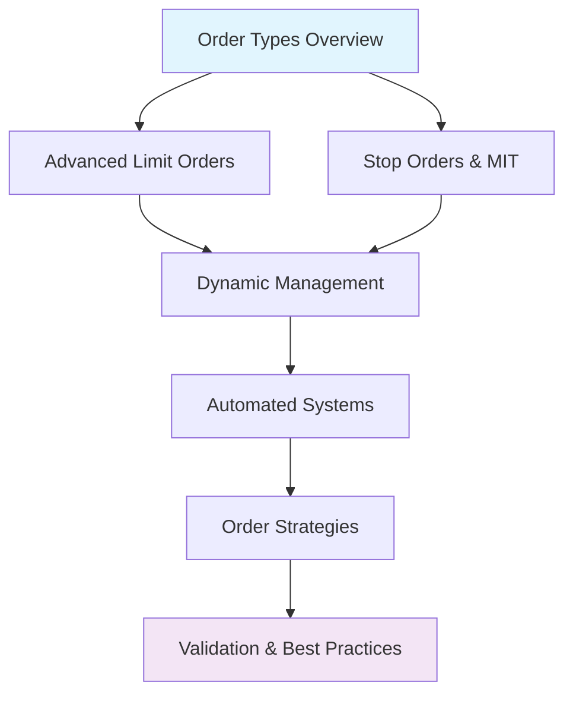

# Advanced Order Types Tutorial Series

Learn sophisticated order management techniques for professional trading with OANDA's comprehensive order system.

## Series Overview

This tutorial series explores advanced order types and management strategies that go beyond basic market orders. You'll learn to implement sophisticated trading logic using OANDA's full range of order capabilities.

### What You'll Learn

- **Order Types Mastery**: Market, limit, stop, and market-if-touched orders
- **Dynamic Management**: Trailing stops, scaling, and adaptive position sizing
- **Automated Systems**: Rule-based order management and monitoring
- **Risk Controls**: Validation frameworks and protective mechanisms
- **Professional Strategies**: Bracket orders, combinations, and advanced techniques

### Tutorial Structure

Each guide builds upon previous concepts while remaining focused on specific techniques:

1. **[Order Types Overview](order-types.md)** - Foundation concepts for all order types
2. **[Advanced Limit Orders](advanced-limit-orders.md)** - Time controls and protective mechanisms
3. **[Stop Orders & Market-If-Touched](stop-orders-mit.md)** - Breakout and mean reversion strategies
4. **[Dynamic Order Management](dynamic-management.md)** - Trailing stops and adaptive sizing
5. **[Automated Order Systems](automated-systems.md)** - Rule-based management and monitoring
6. **[Order Strategies & Combinations](order-strategies.md)** - Bracket orders and advanced techniques
7. **[Validation & Best Practices](validation-best-practices.md)** - Risk management and error handling

### Prerequisites

- Completion of [Basic Trading Tutorial](../basic-trading/index.md)
- Understanding of [Risk Management](../risk-management/index.md) concepts
- Familiarity with OANDA API authentication and basic operations

### Series Learning Path

### Key Concepts Covered

- **Order Lifecycle**: Creation, modification, cancellation, and execution
- **Time Management**: GTD, FOK, IOC, and custom time controls
- **Price Triggers**: Entry, exit, and conditional execution logic
- **Risk Parameters**: Stop losses, take profits, and protective orders
- **System Integration**: Error handling, monitoring, and automation

### Real-World Applications

- High-frequency trading strategies
- Algorithmic position management
- Risk-controlled portfolio systems
- Market-making and arbitrage operations
- Automated trading bot development

## Getting Started

Begin with [Order Types Overview](order-types.md) to establish foundational knowledge, then progress through the series based on your specific needs and trading style.

Each tutorial includes practical examples, code implementations, and real-world scenarios to ensure you can apply these concepts effectively in your trading systems.