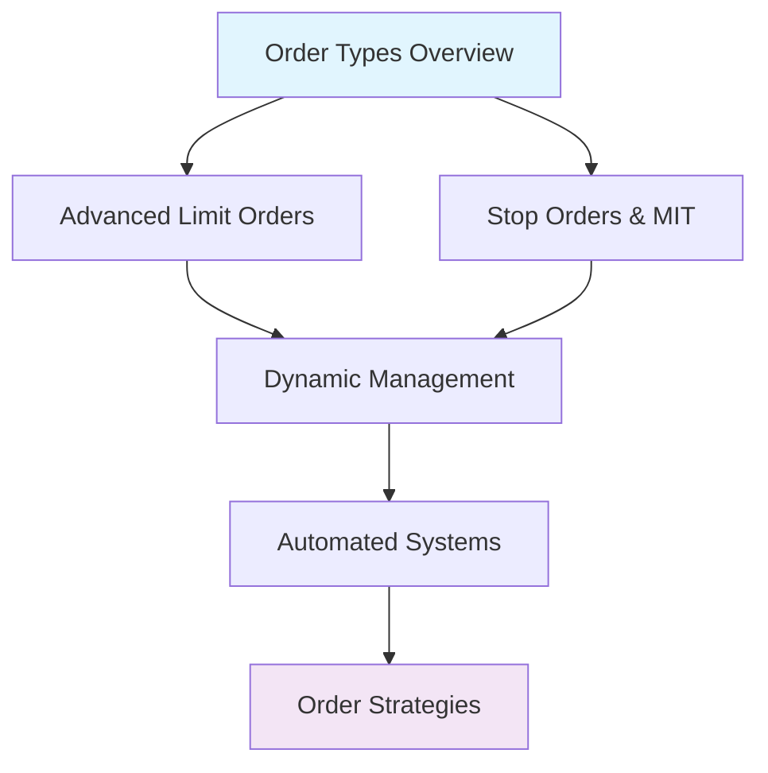

# Advanced Order Types Tutorial Series

This series covers OANDA's order types beyond the plain market order, and how to manage them programmatically.

## Series Overview

Market orders get you into a position; everything else about order management is more interesting. This series works through the rest of OANDA's order system and the trading logic it makes possible.

### What You'll Learn

- Market, limit, stop, and market-if-touched orders
- Trailing stops, scaling, and adaptive position sizing
- Rule-based order management and monitoring
- Bracket orders and order combinations

### Tutorial Structure

Each guide builds upon previous concepts while remaining focused on specific techniques:

1. **[Order Types Reference](../../guides/trading-concepts/order-types.md)** - Complete reference for all OANDA order types
2. **[Stop Orders & Market-If-Touched](stop-orders-mit.md)** - Breakout and mean reversion strategies
3. **[Dynamic Order Management](dynamic-management.md)** - Trailing stops and adaptive sizing
4. **[Order Strategies & Combinations](order-strategies.md)** - Bracket orders and advanced techniques

For order validation and error handling patterns, see the [Best Practices Guide](../../guides/understanding/best-practices.md#order-validation-framework).

### Prerequisites

- Completion of [Basic Trading Tutorial](../basic-trading/index.md)
- Understanding of [Risk Management](../risk-management.md) concepts
- Familiarity with OANDA API authentication and basic operations

### Series Learning Path

### Key Concepts Covered

- **Order Lifecycle**: Creation, modification, cancellation, and execution
- **Time Management**: GTD, FOK, IOC, and custom time controls
- **Price Triggers**: Entry, exit, and conditional execution logic
- **Risk Parameters**: Stop losses, take profits, and protective orders
- **System Integration**: Error handling, monitoring, and automation

### Real-World Applications

- High-frequency trading strategies
- Algorithmic position management
- Risk-controlled portfolio systems
- Market-making and arbitrage operations
- Automated trading bot development

## Getting Started

Review the [Order Types Reference](../../guides/trading-concepts/order-types.md) to understand all available order types, then progress through the tutorials based on your specific needs and trading style.

Each tutorial includes runnable examples you can adapt to your own trading systems.